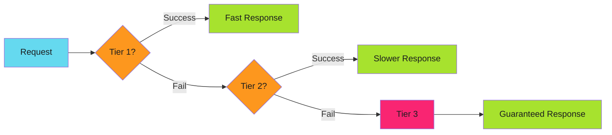

# Design Principles

Architectural guidance for building resilient automation.

Principles answer the *why* and *when* questions. They're decision frameworks, not code snippets.

---

## Overview

| Principle | When to Apply | Trade-off |
|-----------|---------------|-----------|
| [Graceful Degradation](#graceful_degradation) | System has fallback options | Complexity vs availability |
| [Fail Fast](#fail_fast) | Early detection prevents cascading failure | Speed vs thoroughness |
| [Prerequisite Checks](#prerequisite_checks) | Operations have preconditions | Latency vs correctness |

---

## Graceful Degradation

!!! abstract "Principle"

    When the optimal path fails, fall back to progressively more expensive but reliable alternatives.

### The Tiered Fallback Pattern



### Real-World Example

From the [deployment automation blog post](../../../blog/posts/2025-11-29-from-5-seconds-to-5-milliseconds.md):

| Tier | Method | Latency | Fallback Trigger |
|------|--------|---------|------------------|
| 1 | Volume mount | 1-5ms | Mount not available |
| 2 | API call | 50-200ms | API error |
| 3 | Full rebuild | 5-10s | Always succeeds |

### When to Apply

- System has multiple ways to get the same result
- Availability is more important than consistency
- Degraded service is better than no service

### Anti-Patterns

- **Silent degradation** - Falling back without logging
- **No final tier** - Every fallback can fail
- **Expensive default** - Using Tier 3 as the happy path

---

## Fail Fast

!!! abstract "Principle"

    Detect and report problems as early as possible, before they cascade into larger failures.

### When to Apply

- Invalid input would cause downstream failures
- Resources are expensive to allocate
- Partial execution leaves inconsistent state

### When NOT to Apply

- Fallback options exist (use graceful degradation instead)
- Transient failures are expected (use retry instead)
- Partial success is acceptable

### Example

```yaml
# Fail fast: Check permissions before starting
- name: Validate access
  run: |
    gh auth status || exit 1
    gh repo view ${{ github.repository }} || exit 1

# Now proceed with actual work
- name: Create release
  run: gh release create v1.0.0
```

---

## Prerequisite Checks

!!! abstract "Principle"

    Validate all preconditions before executing expensive or irreversible operations.

### When to Apply

- Operations are expensive (time, money, resources)
- Operations are irreversible (deletes, deployments)
- Multiple preconditions must all be true

### Example

```bash
# Check all prerequisites before deployment
check_prerequisites() {
  # Required tools
  command -v kubectl >/dev/null || { echo "kubectl not found"; return 1; }
  command -v helm >/dev/null || { echo "helm not found"; return 1; }

  # Required access
  kubectl auth can-i create deployments || { echo "No deploy permission"; return 1; }

  # Required state
  helm status my-release >/dev/null 2>&1 || { echo "Release not found"; return 1; }

  echo "All prerequisites met"
}

check_prerequisites || exit 1
# Now safe to proceed
```

---

## Principle Interactions

Principles sometimes conflict. Here's how to choose:

| Scenario | Choose | Because |
|----------|--------|---------|
| Recoverable error with fallback | Graceful degradation | Better UX than failing |
| Unrecoverable error | Fail fast | Prevent cascade |
| Expensive operation | Prerequisite check | Avoid wasted work |
| User-facing service | Graceful degradation | Availability matters |
| Data integrity operation | Fail fast | Consistency matters |

---

*Principles are guardrails, not rules. Context determines which one wins.*
