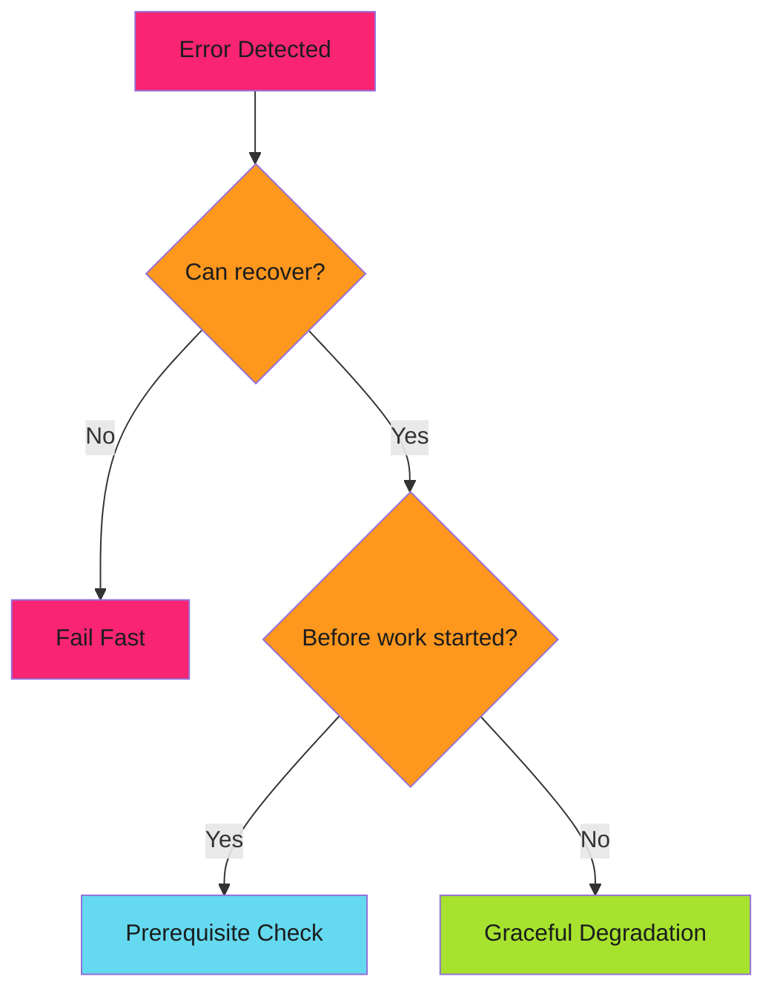

# Error Handling Patterns

Patterns for detecting, reporting, and recovering from failures.

!!! tip "Core Principle"
    Fail fast on **precondition failures**. Degrade gracefully on **runtime failures**.

---

## Overview

Error handling is about **when** and **how** your automation responds to problems.

| Pattern | When to Use | Strategy |
|---------|-------------|----------|
| [Fail Fast](fail-fast/index.md) | Invalid input, missing config | Stop immediately, report clearly |
| [Prerequisite Checks](prerequisite-checks/index.md) | Complex preconditions | Validate all upfront before work |
| [Graceful Degradation](graceful-degradation/index.md) | Fallbacks exist | Degrade to safer state, continue |

---

## Decision Flow

---

## Quick Reference

| Scenario | Pattern | Reasoning |
|----------|---------|-----------|
| Missing required config | Fail Fast | Can't continue safely |
| Invalid user input | Fail Fast | User error, report immediately |
| Complex deployment requirements | Prerequisite Checks | Validate tools, access, state |
| API timeout | Graceful Degradation | Retry or use backup |
| Service unavailable | Graceful Degradation | Fall back to alternatives |

---

*Fail fast when you can't recover. Degrade gracefully when you can.*
