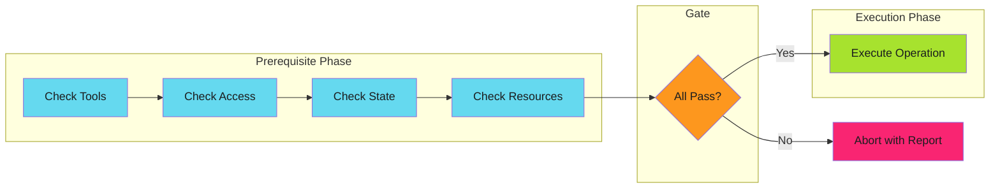

# Prerequisite Checks

Validate all preconditions before executing expensive or irreversible operations.

!!! tip "Key Insight"
    Check everything, then do everything. Consolidate validation into a dedicated phase before any work begins.

---

## Overview

Prerequisite checks are a structured approach to [fail fast](../fail-fast/index.md) validation. Instead of scattering validation throughout code, you consolidate all precondition checks into a dedicated phase that runs before any work begins.

The key insight: **check everything, then do everything**.

---

## Categories of Prerequisites

| Category | What to Check | Example |
|----------|---------------|---------|
| **Tools** | Required binaries exist | `kubectl`, `helm`, `jq` |
| **Access** | Permissions are granted | API tokens, RBAC roles |
| **State** | System is in expected state | Resource exists, not locked |
| **Resources** | Required resources available | Disk space, memory, quotas |
| **Configuration** | Config is valid and complete | Required fields, valid values |

---

## Implementation Checklist

Before implementing prerequisite checks:

- [ ] **List all prerequisites** for the operation
- [ ] **Categorize by type** (tools, access, state, resources, config)
- [ ] **Order by cost** (cheapest first)
- [ ] **Make checks read-only** (no side effects)
- [ ] **Provide actionable errors** (what failed, how to fix)
- [ ] **Collect all errors** (don't stop at first failure)
- [ ] **Test prerequisite failures** explicitly
- [ ] **Document prerequisites** for operators

---

## Deep Dives

| Topic | Description |
|-------|-------------|
| [Check Ordering](ordering.md) | Cost-based ordering strategy |
| [Anti-Patterns](anti-patterns.md) | Common mistakes to avoid |
| [Examples](examples.md) | Real-world implementations |

---

## Relationship to Other Patterns

| Pattern | How Prerequisite Checks Applies |
|---------|--------------------------------|
| [Fail Fast](../fail-fast/index.md) | Prerequisite checks are structured fail-fast validation |
| [Graceful Degradation](../graceful-degradation/index.md) | Prerequisites determine if graceful degradation is even possible |
| [Idempotency](../../efficiency-patterns/idempotency/index.md) | Check-before-act is a prerequisite pattern |
| [Work Avoidance](../../efficiency-patterns/work-avoidance/index.md) | Prerequisites can include "work already done" checks |
