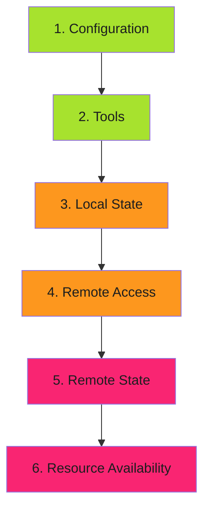

# Check Ordering

Order checks from cheapest to most expensive.

---

## Cost-Based Ordering

---

## Order by Cost

| Order | Category | Cost | Example |
|-------|----------|------|---------|
| 1 | Configuration | Free | Check required fields are set |
| 2 | Tools | Cheap | Check binaries exist |
| 3 | Local State | Cheap | Check local files exist |
| 4 | Remote Access | Medium | Test API authentication |
| 5 | Remote State | Medium | Check remote resources exist |
| 6 | Resources | Expensive | Check quotas, capacity |

---

## Why Order Matters

Fail on cheap checks before running expensive ones. Benefits:

- **Faster feedback** - Configuration errors caught in milliseconds
- **Reduced costs** - No API calls if local checks fail
- **Better UX** - Users see the simplest fixes first
