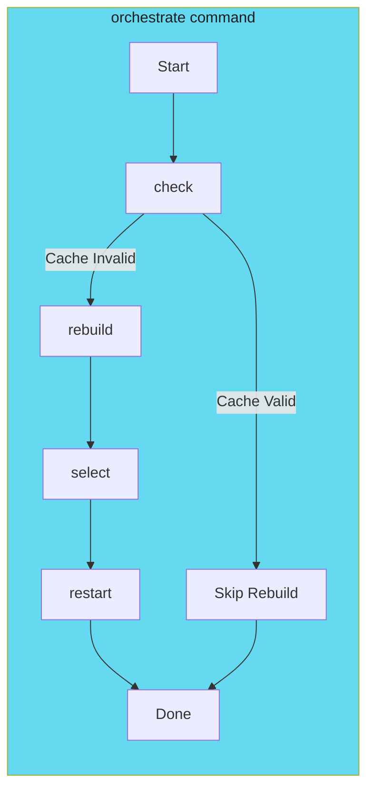

# Command Architecture

Design command structures that are intuitive, composable, and maintainable.

---

## Overview

A well-designed CLI has commands that work both independently and as part of larger workflows. This section covers:

- **[Orchestrator Pattern](orchestrator-pattern.md)** - Coordinate multi-step workflows
- **[Subcommand Design](subcommand-design.md)** - Build independently useful commands
- **[Input/Output Contracts](io-contracts.md)** - Design for pipelines and automation

---

## The Orchestrator Pattern

For complex workflows, use a single entry point that coordinates subcommands:



---

## Command Hierarchy

```text
myctl
├── orchestrate          # Main workflow
├── check                # Cache status
├── rebuild              # Force cache rebuild
├── select               # List deployments
├── restart              # Restart deployments
├── version              # Show version info
└── completion           # Shell completion scripts
    ├── bash
    ├── zsh
    └── fish
```

---

## Best Practices

| Practice | Description |
|----------|-------------|
| **Flat hierarchy** | Avoid deeply nested subcommands (max 2 levels) |
| **Verb-noun ordering** | `myctl restart deployment` not `myctl deployment restart` |
| **Consistent flags** | Use same flag names across commands |
| **Hidden internal commands** | Mark debugging commands as hidden |
| **Exit codes** | Use consistent exit codes (0=success, 1=failure, 2=usage error) |

---

*Design commands for both humans and scripts.*
