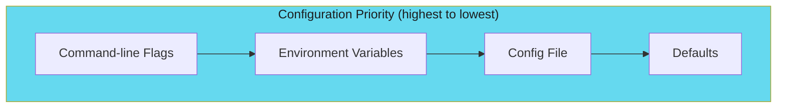

# Configuration with Viper

Layer configuration sources for flexible CLI behavior.

---

## Configuration Hierarchy

Viper integrates seamlessly with Cobra for layered configuration:



---

## Implementation

```go
package cmd

import (
    "fmt"
    "os"
    "strings"

    "github.com/spf13/cobra"
    "github.com/spf13/viper"
)

var cfgFile string

var rootCmd = &cobra.Command{
    Use:   "myctl",
    Short: "Kubernetes orchestration CLI",
    PersistentPreRunE: func(cmd *cobra.Command, args []string) error {
        return initConfig()
    },
}

func init() {
    rootCmd.PersistentFlags().StringVar(&cfgFile, "config", "", "config file (default: $HOME/.myctl.yaml)")
    rootCmd.PersistentFlags().StringP("namespace", "n", "default", "Kubernetes namespace")
    rootCmd.PersistentFlags().String("kubeconfig", "", "Path to kubeconfig file")
    rootCmd.PersistentFlags().Bool("verbose", false, "Enable verbose output")

    // Bind flags to viper
    viper.BindPFlag("namespace", rootCmd.PersistentFlags().Lookup("namespace"))
    viper.BindPFlag("kubeconfig", rootCmd.PersistentFlags().Lookup("kubeconfig"))
    viper.BindPFlag("verbose", rootCmd.PersistentFlags().Lookup("verbose"))
}

func initConfig() error {
    if cfgFile != "" {
        viper.SetConfigFile(cfgFile)
    } else {
        home, err := os.UserHomeDir()
        if err != nil {
            return err
        }
        viper.AddConfigPath(home)
        viper.AddConfigPath(".")
        viper.SetConfigName(".myctl")
        viper.SetConfigType("yaml")
    }

    // Environment variable binding
    viper.SetEnvPrefix("MYCTL")
    viper.SetEnvKeyReplacer(strings.NewReplacer("-", "_", ".", "_"))
    viper.AutomaticEnv()

    // Read config file (ignore if not found)
    if err := viper.ReadInConfig(); err != nil {
        if _, ok := err.(viper.ConfigFileNotFoundError); !ok {
            return fmt.Errorf("error reading config: %w", err)
        }
    }

    return nil
}

func Execute() {
    if err := rootCmd.Execute(); err != nil {
        os.Exit(1)
    }
}
```

---

## Example Config File

```yaml
# ~/.myctl.yaml
namespace: production
kubeconfig: ~/.kube/config
verbose: false

cache:
  ttl: 300
  backend: redis
  redis:
    host: localhost
    port: 6379
```

---

## Accessing Configuration

```go
func runCheck(cmd *cobra.Command, args []string) error {
    namespace := viper.GetString("namespace")
    verbose := viper.GetBool("verbose")
    cacheTTL := viper.GetInt("cache.ttl")

    if verbose {
        fmt.Printf("Using namespace: %s\n", namespace)
        fmt.Printf("Cache TTL: %d seconds\n", cacheTTL)
    }

    // ... check logic
    return nil
}
```

---

## Environment Variable Patterns

### Standard Kubernetes Variables

Support the variables users expect:

```go
func init() {
    // Standard kubeconfig handling
    if kubeconfig := os.Getenv("KUBECONFIG"); kubeconfig != "" {
        viper.SetDefault("kubeconfig", kubeconfig)
    }

    // Namespace from environment (Kubernetes convention)
    if ns := os.Getenv("NAMESPACE"); ns != "" {
        viper.SetDefault("namespace", ns)
    }
}
```

### In-Cluster Detection

```go
func isInCluster() bool {
    _, err := os.Stat("/var/run/secrets/kubernetes.io/serviceaccount/token")
    return err == nil
}

func getDefaultNamespace() string {
    // In-cluster: read from mounted secret
    if isInCluster() {
        if ns, err := os.ReadFile("/var/run/secrets/kubernetes.io/serviceaccount/namespace"); err == nil {
            return string(ns)
        }
    }
    // Out-of-cluster: use default
    return "default"
}
```

---

## Configuration Best Practices

| Practice | Description |
|----------|-------------|
| **Environment prefix** | Use `MYCTL_` prefix for all env vars |
| **Nested config** | Support `cache.ttl` style nested values |
| **Config file optional** | Never require a config file to exist |
| **Respect KUBECONFIG** | Always honor the standard env var |
| **Document all options** | List all config options in `--help` |

---

*Layer configuration for flexibility: flags override env vars override config files.*
