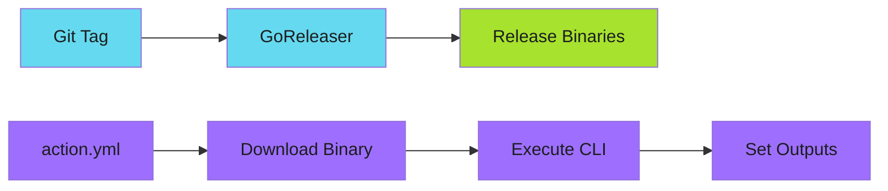

# GitHub Actions Distribution

Distribute your Go CLI as a reusable GitHub Action.

!!! tip "Composite Actions"
    Use composite actions with pre-built binaries. Users get fast execution without compiling from source.

---

## Architecture

Go-based GitHub Actions use a composite action pattern:

1. Download pre-built binary from releases
2. Execute binary with action inputs
3. Set outputs from binary execution



---

## Project Structure

```text
my-action/
├── action.yml                 # GitHub Action definition
├── cmd/my-action/
│   └── main.go               # CLI entrypoint
├── pkg/
│   └── ...                   # Business logic
├── .github/workflows/
│   ├── build.yml             # CI: build, test, lint
│   └── release.yml           # Release automation
├── .goreleaser.yml           # Binary release config
├── go.mod
└── README.md
```

---

## The action.yml File

Define the action interface with composite steps:

```yaml
name: 'My Go Action'
description: 'Analyze things with Go speed'
author: 'Your Name'

branding:
  icon: 'check-circle'
  color: 'blue'

inputs:
  path:
    description: 'Path to analyze'
    required: false
    default: '.'
  check:
    description: 'Exit with error on failure'
    required: false
    default: 'true'
  version:
    description: 'Tool version to use'
    required: false
    default: 'latest'

outputs:
  passed:
    description: 'Number of files that passed'
    value: ${{ steps.analyze.outputs.passed }}
  failed:
    description: 'Number of files that failed'
    value: ${{ steps.analyze.outputs.failed }}

runs:
  using: 'composite'
  steps:
    - name: Download binary
      shell: bash
      run: |
        VERSION="${{ inputs.version }}"

        if [ "$VERSION" = "latest" ]; then
          VERSION=$(curl -sL "https://api.github.com/repos/OWNER/REPO/releases/latest" \
            | jq -r '.tag_name')
        fi

        ARCH="amd64"
        [ "$RUNNER_ARCH" = "ARM64" ] && ARCH="arm64"

        URL="https://github.com/OWNER/REPO/releases/download/${VERSION}/my-action_linux_${ARCH}.tar.gz"
        curl -sL "$URL" | tar -xz -C /tmp
        chmod +x /tmp/my-action

    - name: Run analysis
      id: analyze
      shell: bash
      run: |
        ARGS=""
        [ "${{ inputs.check }}" = "true" ] && ARGS="--check"
        /tmp/my-action $ARGS "${{ inputs.path }}"
```

---

## CLI Design for Actions

### Exit Codes

GitHub Actions use exit codes to determine success:

| Exit Code | Meaning | Action Result |
|-----------|---------|---------------|
| 0 | Success | Step passes |
| 1 | Failure | Step fails |
| Other | Error | Step fails |

```go
func main() {
    if err := run(); err != nil {
        fmt.Fprintf(os.Stderr, "Error: %v\n", err)
        os.Exit(1)
    }
}

func run() error {
    // ... analyze files ...

    if checkFlag && failed > 0 {
        return fmt.Errorf("%d file(s) failed", failed)
    }
    return nil
}
```

### The --check Flag

Always implement a `--check` flag:

- Outputs results for visibility
- Returns exit code 1 on failure
- Used by default in action entry

!!! warning "Don't Fail Silently"
    Without `--check`, the tool might report without failing. Actions should fail when checks don't pass.

---

## Setting Action Outputs

Write to `$GITHUB_OUTPUT` from your CLI:

```go
func setOutputs(passed, failed int) {
    outputPath := os.Getenv("GITHUB_OUTPUT")
    if outputPath == "" {
        return // Not in GitHub Actions
    }

    f, err := os.OpenFile(outputPath, os.O_APPEND|os.O_WRONLY, 0644)
    if err != nil {
        return
    }
    defer f.Close()

    fmt.Fprintf(f, "passed=%d\n", passed)
    fmt.Fprintf(f, "failed=%d\n", failed)
}
```

Reference in workflows:

```yaml
- name: Run analysis
  id: analyze
  uses: owner/my-action@v1

- name: Use results
  run: |
    echo "Passed: ${{ steps.analyze.outputs.passed }}"
    echo "Failed: ${{ steps.analyze.outputs.failed }}"
```

---

## Job Summaries

Write markdown to `$GITHUB_STEP_SUMMARY`:

```go
func writeJobSummary(results []*Result) error {
    path := os.Getenv("GITHUB_STEP_SUMMARY")
    if path == "" {
        return nil
    }

    f, err := os.OpenFile(path, os.O_APPEND|os.O_WRONLY|os.O_CREATE, 0644)
    if err != nil {
        return err
    }
    defer f.Close()

    fmt.Fprintln(f, "## Analysis Results")
    fmt.Fprintln(f, "| File | Status |")
    fmt.Fprintln(f, "|------|--------|")
    for _, r := range results {
        status := "Pass"
        if r.Failed {
            status = "Fail"
        }
        fmt.Fprintf(f, "| %s | %s |\n", r.File, status)
    }
    return nil
}
```

---

## Floating Version Tags

Maintain floating tags for user convenience:

```yaml
# In release workflow
- name: Update floating tags
  run: |
    VERSION=${GITHUB_REF#refs/tags/}
    MAJOR=$(echo $VERSION | cut -d. -f1)

    git tag -f $MAJOR
    git push -f origin $MAJOR
```

Users reference:

```yaml
- uses: owner/my-action@v1  # Gets latest v1.x.x
```

---

## Testing Actions

### Local Testing

```bash
# Build and test directly
go build -o my-action ./cmd/my-action
./my-action --check docs/

# Test with act (local GitHub Actions runner)
brew install act
act -j test-action
```

### CI Testing

```yaml
test-action:
  runs-on: ubuntu-latest
  steps:
    - uses: actions/checkout@v6

    - name: Test action
      uses: ./
      with:
        path: README.md
        check: false
```

---

## GoReleaser Configuration

Build cross-platform binaries:

```yaml
# .goreleaser.yml
version: 2

builds:
  - id: my-action
    main: ./cmd/my-action
    binary: my-action_{{ .Os }}_{{ .Arch }}
    env:
      - CGO_ENABLED=0
    goos: [linux, darwin, windows]
    goarch: [amd64, arm64]
    ldflags:
      - -s -w
      - -X main.version={{ .Version }}

archives:
  - id: my-action
    builds: [my-action]
    format: tar.gz
    name_template: "my-action_{{ .Os }}_{{ .Arch }}"

checksum:
  name_template: 'checksums.txt'

changelog:
  use: github-native
```

---

## Best Practices

| Practice | Description |
|----------|-------------|
| **Binary distribution** | Pre-built binaries avoid compilation delays |
| **Floating tags** | `v1` always points to latest `v1.x.x` |
| **Version input** | Allow pinning to specific versions |
| **Job summaries** | Rich markdown feedback in the Actions UI |
| **Meaningful outputs** | Enable downstream workflow steps |
| **Error messages** | Guide users toward correct fixes |

---

## Related

- [Release Automation](release-automation.md) - GoReleaser and multi-arch builds
- [Pre-commit Hooks](pre-commit-hooks.md) - Same patterns for pre-commit
- [CLI UX Patterns](/blog/posts/2025-12-07-cli-ux-patterns-for-ai-agents/) - Design error messages AI can use

---

*Ship actions like you ship software: fast, tested, automated.*
