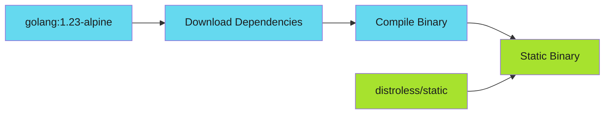

# Packaging

Build minimal, secure container images for your Go CLI.

!!! tip "Minimal Images"
    Static Go binaries on distroless base images give you ~5MB images with no shell attack surface. Small image + non-root + read-only = secure container.

---

## Overview

Packaging a Go CLI for Kubernetes involves creating small, secure container images that can run anywhere. This section covers:

- **[Container Builds](container-builds.md)** - Multi-stage Dockerfiles with distroless
- **[Helm Charts](helm-charts.md)** - Deploy your CLI with Helm
- **[Release Automation](release-automation.md)** - Multi-arch builds and GoReleaser

---

## Build Flow

---

## Base Image Selection

| Image | Size | Use Case |
|-------|------|----------|
| `gcr.io/distroless/static` | ~2MB | Pure Go, no CGO |
| `gcr.io/distroless/base` | ~20MB | Needs libc |
| `alpine:3.19` | ~7MB | Need shell/debugging |
| `scratch` | 0MB | Maximum minimal (no TLS certs) |

---

## Best Practices

| Practice | Description |
|----------|-------------|
| **Static binaries** | Use `CGO_ENABLED=0` for portable builds |
| **Non-root user** | Always run as non-root in containers |
| **Read-only filesystem** | Set `readOnlyRootFilesystem: true` |
| **Drop capabilities** | Remove all capabilities with `drop: ALL` |
| **Version in binary** | Inject version at build time |
| **Multi-arch support** | Build for both amd64 and arm64 |

---

*Ship binaries that run anywhere Kubernetes runs.*
