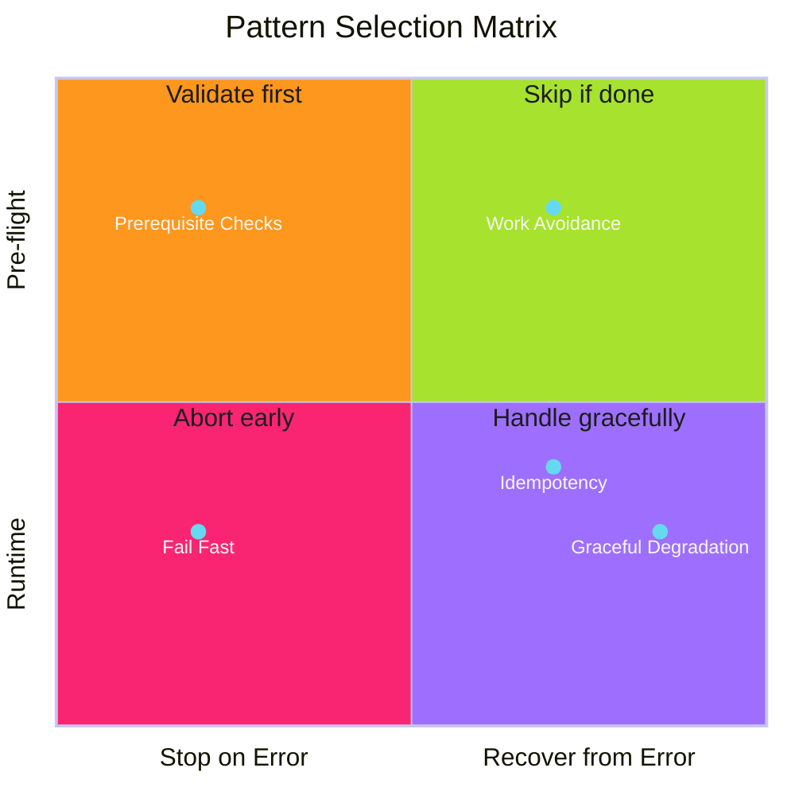

# Pattern Selection Guide

Choose the right pattern for your situation.

Use this decision matrix to determine which pattern applies to your scenario. For implementation details, see the linked pattern guides.

---

## Pattern Decision Matrix

**Reading the matrix:**

- **Y-axis**: When? Pre-flight (before work starts) or runtime (during execution)
- **X-axis**: Strategy? Stop immediately on error, or attempt recovery

---

## Pattern Selection by Scenario

| Scenario | Pattern | Reasoning |
|----------|---------|-----------|
| Invalid user input | [Fail Fast](../error-handling/fail-fast/index.md) | User error, report immediately |
| Missing required config | [Fail Fast](../error-handling/fail-fast/index.md) | Can't continue safely |
| Complex preconditions | [Prerequisite Checks](../error-handling/prerequisite-checks/index.md) | Validate all upfront |
| Deployment requirements | [Prerequisite Checks](../error-handling/prerequisite-checks/index.md) | Check tools, access, state |
| Cache miss | [Graceful Degradation](../error-handling/graceful-degradation/index.md) | Expensive path still works |
| API timeout | [Graceful Degradation](../error-handling/graceful-degradation/index.md) | Retry or use backup |
| Service unavailable | [Graceful Degradation](../error-handling/graceful-degradation/index.md) | Fall back to alternatives |
| Re-running same operation | [Idempotency](../efficiency-patterns/idempotency/index.md) | Same result every time |
| Resource already exists | [Idempotency](../efficiency-patterns/idempotency/index.md) | Create-or-update safely |
| Content unchanged | [Work Avoidance](../efficiency-patterns/work-avoidance/index.md) | Skip unnecessary work |
| Build artifact cached | [Work Avoidance](../efficiency-patterns/work-avoidance/index.md) | Reuse previous results |

---

## Condition Matrix

| Condition | Fail Fast | Prerequisite Checks | Graceful Degradation | Idempotency | Work Avoidance |
|-----------|:---------:|:-------------------:|:--------------------:|:-----------:|:--------------:|
| Before execution starts | ✓ | ✓ | | | ✓ |
| During execution | | | ✓ | ✓ | |
| No fallback available | ✓ | | | | |
| Fallback exists | | | ✓ | | |
| Has preconditions | | ✓ | | | |
| May be retried | | | | ✓ | |
| Result is cacheable | | | | | ✓ |
| Integrity critical | ✓ | | | | |
| Availability critical | | | ✓ | | |

---

## Quick Reference

| Pattern | When to Apply | Trade-off |
|---------|---------------|-----------|
| [Fail Fast](../error-handling/fail-fast/index.md) | Early detection prevents cascading failure | Speed vs thoroughness |
| [Prerequisite Checks](../error-handling/prerequisite-checks/index.md) | Operations have preconditions | Latency vs correctness |
| [Graceful Degradation](../error-handling/graceful-degradation/index.md) | System has fallback options | Complexity vs availability |
| [Idempotency](../efficiency-patterns/idempotency/index.md) | Operations may be retried | Complexity vs reliability |
| [Work Avoidance](../efficiency-patterns/work-avoidance/index.md) | Results can be cached/reused | Cache invalidation vs speed |

---

*Context determines which pattern wins. Use this guide as a starting point, not a rigid rule.*
