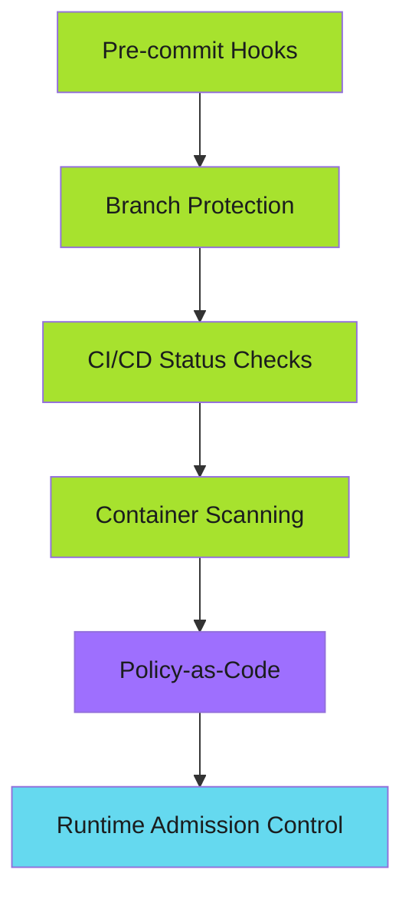

# SDLC Hardening

Auditors don't trust documentation. They trust systems that make security inevitable.

This section covers the enforcement patterns that pass SOC 2, ISO 27001, and PCI-DSS audits.

---

## The Enforcement Stack

From development to deployment, security must be enforced at every layer:

Each layer provides defense in depth. No single control is sufficient.

---

## Implementation Guides

### Source Control Enforcement

- **[Branch Protection](branch-protection.md)** - Required reviews, status checks, admin enforcement
- **[Commit Signing](commit-signing.md)** - GPG signatures for non-repudiation
- **[Pre-commit Hooks](pre-commit-hooks.md)** - Secrets detection, policy enforcement at commit time

### CI/CD Gates

- **[Required Status Checks](status-checks/index.md)** - Tests, linting, security scans as merge gates
- **[GitHub Apps Authentication](github-apps/index.md)** - Machine authentication without PATs
- **[SBOM Generation](sbom-generation.md)** - Software Bill of Materials for supply chain security

### Evidence Collection

- **[Audit Evidence](audit-evidence.md)** - API queries, retention strategies, compliance reports
- **[Implementation Roadmap](implementation-roadmap/index.md)** - Phased rollout plan

---

## Audit Readiness

Your SDLC is audit-ready when:

- [ ] Branch protection enforced on all production branches
- [ ] Required status checks configured (tests, security scans)
- [ ] GitHub Apps replace PATs for automation
- [ ] Pre-commit hooks deployed (secrets, policy checks)
- [ ] Signed commits required
- [ ] SBOM generation integrated
- [ ] Evidence archive process running
- [ ] Exception process documented

---

## Related Resources

- **[Blog: Harden Your SDLC Before the Audit](../../blog/posts/2025-12-12-harden-sdlc-before-audit.md)** - The story behind these patterns
- **[Pre-commit Security Gates](../../blog/posts/2025-12-04-pre-commit-security-gates.md)** - Enforce vendor-neutral policies
- **[Policy-as-Code with Kyverno](../../blog/posts/2025-12-13-policy-as-code-kyverno.md)** - Runtime admission control

---

*Enforcement happens automatically. Audits pass. Systems prove what documentation cannot.*
