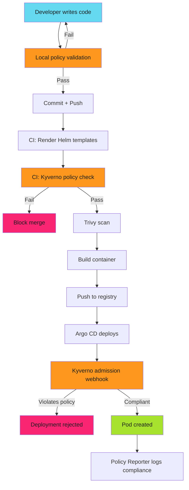

# Kyverno - Operations and Monitoring

## Monitoring and Alerting

!!! tip "Quick Start"
    This guide is part of a modular documentation set. Refer to related guides in the navigation for complete context.

### Policy Reporter Integration

```yaml
# charts/policy-reporter/values.yaml
policyReporter:
  enabled: true
  ui:
    enabled: true
  monitoring:
    enabled: true
    serviceMonitor:
      enabled: true

  # Alert on policy violations
  alerts:
    slack:
      webhook: https://hooks.slack.com/services/XXX
      channel: "#security-alerts"
      minimumPriority: "warning"
```

### Prometheus Queries

```yaml
# Policy violation metrics
kyverno_policy_results_total{policy="require-resource-limits",result="fail"}

# Admission review latency
histogram_quantile(0.95, kyverno_admission_review_duration_seconds_bucket)

# Webhook availability
up{job="kyverno"}
```

### Grafana Dashboard

Metrics tracked:

- Policy pass/fail rates
- Admission latency P95/P99
- Most violated policies
- Namespace compliance scores

---

## Policy Lifecycle Management

### Version Control

```bash
policies/
├── security/
│   ├── v1.0.0/
│   │   ├── image-provenance.yaml
│   │   └── privilege-escalation.yaml
│   └── v1.1.0/
│       ├── image-provenance.yaml  # Updated
│       ├── privilege-escalation.yaml
│       └── network-policy.yaml    # New
└── devops/
    └── v1.0.0/
        ├── resource-limits.yaml
        └── required-labels.yaml
```

### Rollout Strategy

1. **Development**: Deploy new policy version in audit mode
2. **QAC**: Monitor PolicyReports for violations
3. **Staging**: Switch to enforce mode, validate
4. **Production**: Gradual rollout (10% → 50% → 100%)

### Policy Deprecation

```yaml
apiVersion: kyverno.io/v1
kind: ClusterPolicy
metadata:
  name: old-policy
  annotations:
    policies.kyverno.io/deprecated: "true"
    policies.kyverno.io/replacement: "new-policy-v2"
spec:
  validationFailureAction: Audit  # Warn, don't block
  rules:
    - name: deprecated-rule
      validate:
        message: "DEPRECATED: Use new-policy-v2 instead"
```

---

## Integration with CI/CD

### Container Build Validation

```yaml
# .github/workflows/container.yml
- name: Scan container image
  uses: aquasecurity/trivy-action@master
  with:
    image-ref: ${{ env.IMAGE }}
    format: cosign-vuln

- name: Validate Kubernetes manifests for container
  run: |
    # Generate deployment manifest
    cat > deployment.yaml <<EOF
    apiVersion: apps/v1
    kind: Deployment
    spec:
      template:
        spec:
          containers:
          - image: ${{ env.IMAGE }}
    EOF

    # Validate against policies
    kyverno apply policies/ --resource deployment.yaml
```

### SBOM Generation

```yaml
- name: Generate SBOM
  uses: aquasecurity/trivy-action@master
  with:
    scan-type: image
    format: cyclonedx
    output: sbom.json

- name: Upload SBOM to Dependency Graph
  uses: actions/upload-artifact@v4
  with:
    name: sbom
    path: sbom.json
```

---

## End-to-End Workflow



**Shift-left:** Local validation + CI checks catch 90% of violations.

**Shift-down:** Runtime admission control catches the remaining 10%.

---

## Related Guides

- **[Kyverno Basics](index.md)** - Installation and policy structure
- **[Policy Patterns](policy-patterns.md)** - Common validation patterns
- **[Testing and Exceptions](testing-approaches.md)** - Local testing and exceptions

---

*Developer validated locally. CI pipeline checked policies. Container scanned. Manifests rendered. Kyverno validated at build time. Argo CD deployed. Admission webhook enforced at runtime. Policy Reporter tracked compliance. Violations blocked. Production secured end-to-end.*
