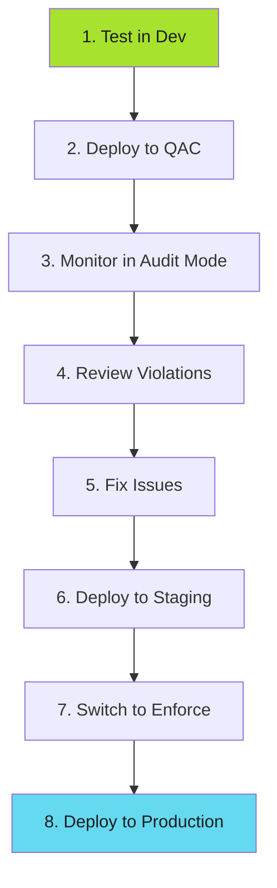

# Operational Workflows

Policy update workflows, backup procedures, performance tuning, and operational best practices.

## Policy Updates Workflow

### Rolling Out Policy Changes

**Safe rollout process**:



!!! warning "Never Skip Audit Phase"
    Deploying policies directly to Enforce mode in production causes outages. Always start with Audit, monitor for 1+ week, fix violations, then switch to Enforce.

**Timeline**:

- Dev: Immediate
- QAC: 1 week in Audit mode
- Staging: 1 week in Enforce mode
- Production: After 0 violations in Staging

---

## Backup and Recovery

### Policy Backup

```bash
# Backup all policies
kubectl get clusterpolicy -o yaml > backup-policies.yaml
kubectl get policyexception -A -o yaml >> backup-policies.yaml

# Backup Kyverno configuration
helm get values kyverno -n kyverno > backup-kyverno-values.yaml
helm get values policy-reporter -n policy-reporter > backup-policy-reporter-values.yaml
```

### Disaster Recovery

**Restore from backup**:

```bash
# Reinstall Kyverno
helm install kyverno kyverno/kyverno \
  --namespace kyverno \
  --values backup-kyverno-values.yaml

# Restore policies
kubectl apply -f backup-policies.yaml
```

!!! tip "Automate Backups"
    Set up a cronjob to backup policies nightly. Store backups in Git or S3 for disaster recovery.

---

## Performance Tuning

### Admission Controller Scaling

```yaml
# kyverno-values.yaml
admissionController:
  replicas: 3  # High availability

  resources:
    limits:
      memory: 512Mi
      cpu: 500m
    requests:
      memory: 256Mi
      cpu: 200m
```

### Background Scan Interval

```yaml
features:
  backgroundScan:
    backgroundScanInterval: 12h  # Reduce frequency for large clusters
```

### Resource Filters

Exclude unnecessary resources:

```yaml
resourceFilters:
  resourceFiltersExcludeNamespaces:
    - kube-system
    - kube-public
    - gmp-system
    - cnrm-system

  resourceFiltersExcludeResources:
    - "[Event,*,*]"
    - "[*,kube-system,*]"
    - "[Node,*,*]"
```

---

## Best Practices

### 1. Version Everything

- Policy repos: Semantic versions
- policy-platform container: Tagged versions
- Helm deployments: Track release history

### 2. Monitor Continuously

- PolicyReporter dashboard
- Prometheus alerts
- Slack notifications

### 3. Test Before Enforce

- New policies start in Audit mode
- Monitor for 1+ week
- Fix violations before Enforce

### 4. Document Exceptions

- Require JIRA tickets
- Set expiration dates
- Quarterly reviews

### 5. Automate Evidence Collection

- Monthly policy exports
- Automated compliance reports
- Audit trail preservation

---

## Key Takeaways

✅ **Local dev** - Run policies in containers before commit

✅ **CI integration** - Automated validation in pipelines

✅ **Runtime enforcement** - Kyverno admission control

✅ **Multi-source** - Aggregate policies from multiple repos

✅ **Operations** - Monitor, update, and audit

**Related Resources**:

- **[SDLC Hardening](../../index.md)** - Broader enforcement patterns
- **[Kyverno Guide](../kyverno/index.md)** - Deep dive on Kyverno
- **[Pre-commit Hooks](../../pre-commit-hooks.md)** - Complementary local checks
