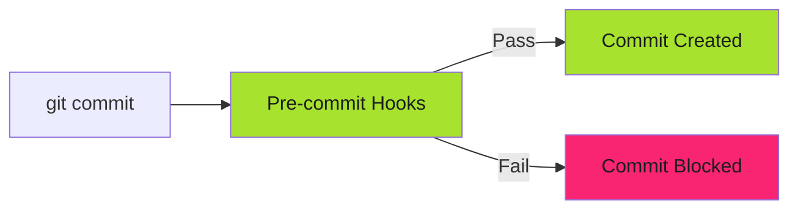

# Pre-commit Hooks

CI catches issues after commit. Pre-commit hooks catch them before.

!!! warning "Security Foundation"
    These controls form the baseline security posture. All controls must be implemented for audit compliance.

Block bad code from ever entering git history.

---

## The Defense Layer

Pre-commit hooks run locally before `git commit` completes.



Violations block the commit. Developer fixes locally before pushing.

---

## Secrets Detection

Block credentials before they enter git history:

```yaml
# .pre-commit-config.yaml
repos:
  - repo: https://github.com/trufflesecurity/trufflehog
    rev: v3.63.0
    hooks:
      - id: trufflehog
        name: TruffleHog
        entry: trufflehog filesystem --fail --no-update
        language: system
```

A developer tries to commit AWS credentials:

```bash
$ git commit -m "Add deployment config"
TruffleHog.........................................................Failed
- hook id: trufflehog

Found verified result:
Detector Type: AWS
File: deploy/config.yaml
```

The commit is blocked. Secret never enters git history.

---

## Policy Enforcement

Enforce vendor-neutral technology policies:

```yaml
# .pre-commit-config.yaml
- repo: local
  hooks:
    - id: check-forbidden-tech
      name: block forbidden technologies
      entry: scripts/check-forbidden-tech.sh
      language: script
      files: \.(md|yaml|yml|sh|tf|Dockerfile|Containerfile)$
```

See [Pre-commit Security Gates](../../blog/posts/2025-12-04-pre-commit-security-gates.md) for full implementation.

---

## Format and Lint Checks

Ensure code quality before commit:

```yaml
repos:
  - repo: https://github.com/pre-commit/pre-commit-hooks
    rev: v4.5.0
    hooks:
      - id: trailing-whitespace
      - id: end-of-file-fixer
      - id: check-yaml
      - id: check-json

  - repo: https://github.com/golangci/golangci-lint
    rev: v1.55.0
    hooks:
      - id: golangci-lint
```

Blocks commits with trailing whitespace, invalid YAML, or linting failures.

---

## Setup

Install pre-commit framework:

```bash
# Install pre-commit
pip install pre-commit

# Install hooks from .pre-commit-config.yaml
pre-commit install

# Run against all files
pre-commit run --all-files
```

Hooks run automatically on `git commit`.

---

## Bypass (When Necessary)

Pre-commit hooks are local and bypassable:

```bash
# Skip hooks for emergency commit
git commit --no-verify -m "Hotfix"
```

**Critical**: Log every `--no-verify` usage. Review in post-commit audit.

Auditors accept documented exceptions. Casual bypasses are findings.

---

## CI Validation (Defense in Depth)

Pre-commit hooks are local. Developers can skip them.

Always validate in CI too:

```yaml
# .github/workflows/validate.yml
- name: Run pre-commit checks
  run: |
    pip install pre-commit
    pre-commit run --all-files
```

CI enforcement prevents bypassed hooks from reaching production.

---

## Common Hooks

| Hook | Purpose | Blocks |
| ------ | --------- | -------- |
| **trufflehog** | Secrets detection | AWS keys, API tokens, passwords |
| **check-yaml** | YAML validation | Syntax errors |
| **check-json** | JSON validation | Syntax errors |
| **trailing-whitespace** | Format check | Trailing spaces |
| **golangci-lint** | Go linting | Code quality issues |
| **markdownlint** | Markdown linting | Formatting violations |
| **shellcheck** | Shell script linting | Bash errors |
| **forbidden-tech** | Policy enforcement | Banned technologies |

---

## Organization-Wide Deployment

Distribute `.pre-commit-config.yaml` to all repositories:

```yaml
# Distribution workflow
jobs:
  distribute:
    runs-on: ubuntu-latest
    steps:
      - name: Copy pre-commit config to all repos
        run: |
          gh repo list org --limit 1000 --json name --jq '.[].name' | \
            while read repo; do
              gh api repos/org/$repo/contents/.pre-commit-config.yaml \
                --method PUT \
                --field message="Add pre-commit config" \
                --field content="$(base64 .pre-commit-config.yaml)"
            done
```

See [File Distribution](../../operator-manual/github-actions/use-cases/file-distribution/index.md) for full pattern.

---

## Developer Onboarding

New developers must install hooks. Add to README.md:

### Setup

1. Install pre-commit framework:

   ```bash
   pip install pre-commit
   ```

2. Install hooks:

   ```bash
   pre-commit install
   ```

3. Test:

   ```bash
   pre-commit run --all-files
   ```

Include in onboarding checklist.

---

## Limitations

Pre-commit hooks have limitations:

- **Bypassable**: Developers can use `--no-verify`
- **Local only**: Don't run on server-side operations
- **Performance**: Complex hooks slow down commits

Always pair with CI/CD validation for defense in depth.

---

## Related Resources

- **[Pre-commit Security Gates](../../blog/posts/2025-12-04-pre-commit-security-gates.md)** - Full implementation guide
- **[Required Status Checks](status-checks/index.md)** - CI/CD validation
- **[Branch Protection](branch-protection.md)** - Server-side enforcement

---

*Hooks blocked the commit. Secrets stayed local. Code quality enforced. Git history remained clean.*
