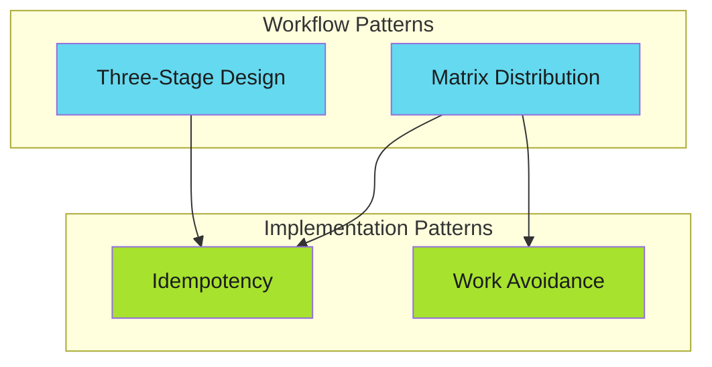

# Workflow Architecture

Structural patterns for building workflows that scale.

!!! tip "Design for Failure"
    Workflows that survive production are designed with failure in mind. Separate concerns, isolate failures, and always report results.

---

## Available Patterns

| Pattern | Problem | Solution |
|---------|---------|----------|
| [Three-Stage Design](three-stage-design.md) | Complex workflows become tangled | Separate discovery, execution, and reporting |
| [Matrix Distribution](matrix-distribution/index.md) | Sequential processing is slow | Parallelize with dynamic matrices |

---

## When to Use

These patterns address workflow-level concerns:

- **Scaling** - Processing many targets efficiently
- **Observability** - Understanding what happened and why
- **Maintainability** - Keeping workflows readable as complexity grows
- **Resilience** - Handling partial failures gracefully

---

## Relationship to Other Patterns

Workflow patterns compose with implementation patterns:

A three-stage workflow uses [idempotency](../efficiency-patterns/idempotency/index.md) to make reruns safe. Matrix distribution uses [work avoidance](../efficiency-patterns/work-avoidance/index.md) to skip unnecessary operations.

---

*Design workflows that survive contact with production.*
