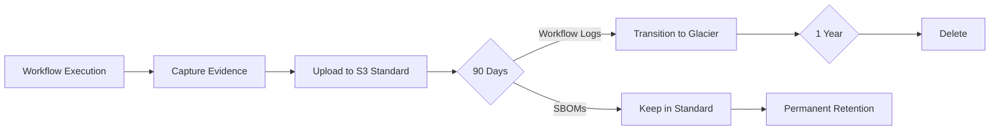

# Evidence Collection Implementation

Complete evidence collection workflow, S3 bucket configuration, and automated lifecycle management. Production-ready patterns for audit compliance.

!!! tip "Production Ready"
    This workflow captures evidence in real-time, uploads to S3 with versioning and object lock, and manages lifecycle automatically. Copy, customize, deploy.

---

## Complete Evidence Collection Workflow

```yaml
name: Evidence Collection

on:
  push:
    branches: [main]
  release:
    types: [published]

jobs:
  collect-evidence:
    runs-on: ubuntu-latest
    permissions:
      contents: read
      actions: read
    steps:
      - uses: actions/checkout@v4

      - name: Configure AWS Credentials
        uses: aws-actions/configure-aws-credentials@v4
        with:
          role-to-assume: arn:aws:iam::123456789012:role/GithubActionsEvidenceUpload
          aws-region: us-east-1

      - name: Collect Workflow Evidence
        run: |
          mkdir -p evidence
          DATE=$(date +%Y%m%d)

          # Workflow metadata
          gh run view ${{ github.run_id }} --json \
            databaseId,event,headBranch,headSha,status,conclusion,createdAt \
            > evidence/workflow-${DATE}.json

          # Branch protection
          gh api repos/${{ github.repository }}/branches/main/protection \
            > evidence/branch-protection-${DATE}.json

          # Commit verification
          git verify-commit ${{ github.sha }} > evidence/commit-sig-${DATE}.txt || true

      - name: Upload to S3
        run: |
          DATE=$(date +%Y%m%d)
          aws s3 cp evidence/ s3://audit-evidence/${{ github.repository }}/${DATE}/ --recursive

          # Generate manifest
          find evidence -type f -exec sha256sum {} \; > evidence-manifest.txt
          aws s3 cp evidence-manifest.txt s3://audit-evidence/${{ github.repository }}/${DATE}/

      - uses: actions/upload-artifact@v4
        with:
          name: audit-evidence-${{ github.run_id }}
          path: evidence/
          retention-days: 365
```

---

## S3 Bucket Setup

```bash
# Create bucket
aws s3 mb s3://audit-evidence --region us-east-1

# Enable versioning
aws s3api put-bucket-versioning \
  --bucket audit-evidence \
  --versioning-configuration Status=Enabled

# Enable object lock (must be set at bucket creation)
aws s3 mb s3://audit-evidence-locked --region us-east-1 --object-lock-enabled-for-bucket

# Set lifecycle policy
aws s3api put-bucket-lifecycle-configuration \
  --bucket audit-evidence \
  --lifecycle-configuration file://lifecycle-policy.json

# Block public access
aws s3api put-public-access-block \
  --bucket audit-evidence \
  --public-access-block-configuration \
    BlockPublicAcls=true,IgnorePublicAcls=true,BlockPublicPolicy=true,RestrictPublicBuckets=true
```

---

## Evidence Lifecycle Management



**Automation**:

```yaml
# Scheduled evidence cleanup
name: Evidence Lifecycle
on:
  schedule:
    - cron: '0 2 * * 0'  # Weekly Sunday 2am

jobs:
  cleanup:
    runs-on: ubuntu-latest
    steps:
      - name: Transition Old Evidence
        run: |
          # List evidence older than 90 days
          CUTOFF=$(date -d '90 days ago' +%Y-%m-%d)
          aws s3 ls s3://audit-evidence/ --recursive | \
            awk -v cutoff="$CUTOFF" '$1 < cutoff {print $4}' > old-evidence.txt

          # Transition to Glacier (handled by lifecycle policy)
          echo "Lifecycle policy will transition $(wc -l < old-evidence.txt) objects"
```

---

## Related Patterns

- [Audit Evidence Collection](audit-evidence.md) - Main overview
- [Evidence Types](evidence-types.md) - What to collect
- [Collection Strategies](collection-strategies.md) - How to capture evidence
- [Compliance Reporting](compliance-reporting.md) - How to retrieve evidence

---

*Production-ready workflow. S3 bucket with versioning and object lock. Automated lifecycle management. Evidence captured in real-time. Retention enforced automatically. Compliance guaranteed.*
