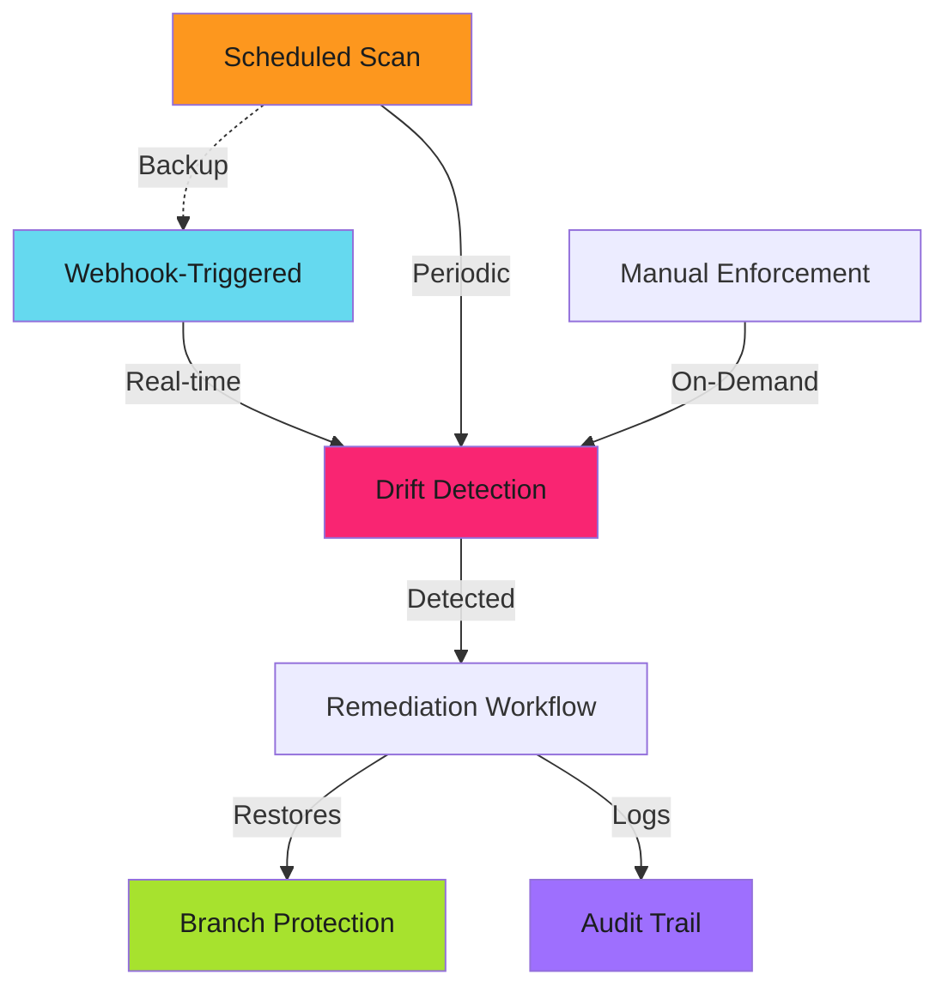

# Enforcement Workflows

Workflows detect drift. Workflows remediate. Workflows audit. Manual intervention becomes the exception.

!!! warning "Static Configuration is Not Enforcement"
    Setting branch protection once is configuration. Enforcement requires continuous monitoring, drift detection, and automated remediation. Workflows provide the automation layer.

Protection can be disabled with a click. Workflows ensure it's restored within minutes.

---

## Architecture

Complete enforcement requires three workflow types:



**Webhook-triggered**: Real-time response to protection changes (< 1 minute).

**Scheduled scans**: Backup verification every 6 hours (catches webhook failures).

**Manual enforcement**: On-demand application for bulk updates.

---

## Webhook-Triggered Enforcement

Real-time drift detection and remediation.

```yaml
# .github/workflows/branch-protection-enforcement.yml
name: Branch Protection Enforcement

on:
  repository_dispatch:
    types: [branch_protection_changed]
  workflow_dispatch:
    inputs:
      repository:
        description: 'Repository to enforce (org/repo)'
        required: true

jobs:
  enforce:
    runs-on: ubuntu-latest
    permissions:
      contents: read

    steps:
      - name: Checkout enforcement config
        uses: actions/checkout@v4

      - name: Generate GitHub App token
        id: app-token
        uses: actions/create-github-app-token@v1
        with:
          app-id: ${{ secrets.BRANCH_PROTECTION_APP_ID }}
          private-key: ${{ secrets.BRANCH_PROTECTION_APP_PRIVATE_KEY }}
          owner: ${{ github.repository_owner }}

      - name: Get repository configuration
        id: config
        env:
          GH_TOKEN: ${{ steps.app-token.outputs.token }}
        run: |
          REPO="${{ github.event.client_payload.repository || github.event.inputs.repository }}"
          TIER=$(jq -r ".repositories[\"${REPO}\"].tier // \"standard\"" config/branch-protection.json)
          echo "tier=${TIER}" >> $GITHUB_OUTPUT
          echo "repo=${REPO}" >> $GITHUB_OUTPUT

      - name: Get current protection
        id: current
        env:
          GH_TOKEN: ${{ steps.app-token.outputs.token }}
        run: |
          REPO="${{ steps.config.outputs.repo }}"
          gh api "repos/${REPO}/branches/main/protection" \
            > current-protection.json 2>/dev/null || echo '{}' > current-protection.json

      - name: Detect drift
        id: drift
        run: |
          python3 scripts/detect-drift.py \
            --current current-protection.json \
            --tier "${{ steps.config.outputs.tier }}" \
            --output drift-report.json

          test -s drift-report.json && echo "detected=true" >> $GITHUB_OUTPUT || echo "detected=false" >> $GITHUB_OUTPUT

      - name: Remediate drift
        if: steps.drift.outputs.detected == 'true'
        env:
          GH_TOKEN: ${{ steps.app-token.outputs.token }}
        run: |
          REPO="${{ steps.config.outputs.repo }}"
          TIER="${{ steps.config.outputs.tier }}"

          jq ".tier_configs[\"${TIER}\"]" config/branch-protection.json | \
            gh api --method PUT "repos/${REPO}/branches/main/protection" --input -

          echo "✅ Protection restored for ${REPO}" >> $GITHUB_STEP_SUMMARY

      - name: Log audit event
        if: steps.drift.outputs.detected == 'true'
        env:
          GH_TOKEN: ${{ steps.app-token.outputs.token }}
        run: |
          gh issue create \
            --repo "${{ steps.config.outputs.repo }}" \
            --title "Branch protection drift auto-remediated" \
            --body "$(cat drift-report.json | jq -r '.summary')" \
            --label "security,auto-remediated"
```

---

## Configuration File

Repository tier mappings and tier configurations. See **[Security Tiers](security-tiers.md)** for complete tier definitions.

```json
{
  "repositories": {
    "org/api-service": {"tier": "maximum"},
    "org/web-app": {"tier": "enhanced"}
  },
  "tier_configs": {
    "standard": {
      "required_pull_request_reviews": {"required_approving_review_count": 1, "dismiss_stale_reviews": true},
      "required_status_checks": {"strict": true, "contexts": ["test"]},
      "enforce_admins": false
    },
    "enhanced": {
      "required_pull_request_reviews": {"required_approving_review_count": 2, "dismiss_stale_reviews": true, "require_code_owner_reviews": true},
      "required_status_checks": {"strict": true, "contexts": ["test", "lint", "security-scan"]},
      "enforce_admins": true
    },
    "maximum": {
      "required_pull_request_reviews": {"required_approving_review_count": 2, "dismiss_stale_reviews": true, "require_code_owner_reviews": true, "require_last_push_approval": true},
      "required_status_checks": {"strict": true, "contexts": ["test", "lint", "security-scan", "sast"]},
      "enforce_admins": true,
      "required_signatures": true
    }
  }
}
```

---

## Scheduled Compliance Scan

Organization-wide verification every 6 hours. Catches webhook failures.

```yaml
# .github/workflows/compliance-scan.yml
name: Branch Protection Compliance Scan

on:
  schedule:
    - cron: '0 */6 * * *'
  workflow_dispatch:

jobs:
  scan:
    runs-on: ubuntu-latest
    steps:
      - name: Generate GitHub App token
        id: app-token
        uses: actions/create-github-app-token@v1
        with:
          app-id: ${{ secrets.BRANCH_PROTECTION_APP_ID }}
          private-key: ${{ secrets.BRANCH_PROTECTION_APP_PRIVATE_KEY }}
          owner: ${{ github.repository_owner }}

      - name: Scan repositories
        env:
          GH_TOKEN: ${{ steps.app-token.outputs.token }}
        run: |
          echo "# Branch Protection Compliance Report" >> $GITHUB_STEP_SUMMARY

          gh api --paginate "orgs/${{ github.repository_owner }}/repos" \
            --jq '.[] | select(.archived == false) | .name' | while read repo; do
            DEFAULT_BRANCH=$(gh api "repos/${{ github.repository_owner }}/${repo}" --jq '.default_branch')

            if gh api "repos/${{ github.repository_owner }}/${repo}/branches/${DEFAULT_BRANCH}/protection" > /dev/null 2>&1; then
              echo "✅ ${repo}"
            else
              echo "❌ ${repo}" | tee -a violations.txt
            fi
          done

          if [ -f violations.txt ]; then
            echo "" >> $GITHUB_STEP_SUMMARY
            echo "## Violations" >> $GITHUB_STEP_SUMMARY
            cat violations.txt >> $GITHUB_STEP_SUMMARY
          fi
```

---

## Drift Detection Script

Compare current protection against desired tier.

```python
#!/usr/bin/env python3
# scripts/detect-drift.py
import argparse
import json
import sys

TIER_CONFIGS = {
    "standard": {"required_reviewers": 1, "enforce_admins": False, "required_signatures": False},
    "enhanced": {"required_reviewers": 2, "enforce_admins": True, "required_signatures": False},
    "maximum": {"required_reviewers": 2, "enforce_admins": True, "required_signatures": True}
}

def detect_drift(current, tier):
    tier_config = TIER_CONFIGS.get(tier, TIER_CONFIGS["standard"])
    issues = []

    if not current or current == {}:
        return ["Branch protection not enabled"]

    reviews = current.get("required_pull_request_reviews", {})
    current_reviewers = reviews.get("required_approving_review_count", 0)
    if current_reviewers < tier_config["required_reviewers"]:
        issues.append(f"Insufficient reviewers: {current_reviewers} < {tier_config['required_reviewers']}")

    enforce = current.get("enforce_admins", {}).get("enabled", False)
    if tier_config["enforce_admins"] and not enforce:
        issues.append("Admin enforcement disabled")

    sigs = current.get("required_signatures", {}).get("enabled", False)
    if tier_config["required_signatures"] and not sigs:
        issues.append("Required signatures disabled")

    return issues

def main():
    parser = argparse.ArgumentParser()
    parser.add_argument("--current", required=True)
    parser.add_argument("--tier", required=True)
    parser.add_argument("--output", required=True)
    args = parser.parse_args()

    with open(args.current) as f:
        current = json.load(f)

    issues = detect_drift(current, args.tier)

    if issues:
        with open(args.output, 'w') as f:
            json.dump({"tier": args.tier, "issues": issues,
                      "summary": f"{len(issues)} drift issues detected for tier {args.tier}"}, f, indent=2)
        sys.exit(1)
    else:
        sys.exit(0)

if __name__ == "__main__":
    main()
```

---

## Best Practices

**1. Use GitHub Apps for authentication**: Personal access tokens have lower rate limits (60 vs 5000 requests/hour) and poor audit trails.

**2. Implement retry logic**: Use retry action with exponential backoff (`nick-invision/retry@v2`, max 3 attempts, 10s wait).

**3. Run scheduled scans**: Webhooks can fail. Periodic scans provide backup verification.

**4. Start with dry runs**: Test bulk operations on canary repositories before organization-wide deployment.

**5. Log all enforcement actions**: Create audit trail via issues or workflow summaries. Required for compliance.

**6. Handle rate limits**: Check rate limit before bulk operations. Pause if under 100 remaining requests.

---

## Troubleshooting

**Workflow triggered but no action taken**: Check `repository_dispatch` payload structure. Verify webhook configuration. Review workflow run logs.

**Permission denied when applying protection**: Verify GitHub App has `Administration: Read & Write`. Confirm installation scope includes target repository.

**Drift continuously detected despite remediation**: Terraform and GitHub App conflict. Disable one enforcement mechanism. Use single source of truth.

**Rate limit exceeded**: Use GitHub App authentication (5000 req/hour). Add rate limit checks. Implement delays.

See **[Troubleshooting](troubleshooting.md)** for additional issues. For bulk enforcement across repositories, see **[Multi-Repo Management](multi-repo-management.md)**.

---

## Related Patterns

- **[GitHub App Enforcement](github-app-enforcement.md)**: Architecture and enforcement patterns
- **[Security Tiers](security-tiers.md)**: Tier configurations and selection criteria
- **[Multi-Repo Management](multi-repo-management.md)**: Organization-wide automation patterns
- **[Drift Detection](drift-detection.md)**: Advanced detection algorithms
- **[GitHub Apps Setup](../../secure/github-apps/index.md)**: Core App creation and configuration

---

## Next Steps

1. Create GitHub App with `Administration: Read & Write` permission
2. Store credentials in organization secrets (`BRANCH_PROTECTION_APP_ID`, `BRANCH_PROTECTION_APP_PRIVATE_KEY`)
3. Deploy webhook-triggered enforcement workflow to central repository
4. Enable scheduled compliance scans for backup verification
5. Test with dry-run mode on canary repositories before production enforcement

See **[GitHub App Enforcement](github-app-enforcement.md)** for detailed setup guidance.

---

*The workflows were deployed. Webhooks were configured. Drift was detected within seconds. Remediation was automatic. Compliance reports showed zero violations. Enforcement became continuous. Manual work disappeared.*
