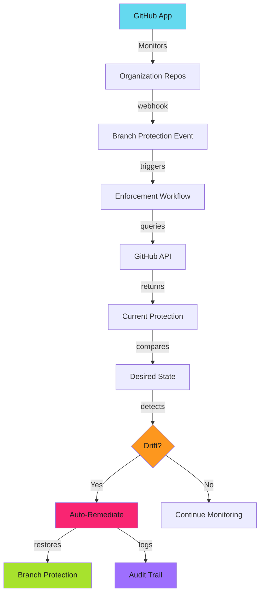
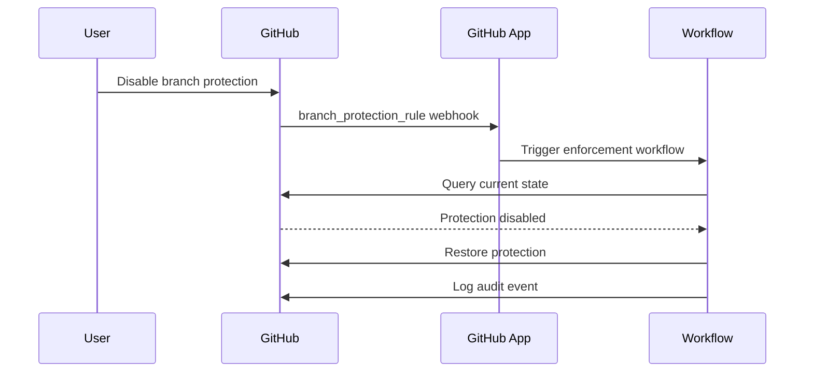
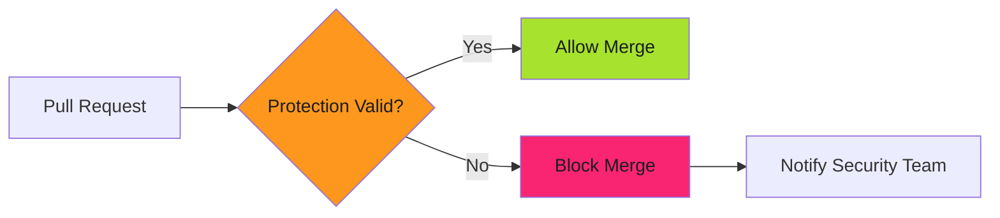

# GitHub App Enforcement

Terraform declares protection. GitHub Apps enforce it. Drift is detected. Remediation is automatic.

!!! warning "Enforcement Without Monitoring is Theater"
    Terraform applies protection once. Developers can disable it. Admins can bypass it. Compliance fails. GitHub Apps provide continuous enforcement.

Manual verification doesn't scale. Automated monitoring detects drift within minutes. Remediation restores protection without human intervention.

---

## The Enforcement Problem

**Common drift scenarios**:

- Developer disables protection during incident, forgets to re-enable
- Admin bypasses protection for emergency fix, never restores
- Repository transferred from personal namespace, inherits no protection
- Protection weakened through GitHub UI without audit trail
- New branches created without protection

**Manual detection**: Weekly audit scripts. Monthly compliance reviews. Always too late.

**Automated enforcement**: Continuous monitoring. Drift detected < 5 minutes. Auto-remediation < 1 minute.

---

## Architecture Overview



**Enforcement flow**: GitHub App monitors repositories → Webhook triggers on protection changes → Workflow queries current state → Compares against desired state → Detects drift → Restores protection → Logs audit event.

---

## Why GitHub Apps

### vs. Personal Access Tokens

**PAT limitations**: Tied to user account. 5000 requests/hour (org-wide). No granular permissions. Poor audit trail.

**GitHub App advantages**: Organization-owned identity. 5000 requests/hour per installation. Fine-grained permissions. Complete audit trail. Survives personnel changes.

### vs. Terraform Alone

**Terraform**: Declarative configuration. Applied manually or via CI. No drift detection.

**GitHub App**: Continuous monitoring. Detects and remediates drift automatically.

**Combined approach**: Terraform declares desired state. GitHub App enforces it continuously.

---

## Required Permissions

### Monitoring Only (Read-Only)

```text
Repository permissions:
  Administration: Read
  Contents: Read

Organization permissions:
  Members: Read
```

**Use when**: Manual approval required. Compliance reporting only.

### Full Enforcement (Read-Write)

```text
Repository permissions:
  Administration: Read & Write
  Contents: Read

Organization permissions:
  Members: Read
```

**Use when**: Automated remediation approved. Production enforcement.

---

## Enforcement Patterns

### Pattern 1: Webhook-Triggered Enforcement

Monitor branch protection changes in real-time.



**Webhook events**: `branch_protection_rule.created`, `branch_protection_rule.edited`, `branch_protection_rule.deleted`

**Response time**: < 1 minute from drift to remediation.

### Pattern 2: Scheduled Compliance Scan

Periodic verification across all repositories.

```yaml
# .github/workflows/compliance-scan.yml
on:
  schedule:
    - cron: '0 */6 * * *'  # Every 6 hours
```

**Scan frequency**: Every 6 hours (standard). Every 1 hour (high-security).

### Pattern 3: Pull Request Gate

Block PRs to repositories with weakened protection.



**Enforcement**: Required status check fails if protection weakened.

---

## GitHub App Setup

See **[GitHub Apps](../../secure/github-apps/index.md)** for detailed setup guide.

**Required configuration**:

- **Name**: `Branch Protection Enforcer`
- **Webhook URL**: `https://github.com/{ORG}/branch-protection-enforcement/actions`
- **Webhook events**: Branch protection rule, Repository
- **Permissions**: Administration (Read & Write), Contents (Read), Pull Requests (Read)

**Store credentials**:

```bash
gh secret set BRANCH_PROTECTION_APP_ID -b "123456"
gh secret set BRANCH_PROTECTION_APP_PRIVATE_KEY < app-private-key.pem
```

---

## Workflow Integration

### Token Generation

```yaml
- name: Generate GitHub App token
  id: app-token
  uses: actions/create-github-app-token@v1
  with:
    app-id: ${{ secrets.BRANCH_PROTECTION_APP_ID }}
    private-key: ${{ secrets.BRANCH_PROTECTION_APP_PRIVATE_KEY }}
    owner: ${{ github.repository_owner }}

- name: Use token
  env:
    GITHUB_TOKEN: ${{ steps.app-token.outputs.token }}
  run: |
    gh api repos/${{ github.repository }}/branches/main/protection
```

See **[Enforcement Workflows](enforcement-workflows.md)** for complete examples.

---

## Desired State Configuration

**Option 1 (Configuration File)**: JSON file with tier mappings per repository.

**Option 2 (Repository Topics)**: Tag repositories with `tier-maximum`, `tier-enhanced`, `tier-standard`.

**Option 3 (Terraform State)**: Query Terraform state to extract desired configuration.

Example configuration file:

```json
{
  "repositories": {
    "api-service": {"tier": "maximum", "branches": ["main"]}
  },
  "tier_configs": {
    "maximum": {
      "required_approving_review_count": 2,
      "enforce_admins": true
    }
  }
}
```

---

## Drift Detection Logic

```python
# detect-drift.py
def detect_drift(current_protection, desired_tier):
    tier_requirements = load_tier_config(desired_tier)
    issues = []

    # Check required reviewers
    if current_protection.get('required_approving_review_count', 0) < tier_requirements['required_reviewers']:
        issues.append('Insufficient required reviewers')

    # Check admin enforcement
    if tier_requirements['enforce_admins'] and not current_protection.get('enforce_admins', {}).get('enabled'):
        issues.append('Admin enforcement disabled')

    # Check required signatures
    if tier_requirements['required_signatures'] and not current_protection.get('required_signatures', {}).get('enabled'):
        issues.append('Required signatures disabled')

    return issues
```

---

## Remediation Strategies

**Immediate Remediation**: Restore protection automatically. Use for Maximum tier.

```bash
gh api --method PUT repos/${ORG}/${REPO}/branches/main/protection --input desired-state.json
```

**Notification + Manual Review**: Detect and notify. Use for Enhanced tier with change management.

**Time-Boxed Bypass**: Allow temporary weakening with auto-restore after delay. See **[Bypass Controls](bypass-controls.md)**.

---

## Monitoring and Alerting

**Key metrics**: Drift frequency, remediation success rate, MTTD, MTTR, recurring drift repositories.

**Alert configuration**:

```yaml
- name: Alert on drift
  uses: slackapi/slack-github-action@v1
  with:
    webhook-url: ${{ secrets.SLACK_WEBHOOK }}
    payload: |
      {"repository": "${{ github.repository }}", "remediated": "${{ steps.remediate.outputs.success }}"}
```

---

## Best Practices

**1. Start with monitoring**: Deploy read-only first. Verify accuracy before auto-remediation.

**2. Use repository topics**: Tag repositories with tier. Enables automated classification.

**3. Graduated response**: Warning for Standard tier. Auto-remediate for Maximum tier.

**4. Log all actions**: Audit trail required. GitHub App events provide immutable log.

**5. Test with canaries**: Verify logic before organization-wide deployment.

**6. Backup verification**: Scheduled scans catch webhook failures.

---

## Troubleshooting

**Issue**: Webhook not triggering enforcement workflow.

**Solution**: Verify webhook configuration. Check delivery history in GitHub App settings. Confirm webhook secret matches.

**Issue**: Permission denied when restoring protection.

**Solution**: Verify GitHub App has `Administration: Read & Write`. Check installation scope includes repository.

**Issue**: Remediation loop (protection continuously reset).

**Solution**: Terraform and GitHub App conflict. Use single source of truth. Disable Terraform auto-apply or GitHub App remediation.

See **[Troubleshooting](troubleshooting.md)** for additional issues.

---

## Related Patterns

- **[Security Tiers](security-tiers.md)**: Tier-based protection configurations
- **[Enforcement Workflows](enforcement-workflows.md)**: Complete workflow examples
- **[Drift Detection](drift-detection.md)**: Detection algorithms and patterns
- **[GitHub Apps Setup](../../secure/github-apps/index.md)**: Core App configuration
- **[Multi-Repo Management](multi-repo-management.md)**: Organization-wide patterns
- **[Bypass Controls](bypass-controls.md)**: Time-boxed exception handling

---

## Next Steps

1. Review **[GitHub Apps Setup](../../secure/github-apps/index.md)** for Core App creation
2. Configure permissions for enforcement pattern
3. Deploy **[Enforcement Workflows](enforcement-workflows.md)** to pilot repositories
4. Enable **[Drift Detection](drift-detection.md)** monitoring
5. Review audit trails and tune remediation thresholds

---

*The app was deployed. Webhooks were configured. Drift was detected in real-time. Remediation was automatic. Protection became immutable. Auditors found zero gaps. Compliance was continuous.*
