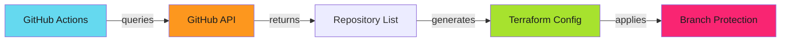
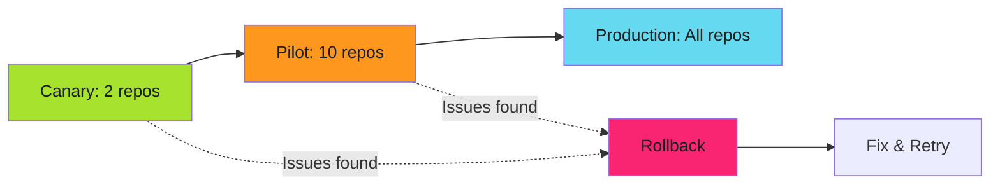

# Multi-Repository Management

One repository is configuration. One hundred repositories is infrastructure. Manual changes don't scale.

!!! warning "Scale Changes Everything"
    Patterns that work for 5 repositories fail at 50. Manual UI configuration becomes impossible. Terraform workspace sprawl creates maintenance nightmares. Organization-wide enforcement requires different architecture.

Discover repositories. Classify by tier. Apply protection as code. Monitor drift. Remediate automatically.
---

## The Challenge

**Manual configuration at scale**:

- 100+ repositories × 4 branches × 15 rules = 6,000+ configurations
- New repositories inherit no protection
- Drift detection requires manual API queries
- Bulk updates take days of manual work
- Emergency changes affect only subset of repositories

**The solution**: Automated discovery, classification, and enforcement.
---

## Architecture Patterns

### Pattern 1: Monolithic Terraform

Single workspace manages all repositories. Simple architecture. Single state file.

**Use when**: < 50 repositories. Homogeneous security tiers.

**Limitation**: Large state file. Slow plan/apply. All-or-nothing changes.

### Pattern 2: Per-Tier Workspaces

Separate workspaces for Standard, Enhanced, Maximum tiers.

**Use when**: 50-200 repositories. Clear tier boundaries.

**Benefit**: Tier isolation. Faster plan/apply. Independent rollouts.

### Pattern 3: Dynamic Configuration

GitHub Actions discovers repositories and generates Terraform configuration automatically.



**Use when**: > 200 repositories. Frequent repository creation.

**Benefit**: No manual repository lists. Auto-discovery. Scales to 1000+ repos.
---

## Repository Discovery

Automated repository classification.

### GitHub API Discovery

```bash
#!/bin/bash
# discover-repos.sh - Discover and classify repositories

gh api --paginate "orgs/my-org/repos" \
  --jq '[.[] | {
    name: .name,
    topics: .topics,
    archived: .archived,
    private: .private
  }]' > repositories.json
```

### Topic-Based Classification

Use GitHub topics for tier assignment.

```bash
# Apply topics for automated classification
gh api --method PUT repos/my-org/api-service/topics \
  --field names[]="production" \
  --field names[]="tier-maximum"
```

### Convention-Based Classification

```python
# classify.py - Repository tier classification
def classify_repository(repo):
    name = repo['name'].lower()

    # Maximum tier: security-critical patterns
    if any(p in name for p in ['auth', 'crypto', 'security', 'payment']):
        return 'maximum'

    # Enhanced tier: production services
    if repo['topics'] and 'production' in repo['topics']:
        return 'enhanced'

    # Standard tier: documentation and tools
    if any(p in name for p in ['docs', 'tool', 'script']):
        return 'standard'

    # Default: Enhanced for private, Standard for public
    return 'enhanced' if repo['private'] else 'standard'
```
---

## Dynamic Terraform Generation

Generate configuration from repository data.

### Repository Data File

```json
{
  "repositories": {
    "api-service": {"tier": "maximum", "branches": ["main", "staging"]},
    "web-app": {"tier": "enhanced", "branches": ["main"]},
    "docs-site": {"tier": "standard", "branches": ["main"]}
  }
}
```

### Generation Script

```python
#!/usr/bin/env python3
# generate-terraform.py
import json

with open('repositories.json') as f:
    data = json.load(f)

for repo_name, config in data['repositories'].items():
    tier = config['tier']
    for branch in config.get('branches', ['main']):
        print(f"""
module "{repo_name}_{branch}" {{
  source          = "./modules/branch-protection-{tier}"
  repository_name = "{repo_name}"
  branch_pattern  = "{branch}"
}}""")
```

Apply:

```bash
python3 generate-terraform.py > generated.tf
terraform init
terraform plan
```
---

## Bulk Updates

### GitHub Actions Workflow

```yaml
# .github/workflows/bulk-update.yml
name: Bulk Branch Protection Update

on:
  workflow_dispatch:
    inputs:
      tier:
        description: 'Security tier to update'
        required: true
        type: choice
        options: [standard, enhanced, maximum]

jobs:
  update:
    runs-on: ubuntu-latest
    steps:
      - uses: actions/checkout@v4

      - name: Generate GitHub App token
        id: app-token
        uses: actions/create-github-app-token@v1
        with:
          app-id: ${{ secrets.GITHUB_APP_ID }}
          private-key: ${{ secrets.GITHUB_APP_PRIVATE_KEY }}
          owner: ${{ github.repository_owner }}

      - uses: hashicorp/setup-terraform@v3

      - name: Apply
        run: |
          terraform init
          terraform apply -auto-approve
        working-directory: ./terraform/${{ inputs.tier }}
        env:
          GITHUB_TOKEN: ${{ steps.app-token.outputs.token }}
```
---

## Staged Rollout

Test changes before organization-wide deployment.



### Implementation

```hcl
# terraform/enhanced-tier/main.tf
variable "rollout_stage" {
  description = "Rollout stage: canary, pilot, production"
  type        = string
  default     = "canary"
}

locals {
  canary_repos = ["test-repo-1", "test-repo-2"]
  pilot_repos  = concat(local.canary_repos, ["internal-tool-1", "internal-tool-2"])
  all_repos    = [] # ... all repositories

  active_repos = (
    var.rollout_stage == "canary" ? local.canary_repos :
    var.rollout_stage == "pilot" ? local.pilot_repos :
    local.all_repos
  )
}

module "protection" {
  for_each        = toset(local.active_repos)
  source          = "./modules/branch-protection-enhanced"
  repository_name = each.key
}
```

Apply stages:

```bash
terraform apply -var="rollout_stage=canary"   # Monitor 24h
terraform apply -var="rollout_stage=pilot"    # Monitor 48h
terraform apply -var="rollout_stage=production"
```
---

## Monitoring and Compliance

### Compliance Dashboard

```bash
#!/bin/bash
# compliance-check.sh - Generate compliance report
ORG="my-org"

echo "Repository,Protected,Enforce Admins,Required Reviewers"

gh api --paginate "orgs/${ORG}/repos" --jq '.[] | .name' | while read repo; do
  protection=$(gh api "repos/${ORG}/${repo}/branches/main/protection" 2>/dev/null || echo "null")

  if [ "$protection" = "null" ]; then
    echo "${repo},false,false,0"
  else
    enforce=$(echo "$protection" | jq -r '.enforce_admins.enabled')
    reviews=$(echo "$protection" | jq -r '.required_pull_request_reviews.required_approving_review_count // 0')
    echo "${repo},true,${enforce},${reviews}"
  fi
done
```

### Drift Detection

See **[Drift Detection](drift-detection.md)** for automated monitoring patterns.
---

## Best Practices

**1. Start with discovery**: Audit current state before making changes.

**2. Use topic-based classification**: GitHub topics enable automated tier assignment.

**3. Implement staged rollouts**: Test on canary repositories first.

**4. Separate state by tier**: Isolate Standard, Enhanced, Maximum configurations.

**5. Use GitHub Apps for auth**: Personal access tokens don't scale. See [GitHub Apps](../../secure/github-apps/index.md).

**6. Version Terraform modules**: Pin module versions to prevent unintended changes.
---

## Troubleshooting

**Issue**: Terraform state file too large (> 100MB).

**Solution**: Split into per-tier workspaces or implement dynamic generation.

**Issue**: API rate limiting during bulk operations.

**Solution**: Use GitHub App authentication (5000 req/hour vs 60 for PAT). Implement exponential backoff.

**Issue**: Repository not found during Terraform apply.

**Solution**: Repository was archived or renamed. Update repository list. Use `terraform state rm` to remove.

See **[Troubleshooting](troubleshooting.md)** for more issues.
---

## Related Patterns

- **[Security Tiers](security-tiers.md)** - Tier classification and templates
- **[OpenTofu Modules](opentofu-modules.md)** - OpenTofu-specific patterns
- **[GitHub App Enforcement](github-app-enforcement.md)** - Automated drift remediation
- **[Drift Detection](drift-detection.md)** - Organization-wide monitoring
- **[Audit Evidence](audit-evidence.md)** - Compliance reporting at scale
---

## Next Steps

1. Run repository discovery to classify existing repositories
2. Choose architecture pattern based on repository count
3. Implement staged rollout starting with canary repositories
4. Deploy drift detection for continuous monitoring

For advanced enforcement, see **[GitHub App Enforcement](github-app-enforcement.md)**.
---

*One hundred repositories were discovered. Tiers were assigned. Protection was applied in waves. Drift was impossible. Compliance became continuous. Manual work disappeared.*
