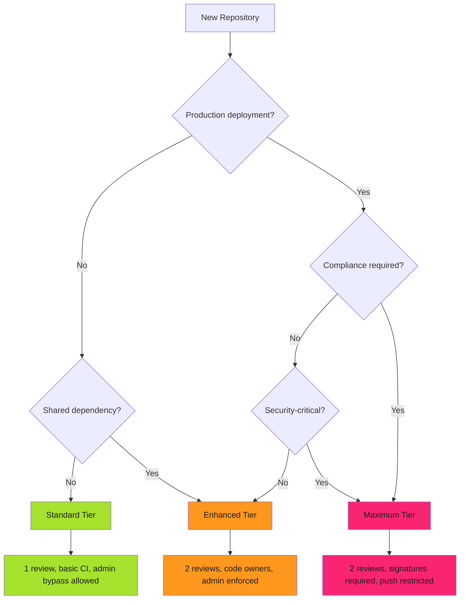

# Security Tiers

Not all repositories require maximum protection. Documentation repos need lighter controls. Production infrastructure demands full enforcement.

!!! tip "Right-Sized Security"
    Over-protection creates friction. Under-protection creates risk. Match enforcement to blast radius.

Three tiers. Standard for internal tools. Enhanced for production services. Maximum for security-critical systems.

---

## Tier Comparison

| Control | Standard | Enhanced | Maximum |
|---------|----------|----------|---------|
| **Required reviews** | 1 | 2 | 2 |
| **Dismiss stale reviews** | ✅ | ✅ | ✅ |
| **Code owner reviews** | ❌ | ✅ | ✅ |
| **Require last push approval** | ❌ | ❌ | ✅ |
| **Required status checks** | Basic | Comprehensive | Comprehensive + Security |
| **Strict status checks** | ✅ | ✅ | ✅ |
| **Enforce admins** | ❌ | ✅ | ✅ |
| **Linear history** | ✅ | ✅ | ✅ |
| **Force push protection** | ✅ | ✅ | ✅ |
| **Deletion protection** | ✅ | ✅ | ✅ |
| **Required signatures** | ❌ | ❌ | ✅ |
| **Conversation resolution** | ❌ | ✅ | ✅ |

---

## Standard Tier

Basic protection for internal repositories.

**Use cases**: Documentation, internal tools, development sandboxes, POCs, non-production experiments.

**Key features**: One required review. Basic CI checks. Admin bypass allowed. Linear history enforced.

### Configuration

```json
{
  "required_status_checks": {
    "strict": true,
    "contexts": ["ci/tests", "lint/code-quality"]
  },
  "enforce_admins": false,
  "required_pull_request_reviews": {
    "required_approving_review_count": 1,
    "dismiss_stale_reviews": true,
    "require_code_owner_reviews": false
  },
  "restrictions": null,
  "required_linear_history": true,
  "allow_force_pushes": false,
  "allow_deletions": false
}
```

Apply via GitHub CLI:

```bash
gh api --method PUT \
  repos/org/docs-site/branches/main/protection \
  --input standard-tier.json
```

---

## Enhanced Tier

Production-grade protection with multi-reviewer requirements.

**Use cases**: Production services, customer-facing apps, shared libraries, platform infrastructure.

**Key features**: Two required reviews. Code owner reviews. Admin enforcement. Comprehensive status checks (tests, SAST, dependency scanning). Conversation resolution required.

### Configuration

```json
{
  "required_status_checks": {
    "strict": true,
    "contexts": [
      "ci/tests",
      "ci/integration-tests",
      "lint/code-quality",
      "security/sast",
      "security/dependency-scan"
    ]
  },
  "enforce_admins": true,
  "required_pull_request_reviews": {
    "required_approving_review_count": 2,
    "dismiss_stale_reviews": true,
    "require_code_owner_reviews": true,
    "dismissal_restrictions": {
      "teams": ["platform-leads"]
    }
  },
  "required_linear_history": true,
  "allow_force_pushes": false,
  "allow_deletions": false,
  "required_conversation_resolution": true
}
```

Code owner reviews require `.github/CODEOWNERS`:

```text
/api/**           @backend-team
/infrastructure/** @platform-team
/security/**      @security-team
```

Apply via GitHub CLI:

```bash
gh api --method PUT \
  repos/org/api-service/branches/main/protection \
  --input enhanced-tier.json
```

---

## Maximum Tier

Maximum protection with cryptographic proof.

**Use cases**: Security-critical systems (auth, authorization), compliance-regulated code (PCI-DSS, HIPAA, FedRAMP), infrastructure as code, release automation.

**Key features**: Two required reviews with last push approval. Required commit signatures (GPG/SSH). Push restrictions. Full security suite (SAST, dependency, container, IaC scanning, SBOM).

### Configuration

```json
{
  "required_status_checks": {
    "strict": true,
    "contexts": [
      "ci/tests",
      "ci/integration-tests",
      "ci/e2e-tests",
      "lint/code-quality",
      "security/sast",
      "security/dependency-scan",
      "security/container-scan",
      "security/iac-scan",
      "compliance/license-check",
      "compliance/sbom-generation"
    ]
  },
  "enforce_admins": true,
  "required_pull_request_reviews": {
    "required_approving_review_count": 2,
    "dismiss_stale_reviews": true,
    "require_code_owner_reviews": true,
    "require_last_push_approval": true,
    "dismissal_restrictions": {
      "teams": ["security-leads"]
    }
  },
  "restrictions": {
    "teams": ["release-engineers"]
  },
  "required_linear_history": true,
  "allow_force_pushes": false,
  "allow_deletions": false,
  "required_conversation_resolution": true,
  "required_signatures": true
}
```

Apply via GitHub CLI:

```bash
gh api --method PUT \
  repos/org/auth-service/branches/main/protection \
  --input maximum-tier.json
```

Verify signatures:

```bash
git log --show-signature
# Output: gpg: Good signature from "Alice <alice@example.com>"
```

See [Commit Signing](../commit-signing/commit-signing.md) for GPG setup.

---

## Tier Selection Decision Tree



**Decision criteria**:

1. **Production deployment?** → Enhanced or Maximum
2. **Compliance required?** (SOC 2, PCI-DSS, HIPAA) → Maximum
3. **Security-critical?** (auth, crypto, IAM) → Maximum
4. **Shared dependency?** (library, SDK) → Enhanced
5. **Documentation/tools only?** → Standard

---

## Tier Migration

### Upgrading Standard → Enhanced

```bash
# Backup and apply
gh api repos/org/repo/branches/main/protection > backup.json
gh api --method PUT repos/org/repo/branches/main/protection --input enhanced-tier.json

# Verify
gh api repos/org/repo/branches/main/protection --jq '.enforce_admins.enabled'
# Output: true
```

**Impact**: PRs need 2nd approval. Admin bypass disabled. Code owners required.

**Mitigation**: Add CODEOWNERS first. Notify team. Update emergency procedures.

### Upgrading Enhanced → Maximum

```bash
# Backup and apply
gh api repos/org/repo/branches/main/protection > backup.json
gh api --method PUT repos/org/repo/branches/main/protection --input maximum-tier.json

# Verify
gh api repos/org/repo/branches/main/protection --jq '.required_signatures.enabled'
# Output: true
```

**Impact**: Unsigned commits blocked. Push restrictions applied. Additional status checks required.

**Mitigation**: Configure commit signing. Set up additional security scanning. Add teams to push restrictions.

### Downgrading Tiers

```bash
gh api repos/org/repo/branches/main/protection > backup.json
gh api --method PUT repos/org/repo/branches/main/protection --input enhanced-tier.json
```

**Warning**: Downgrading removes enforcement. Document justification. Requires approval.

---

## At Scale Implementation

For organization-wide tier enforcement:

- **[Multi-Repo Management](multi-repo-management.md)** - 100+ repository patterns
- **[GitHub App Enforcement](github-app-enforcement.md)** - Centralized automation
- **[Drift Detection](drift-detection.md)** - Compliance monitoring

For infrastructure as code:

- **[OpenTofu Modules](opentofu-modules.md)** - Declarative tier management

---

## Audit Evidence

Document tier assignments for compliance.

```json
{
  "organization": "my-org",
  "tier_policy_version": "2.1",
  "repositories": [
    {
      "name": "auth-service",
      "tier": "maximum",
      "justification": "Authentication system - security-critical",
      "compliance_requirements": ["SOC2", "ISO27001"],
      "approved_by": "security-team",
      "approval_date": "2025-12-01"
    }
  ]
}
```

See [Audit Evidence](audit-evidence.md) and [Compliance Reporting](compliance-reporting.md) for automated patterns.

---

## Related Patterns

- **[Branch Protection Rules](branch-protection.md)** - Detailed configuration reference
- **[Multi-Repo Management](multi-repo-management.md)** - Organization-wide enforcement
- **[GitHub App Enforcement](github-app-enforcement.md)** - Centralized automation
- **[Drift Detection](drift-detection.md)** - Compliance monitoring
- **[Emergency Access](emergency-access.md)** - Break-glass procedures
- **[Commit Signing](../commit-signing/commit-signing.md)** - GPG setup for Maximum tier

---

*Three tiers were defined. Repositories were classified. Protection was applied. Auditors found perfect compliance. The controls matched the risk.*
