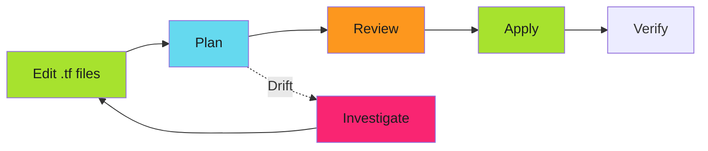

# Terraform Modules

Branch protection as infrastructure. Declare the rules. Apply across repositories. Version the configuration.

!!! tip "Infrastructure as Code for Security"
    Terraform transforms branch protection from manual configuration into versioned, auditable, repeatable infrastructure. Changes require code review. Drift is detected automatically.

Manual GitHub UI configuration doesn't scale. Terraform eliminates manual work.

---

## GitHub Provider Setup

Configure the GitHub Terraform provider.

```hcl
# terraform.tf
terraform {
  required_providers {
    github = {
      source  = "integrations/github"
      version = "~> 6.0"
    }
  }

  backend "gcs" {
    bucket = "my-org-terraform-state"
    prefix = "github/branch-protection"
  }
}

provider "github" {
  owner = "my-org"

  app_auth {
    id              = var.github_app_id
    installation_id = var.github_app_installation_id
    pem_file        = var.github_app_pem_file
  }
}
```

**Authentication**: Use GitHub App for production. See [GitHub Apps](../../secure/github-apps/index.md).

---

## Basic Module

Reusable module for branch protection.

```hcl
# modules/branch-protection/main.tf
resource "github_branch_protection" "main" {
  repository_id = var.repository_name
  pattern       = var.branch_pattern

  required_pull_request_reviews {
    required_approving_review_count = var.required_reviewers
    dismiss_stale_reviews           = var.dismiss_stale_reviews
    require_code_owner_reviews      = var.require_code_owner_reviews
  }

  required_status_checks {
    strict   = var.strict_status_checks
    contexts = var.required_status_checks
  }

  enforce_admins          = var.enforce_admins
  require_signed_commits  = var.require_signed_commits
  required_linear_history = var.required_linear_history
  allow_force_pushes      = false
  allow_deletions         = false
}
```

### Key Variables

```hcl
# modules/branch-protection/variables.tf
variable "repository_name" {
  description = "Repository name"
  type        = string
}

variable "required_reviewers" {
  description = "Number of required approving reviews"
  type        = number
  default     = 1
}

variable "enforce_admins" {
  description = "Enforce rules for administrators"
  type        = bool
  default     = false
}

variable "required_status_checks" {
  description = "Status check contexts that must pass"
  type        = list(string)
  default     = []
}
```

---

## Security Tier Modules

Pre-configured modules matching tier templates. See **[Security Tiers](security-tiers.md)**.

### Standard Tier

```hcl
# modules/branch-protection-standard/main.tf
module "standard_protection" {
  source = "../branch-protection"

  repository_name        = var.repository_name
  required_reviewers     = 1
  enforce_admins         = false
  required_status_checks = ["ci/tests", "lint/code-quality"]
}
```

### Enhanced Tier

```hcl
# modules/branch-protection-enhanced/main.tf
module "enhanced_protection" {
  source = "../branch-protection"

  repository_name            = var.repository_name
  required_reviewers         = 2
  enforce_admins             = true
  require_code_owner_reviews = true
  required_status_checks     = [
    "ci/tests",
    "security/sast",
    "security/dependency-scan"
  ]
}
```

### Maximum Tier

```hcl
# modules/branch-protection-maximum/main.tf
module "maximum_protection" {
  source = "../branch-protection"

  repository_name            = var.repository_name
  required_reviewers         = 2
  enforce_admins             = true
  require_code_owner_reviews = true
  require_signed_commits     = true
  required_status_checks     = [
    "ci/tests",
    "security/sast",
    "security/container-scan",
    "compliance/license-check"
  ]
}
```

### Usage

```hcl
# Enhanced tier for production API
module "api_service" {
  source          = "./modules/branch-protection-enhanced"
  repository_name = "api-service"
}

# Maximum tier for auth service
module "auth_service" {
  source          = "./modules/branch-protection-maximum"
  repository_name = "auth-service"
}
```

---

## Workflow

### Development Flow



### Commands

```bash
# Initialize
terraform init

# Plan
terraform plan

# Apply
terraform apply

# Detect drift
terraform plan
```

---

## Import Existing Protection

```bash
# Inspect current protection
gh api repos/my-org/api-service/branches/main/protection > current.json

# Import into state
terraform import 'module.api_service.github_branch_protection.main' \
  'api-service:main'

# Verify
terraform plan
```

---

## Verification

### Check Plan

```bash
terraform plan

# Example drift:
# ~ enforce_admins = true -> false
```

### Manual Check

```bash
gh api repos/my-org/api-service/branches/main/protection \
  --jq '{
    enforce_admins: .enforce_admins.enabled,
    required_reviews: .required_pull_request_reviews.required_approving_review_count
  }'
```

---

## Troubleshooting

**Issue**: `Error: repository not found`

```hcl
repository_name = "api-service"  # Correct
repository_name = "my-org/api-service"  # Wrong (no org prefix)
```

**Issue**: `Error: Branch not found`

```bash
# Branch must exist before applying protection
gh api repos/my-org/api-service/branches/main
```

**Issue**: Drift detected

```bash
terraform plan  # Shows changes
terraform apply # Restores protection
```

See **[Troubleshooting](troubleshooting.md)**.

---

## Best Practices

### 1. Version Control

```bash
terraform/
├── main.tf
├── variables.tf
└── modules/
    ├── branch-protection/
    ├── branch-protection-standard/
    ├── branch-protection-enhanced/
    └── branch-protection-maximum/
```

### 2. Use Tier Modules

```hcl
# ❌ Don't repeat configuration
module "repo1" {
  source = "./modules/branch-protection"
  required_reviewers = 2
  enforce_admins = true
  # ... 15 more variables
}

# ✅ Use tier modules
module "repo1" {
  source          = "./modules/branch-protection-enhanced"
  repository_name = "repo1"
}
```

### 3. Require Code Review

```yaml
# CODEOWNERS
/terraform/**  @platform-team @security-team
```

---

## Multi-Repository Patterns

For organization-wide enforcement across 100+ repositories, see **[Multi-Repo Management](multi-repo-management.md)**.

---

## Related Patterns

- **[Security Tiers](security-tiers.md)** - Pre-configured tier templates
- **[OpenTofu Modules](opentofu-modules.md)** - OpenTofu patterns
- **[Multi-Repo Management](multi-repo-management.md)** - Organization-wide enforcement
- **[Drift Detection](drift-detection.md)** - Automated monitoring
- **[GitHub Apps Setup](../../secure/github-apps/index.md)** - Authentication

---

## Next Steps

1. Set up GitHub provider with organization-wide authentication
2. Import existing protection to establish baseline
3. Refactor to tier modules for consistency
4. Enable CI/CD for automated plan/apply
5. Configure drift detection for compliance

For organization-wide patterns, see **[Multi-Repo Management](multi-repo-management.md)**.

For alternative IaC tool, see **[OpenTofu Modules](opentofu-modules.md)**.

---

*Protection was declared as code. State was versioned. Changes required review. Drift was impossible.*
