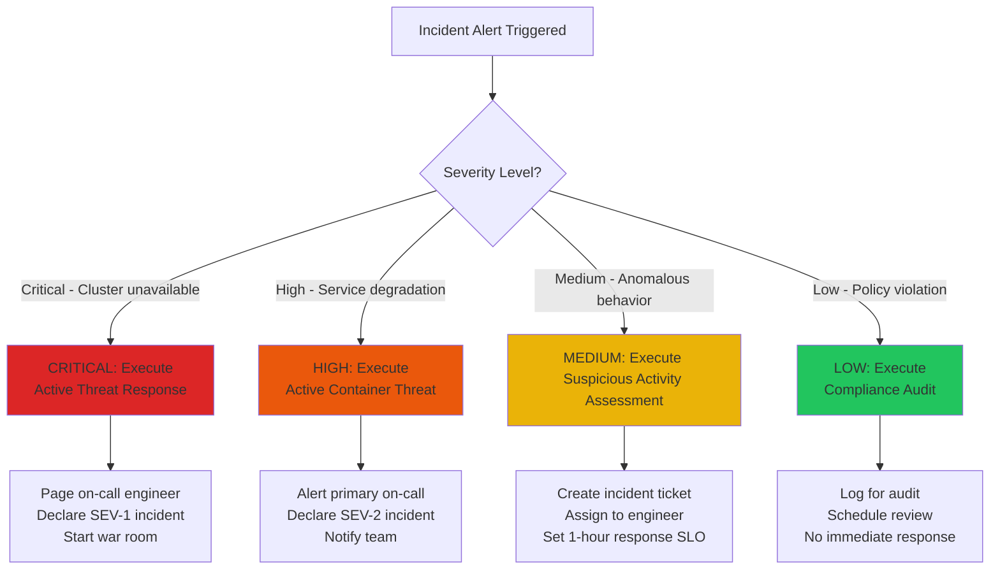

# Incident Response Playbook Templates

Operational runbooks for Kubernetes security incidents. Each playbook combines decision trees, step-by-step procedures, and validation criteria to enable rapid, confident response to common incident patterns.

This library is designed for teams operating Kubernetes infrastructure at scale, where incident response speed and consistency directly impact security posture and business continuity.

---

## How to Use This Library

### Before an Incident

1. **Review** each playbook relevant to your environment and threat model
2. **Customize** commands and thresholds for your cluster configuration
3. **Test** playbook steps in non-production environments
4. **Train** on-call engineers on decision trees and escalation paths
5. **Integrate** with monitoring and alerting systems

### During an Incident

1. **Identify** which playbook applies using decision trees
2. **Follow** procedures in sequence without skipping steps
3. **Document** actions and timestamps as you proceed
4. **Validate** success criteria before moving to next phase
5. **Escalate** if playbook doesn't resolve issue or if conditions change

### After an Incident

1. **Collect** evidence using post-incident procedures
2. **Complete** RCA templates to identify root causes
3. **Track** improvements in incident tracking system
4. **Update** playbooks based on lessons learned

---

## Playbook Categories

!!! info "Detection Playbooks"
    Initial assessment and threat classification procedures. Use these when alerts fire to quickly determine incident severity and appropriate response path.

    *Coming soon: Detection playbook templates*

!!! warning "Response Playbooks"
    Active containment and isolation procedures. Execute these to prevent incident spread and preserve forensic evidence.

    *Coming soon: Response playbook templates*

!!! success "Recovery Playbooks"
    Remediation and service restoration procedures. Apply these after containment to return to normal operations with verified fixes.

    *Coming soon: Recovery playbook templates*

!!! note "Practice Exercises"
    Tabletop exercises and simulation scenarios. Use these to train teams and validate playbook effectiveness before real incidents.

    *Coming soon: Tabletop exercise templates*

---

## Alert Classification Decision Tree

---

## Quick Reference: Incident Severity Levels

| Level | Criteria | Response | Playbook |
|---|---|---|---|
| **SEV-1 (Critical)** | Cluster unavailable, widespread pod failures, data loss risk | Page all on-call, declare war room, 15-min SLO | Detection → Containment → Remediation (parallel) |
| **SEV-2 (High)** | Service degradation, one pod compromised, customer impact | Page primary on-call, 1-hour SLO | Detection → Containment → Remediation (sequential) |
| **SEV-3 (Medium)** | Anomalous behavior, no customer impact, security alert | Create ticket, assign to engineer, 4-hour SLO | Detection → Investigation (no immediate action) |
| **SEV-4 (Low)** | Policy violation, compliance finding, no immediate threat | Log for audit, schedule review, no SLO | Audit only, no immediate action |

---

## Continuous Improvement

### Playbook Review Schedule

- **Monthly:** Review alerts that triggered playbooks for false positives
- **Quarterly:** Update playbooks based on lessons learned from incidents
- **Semi-annually:** Review against new threats and attack patterns
- **Annually:** Comprehensive review and rewrite of all playbooks

### Metrics to Track

- **Time to Detect:** Goal: < 5 minutes from incident start
- **Time to Contain:** Goal: < 15 minutes from detection
- **Time to Resolve:** Goal: < 1 hour from detection
- **Accuracy:** % of playbook steps that applied without modification
- **False Positives:** % of alerts that weren't actual incidents

### Feedback Loop

After each incident:

1. RCA identifies gaps in playbook
2. Update playbook with lessons learned
3. Add new alert rules for faster detection
4. Update runbook links in monitoring
5. Run training on updated playbook
6. Update metrics and SLOs based on performance

---

## Additional Resources

- **Kubernetes Security Documentation:** <https://kubernetes.io/docs/concepts/security/>
- **Network Policies:** <https://kubernetes.io/docs/concepts/services-networking/network-policies/>
- **RBAC Authorization:** <https://kubernetes.io/docs/reference/access-authn-authz/rbac/>
- **Audit Logging:** <https://kubernetes.io/docs/tasks/debug-application-cluster/audit/>
- **Pod Security Standards:** <https://kubernetes.io/docs/concepts/security/pod-security-standards/>

---

## Version History

| Version | Date | Changes |
|---|---|---|
| 1.0 | 2026-01-02 | Initial version with Detection, Containment, Remediation, and Post-Incident playbooks |

---

## Contact and Support

For playbook updates, questions, or incident support:

- **On-Call:** Page the primary on-call through your alerting system
- **Playbook Issues:** File GitHub issue in the incident-response repository
- **Training:** Contact your security/SRE team lead
- **Escalation:** Use the escalation phone tree in your incident response plan
