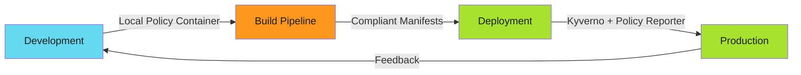

# Kyverno CI/CD Integration

Policy enforcement across the entire software development lifecycle: development → build → deploy. Shift-left catches issues early. Shift-down enforces at runtime.

---

## Architecture Overview



**Three enforcement layers:**

1. **Development** - Local container with Kyverno CLI
2. **Build** - CI/CD pipeline validation
3. **Deploy** - Runtime admission control

---

## Development Phase: Local Validation

!!! tip "Quick Start"
    This guide is part of a modular documentation set. Refer to related guides in the navigation for complete context.

Run policy container locally before committing:

```bash
# Pull policy platform container
docker pull europe-west6-docker.pkg.dev/neon-free-ops/operations/policy-platform:latest

# Validate Helm chart against policies
docker run --rm \
  -v $(pwd)/charts:/charts \
  -v $(pwd)/policies:/policies \
  policy-platform:latest \
  kyverno apply /policies --resource <(helm template /charts/myapp)
```

### Container Includes

- **Kyverno CLI** - Policy validation
- **Pluto** - Deprecated API detection
- **Helm** - Chart linting

### Pre-Commit Hook

```bash
# .git/hooks/pre-commit
#!/bin/bash
docker run --rm \
  -v $(pwd):/workspace \
  policy-platform:latest \
  kyverno apply /workspace/policies --resource /workspace/manifests

if [ $? -ne 0 ]; then
  echo "Policy validation failed. Commit blocked."
  exit 1
fi
```

Developers catch violations before pushing.

---

## Build Phase: CI/CD Validation

### GitHub Actions

```yaml
name: Policy Validation
on: [push, pull_request]
jobs:
  validate-policies:
    runs-on: ubuntu-latest
    container:
      image: europe-west6-docker.pkg.dev/neon-free-ops/operations/policy-platform:latest
      credentials:
        username: _json_key
        password: ${{ secrets.GCP_SA_KEY }}
    steps:
      - uses: actions/checkout@v4

      - name: Render Helm templates
        run: |
          helm template charts/myapp > manifests.yaml

      - name: Validate against security policies
        run: |
          kyverno apply policies/security/ --resource manifests.yaml --remove-color

      - name: Validate against DevOps policies
        run: |
          kyverno apply policies/devops/ --resource manifests.yaml --remove-color

      - name: Check for deprecated APIs
        run: |
          pluto detect manifests.yaml

      - name: Generate policy report
        run: |
          kyverno apply policies/ --resource manifests.yaml --policy-report > policy-report.yaml

      - uses: actions/upload-artifact@v4
        with:
          name: policy-report
          path: policy-report.yaml
```

### Bitbucket Pipelines

```yaml
---
image:
  name: europe-west6-docker.pkg.dev/neon-free-ops/operations/policy-platform
  username: _json_key
  password: "$GCLOUD_API_KEYFILE"
pipelines:
  default:
    - step:
        name: Policy Validation
        script:
          # Render Helm chart
          - helm template charts/backend-app > manifests.yaml

          # Summary report
          - kyverno apply policies/ --resource manifests.yaml --remove-color

          # Table format
          - kyverno apply policies/ --resource manifests.yaml -t --remove-color

          # Full YAML report
          - kyverno apply policies/ --resource manifests.yaml --policy-report > report.yaml

        artifacts:
          - manifests.yaml
          - report.yaml
```

**Pipeline blocks merges** if policies fail. Non-compliant code can't reach production.

---

## Deploy Phase: Runtime Enforcement

### Kyverno Deployment via Helm

```yaml
# charts/policy-platform/values.yaml
kyverno:
  replicaCount: 3
  image:
    repository: ghcr.io/kyverno/kyverno
    tag: v1.11.4

  config:
    webhooks:
      - admissionReviewVersions: ["v1"]
        failurePolicy: Fail  # Block on policy failure
        sideEffects: None

  policies:
    # Pull policies from ConfigMaps/remote sources
    sources:
      - git: https://github.com/kyverno/policies
      - oci: gcr.io/project/policies:v1.0.0
```

Deploy to clusters via Argo CD:

```yaml
# argocd-application.yaml
apiVersion: argoproj.io/v1alpha1
kind: Application
metadata:
  name: policy-platform
  namespace: argocd
spec:
  project: security
  source:
    repoURL: https://github.com/org/policy-platform
    targetRevision: HEAD
    path: charts/policy-platform
    helm:
      valueFiles:
        - values-production.yaml
  destination:
    server: https://kubernetes.default.svc
    namespace: kyverno
  syncPolicy:
    automated:
      prune: true
      selfHeal: true
```

### Environment-Specific Policies

```bash
cd/
├── dev/values.yaml          # Audit mode, relaxed policies
├── qac/values.yaml          # Audit mode, production-like policies
├── stg/values.yaml          # Enforce mode, full policies
├── prd/values.yaml          # Enforce mode, full policies + alerts
└── ops/values.yaml          # Enforce mode, infrastructure policies
```

---
