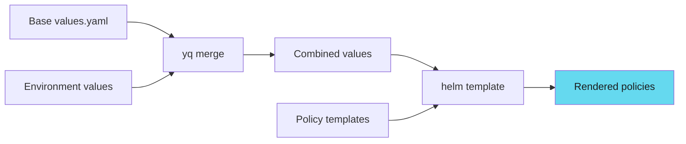

# Policy Management

Rendering, versioning, and discovering policies from multiple sources.

## Policy Rendering Pipeline

### How Policies Are Rendered



**Example command**:

```bash
# Merge base + environment values
yq eval-all 'select(fileIndex == 0) * select(fileIndex == 1)' \
  /repos/security-policy/charts/security-policy/values.yaml \
  /repos/security-policy/cd/prd/values.yaml \
> merged-values.yaml

# Render policies
helm template security-policy \
  /repos/security-policy/charts/security-policy \
  -f merged-values.yaml \
> security-policies.yaml
```

!!! tip "Two-Stage Rendering"
    Always merge values first with `yq`, then render with `helm template`. This ensures environment-specific values override base values correctly.

---

## Environment-Specific Enforcement

### Base Values

**charts/security-policy/values.yaml** (defaults):

```yaml
policies:
  resourceLimits:
    enabled: true
    validationFailureAction: Audit

  imageTag:
    enabled: true
    allowLatest: true
    validationFailureAction: Audit

  privileged:
    enabled: true
    validationFailureAction: Enforce
```

### Development Override

**cd/dev/values.yaml**:

```yaml
policies:
  resourceLimits:
    validationFailureAction: Audit  # Warn only

  imageTag:
    allowLatest: true
    validationFailureAction: Audit
```

### Production Override

**cd/prd/values.yaml**:

```yaml
policies:
  resourceLimits:
    validationFailureAction: Enforce  # Block violations

  imageTag:
    allowLatest: false
    validationFailureAction: Enforce
```

!!! warning "Production Must Be Stricter"
    Same policy templates. Different enforcement per environment. Production policies must never be more permissive than dev.

---

## Policy Versioning Strategy

### Semantic Versioning

Each policy repo uses semantic versioning:

```yaml
# Chart.yaml
apiVersion: v2
name: security-policy
version: 2.1.2
appVersion: 2.1.2
```

**Version meaning**:

- **Major** (2.x.x): Breaking changes, new required fields
- **Minor** (x.1.x): New policies, non-breaking changes
- **Patch** (x.x.2): Bug fixes, policy refinements

### Pinning Policy Versions

Pin specific policy versions in CI:

```bash
# Use specific version
docker pull policy-platform:v1.0.2

# Or pin policy repo versions
helm template security-policy /repos/security-policy/charts/security-policy \
  --version 2.1.2
```

---

## Policy Discovery

### Listing Available Policies

```bash
# List all policies in container
docker run --rm policy-platform:latest \
  find /repos -name "*.yaml" -path "*/templates/*"
```

**Output**:

```text
/repos/security-policy/charts/security-policy/templates/require-resource-limits.yaml
/repos/security-policy/charts/security-policy/templates/disallow-latest-tag.yaml
/repos/devops-policy/charts/devops-policy/templates/require-labels.yaml
/repos/devops-policy/charts/devops-policy/templates/naming-conventions.yaml
```

### Policy Metadata

Extract policy information:

```bash
# Get policy names and descriptions
docker run --rm policy-platform:latest \
  yq eval '.metadata.name, .metadata.annotations["policies.kyverno.io/title"]' \
  /repos/security-policy/charts/security-policy/templates/*.yaml
```

---

## Conflict Resolution

### Handling Overlapping Policies

When multiple repos define similar policies:

#### Strategy 1: Namespace policies

```yaml
metadata:
  name: security-require-resource-limits  # Prefix with source

metadata:
  name: devops-require-resource-limits
```

#### Strategy 2: Policy precedence

Security policies override DevOps policies:

```bash
# Apply in order: DevOps first, Security last
kyverno apply devops-policy.yaml --resource app.yaml
kyverno apply security-policy.yaml --resource app.yaml
```

#### Strategy 3: Merge policies

Combine rules into single policy during Helm rendering.

!!! note "Namespace by Source"
    Prefix policy names with their source repository (security-, devops-, app-). This prevents conflicts and makes policy ownership clear.

---

## Next Steps

- **[Testing and Operations](testing-and-operations.md)** - Test multi-source policies
- **[Policy Packaging](../policy-packaging/index.md)** - Build the policy-platform container
- **[Operations](../operations/index.md)** - Day-to-day policy management
