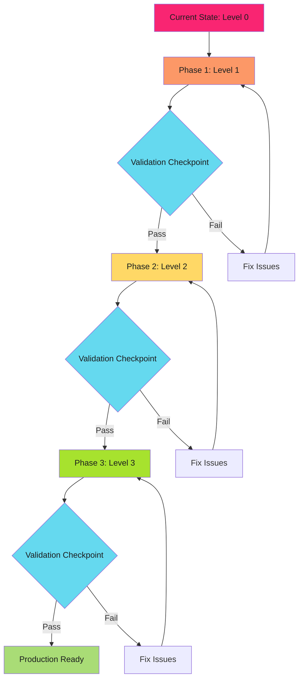
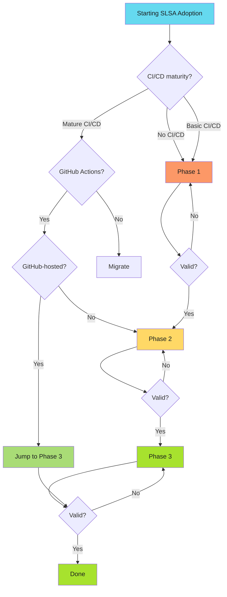

---
tags:
  - slsa
  - provenance
  - supply-chain
  - security
  - attestation
  - adoption
  - migration
  - developers
  - operators
  - security-teams
description: >-
  SLSA adoption roadmap: phased approach from Level 1 to Level 3 with validation checkpoints and rollback strategies. Incremental path to production-grade supply chain security.
---

# SLSA Adoption Roadmap

Incremental path from zero to production-grade supply chain security.

!!! info "Adoption Timeline"
    **Phase 1 (Level 1)**: Document builds and establish baseline (1-2 days)

    **Phase 2 (Level 2)**: Automate provenance with CI/CD integration (1-2 weeks)

    **Phase 3 (Level 3)**: Isolated builds with verification workflows (2-4 weeks)

    **Total time**: 4-6 weeks from zero to OpenSSF Scorecard 10/10

---

## Overview

SLSA adoption doesn't require a big bang migration. This roadmap provides a phased approach with validation checkpoints, rollback strategies, and clear success metrics.

**Core principle**: Validate at each phase before progressing. Build confidence incrementally.

**Key insight**: You can jump directly to Level 3 if using GitHub-hosted runners, but incremental adoption reduces risk and builds team expertise.

**Also see**: [Adoption Management Guide](adoption-management.md) for team coordination, risk management, and pilot program strategies.

---

## Adoption Strategy



---

## Phase 1: SLSA Level 1 (Build Documentation)

**Goal**: Establish build provenance baseline with minimal infrastructure changes.

**Duration**: 1-2 days

**Prerequisites**: Version-controlled build scripts, CI/CD pipeline (optional)

### Implementation Steps

#### Step 1.1: Document build process

Create `.github/workflows/document-build.yml`:

```yaml
name: Build with Basic Provenance

on:
  push:
    branches: [main]
    tags: ['v*']

jobs:
  build:
    runs-on: ubuntu-latest
    permissions:
      contents: read
    steps:
      - uses: actions/checkout@v4
      - name: Build artifact
        run: |
          make build

      - name: Record provenance metadata
        run: |
          cat > provenance.json <<EOF
          {
            "source_repo": "${{ github.repository }}",
            "source_commit": "${{ github.sha }}",
            "build_ref": "${{ github.ref }}",
            "builder": "github-actions",
            "build_time": "$(date -u +%Y-%m-%dT%H:%M:%SZ)"
          }
          EOF

      - name: Upload artifacts
        uses: actions/upload-artifact@v4
        with:
          name: build-artifacts
          path: |
            dist/*
            provenance.json
```

#### Step 1.2: Validate provenance generation

```bash
# Download artifact from workflow run
gh run download <run-id>

# Verify provenance.json exists and contains expected fields
cat build-artifacts/provenance.json | jq .
```

Expected output showing source repository, commit SHA, build reference, builder identity, and build timestamp.

### Validation Checkpoint: Level 1

**Success criteria**:

- [ ] Build script version-controlled in repository
- [ ] Source commit SHA recorded in provenance
- [ ] Provenance file generated for every build
- [ ] Artifacts and provenance uploaded together
- [ ] Team can locate provenance for any release

**Validation command**:

```bash
# Verify last 5 builds generated provenance
gh run list --limit 5 --json databaseId,conclusion | \
  jq -r '.[] | .databaseId' | \
  while read run_id; do
    echo "Checking run $run_id..."
    gh run download $run_id --name build-artifacts
    test -f build-artifacts/provenance.json && echo "✓ Provenance found" || echo "✗ Missing"
  done
```

**Common issues**:

- Provenance not uploaded: Add to upload-artifact path
- Missing commit SHA: Use correct GitHub context variable
- Build script not versioned: Commit workflow to repository

**Rollback**: Delete workflow file. No runtime impact.

### Success Metrics: Phase 1

- Build provenance exists for 100% of builds
- Provenance retrievable within 5 minutes
- Zero false negatives (every build has provenance)

---

## Phase 2: SLSA Level 2 (Service-Signed Provenance)

**Goal**: Automate provenance generation with service signing (non-falsifiable).

**Duration**: 1-2 weeks

**Prerequisites**: Level 1 complete, GitHub Actions workflow established

### Implementation Steps

#### Step 2.1: Migrate to GitHub attestation

Update `.github/workflows/document-build.yml`:

```yaml
name: Build with Level 2 Provenance

on:
  push:
    branches: [main]
    tags: ['v*']

jobs:
  build:
    runs-on: ubuntu-latest
    permissions:
      contents: read
      id-token: write  # Required for attestation
      attestations: write
    steps:
      - uses: actions/checkout@v4

      - name: Build artifact
        run: make build

      - name: Generate build provenance
        uses: actions/attest-build-provenance@v2
        with:
          subject-path: 'dist/*'

      - name: Upload artifacts
        uses: actions/upload-artifact@v4
        with:
          name: build-artifacts
          path: dist/*
```

#### Step 2.2: Verify service-signed provenance

```bash
# Download artifact from workflow run
gh run download <run-id>

# Verify attestation was created
gh attestation verify <artifact-path> --owner <org>
```

Expected output showing successful verification with cryptographic signature validation.

#### Step 2.3: Add provenance to releases

```yaml
jobs:
  release:
    runs-on: ubuntu-latest
    permissions:
      contents: write
      id-token: write
      attestations: write
    steps:
      - uses: actions/checkout@v4
      - run: make build

      - uses: actions/attest-build-provenance@v2
        with:
          subject-path: 'dist/*'

      - name: Create release
        env:
          GH_TOKEN: ${{ github.token }}
        run: |
          gh release create ${{ github.ref_name }} dist/*
```

### Validation Checkpoint: Level 2

**Success criteria**:

- [ ] Service-generated provenance for all builds
- [ ] Provenance cryptographically signed by GitHub
- [ ] Provenance includes builder identity
- [ ] Attestation verifiable via gh attestation verify
- [ ] Provenance attached to releases

**Validation command**:

```bash
# Verify last release has valid attestation
LATEST_TAG=$(gh release list --limit 1 --json tagName -q '.[0].tagName')
gh release download $LATEST_TAG
ARTIFACT=$(ls dist/* | head -1)
gh attestation verify "$ARTIFACT" --owner $(gh repo view --json owner -q .owner.login)
```

**Common issues**:

- Permission denied: Add id-token write and attestations write permissions
- No attestations found: Ensure attest-build-provenance action ran successfully
- Verification fails: Check artifact path matches subject-path pattern

**Rollback**: Revert to Phase 1 workflow. No breaking changes.

### Success Metrics: Phase 2

- 100% of releases have verifiable attestations
- Verification passes for all artifacts
- Zero manual provenance generation
- Team trained on gh attestation verify

---

## Phase 3: SLSA Level 3

**Goal**: Achieve build isolation with verification workflows and OpenSSF Scorecard 10/10.

**Duration**: 2-4 weeks

**Implementation details**: See [Phase 3: Level 3 Implementation](adoption-phase3.md) for complete implementation steps, validation checkpoints, and success metrics.

---

## Migration Decision Tree



---

## FAQ

**Can I skip Level 1 and Level 2?** Yes, if using GitHub-hosted runners. Jump directly to Level 3.

**What if we use self-hosted runners?** Evaluate if runners are ephemeral or persistent. See [Runner Configuration Guide](runner-configuration.md).

**Do all repositories need Level 3?** No. Prioritize public releases and high-security services.

**How do we enforce SLSA organization-wide?** Use Kyverno or OPA Gatekeeper. See [Policy Templates](policy-templates.md).

---

## Related Content

- **[Adoption Management Guide](adoption-management.md)**: Team coordination, risk management, pilot programs
- **[SLSA Levels Explained](slsa-levels.md)**: Understand requirements for each level
- **[Level Classification](level-classification.md)**: Decision trees for choosing target level
- **[Verification Workflows](verification-workflows.md)**: Implement verification gates
- **[Runner Configuration](runner-configuration.md)**: Evaluate self-hosted runner capabilities
- **[Policy Templates](policy-templates.md)**: Enforce SLSA with Kyverno/OPA

---

*Start small. Validate constantly. Scale progressively. Build confidence at each phase before advancing.*
