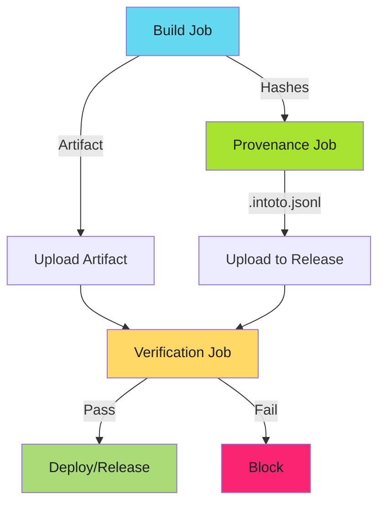

# GitHub Actions Workflow Patterns for SLSA

Turn SLSA provenance generation into repeatable, organization-wide patterns.

!!! info "Pattern-Based Approach"
    These patterns are designed as reusable workflows that can be called from multiple repositories, ensuring consistent SLSA implementation across your organization.

---

## Overview

This guide covers reusable GitHub Actions workflow patterns for:

1. **Generic artifact provenance** - Binaries, tarballs, release archives
2. **Container image provenance** - OCI images with SLSA attestation
3. **Verification gates** - Enforce provenance validation before release

**Prerequisites**: Understanding of [SLSA Levels](slsa-levels.md) and basic [SLSA Implementation](slsa-provenance.md).

**Advanced patterns**: See [Advanced GitHub Actions Patterns](github-actions-advanced.md) for multi-platform builds, monorepo patterns, and organization-wide adoption.

---

## Architecture: Workflow Separation



**Critical pattern**: Build, provenance generation, and verification are **separate jobs** with minimal permissions each.

---

## Pattern 1: Generic Artifact Provenance (Reusable)

Create `.github/workflows/slsa-generic-provenance.yml` as a reusable workflow:

```yaml
name: SLSA Generic Provenance

on:
  workflow_call:
    inputs:
      artifact-name:
        description: 'Name of artifact to download'
        required: true
        type: string
      artifact-path:
        description: 'Path pattern to hash (e.g., dist/*)'
        required: true
        type: string
      upload-to-release:
        description: 'Upload provenance to GitHub release'
        required: false
        type: boolean
        default: true

permissions: {}

jobs:
  provenance:
    permissions:
      actions: read        # Download artifact
      id-token: write      # OIDC token for signing
      contents: write      # Upload to release (if enabled)
    runs-on: ubuntu-latest
    steps:
      - uses: actions/download-artifact@v4
        with:
          name: ${{ inputs.artifact-name }}
          path: artifacts/

      - name: Generate artifact hashes
        id: hash
        run: |
          cd artifacts
          sha256sum ${{ inputs.artifact-path }} | base64 -w0 > ../hashes.txt
          echo "hashes=$(cat ../hashes.txt)" >> "$GITHUB_OUTPUT"

      - uses: slsa-framework/slsa-github-generator/.github/workflows/generator_generic_slsa3.yml@v2.1.0
        with:
          base64-subjects: "${{ steps.hash.outputs.hashes }}"
          upload-assets: ${{ inputs.upload-to-release }}
```

### Using the Reusable Workflow

```yaml
name: Release

on:
  push:
    tags: ['v*']

permissions: {}

jobs:
  build:
    permissions:
      contents: read
    runs-on: ubuntu-latest
    steps:
      - uses: actions/checkout@v4
      - name: Build artifacts
        run: make build
      - uses: actions/upload-artifact@v4
        with:
          name: release-artifacts
          path: dist/

  provenance:
    needs: [build]
    uses: ./.github/workflows/slsa-generic-provenance.yml
    permissions:
      actions: read
      id-token: write
      contents: write
    with:
      artifact-name: release-artifacts
      artifact-path: '*'
      upload-to-release: true
```

**Benefits**: Single reusable workflow for all repositories, consistent SLSA implementation, job-level permissions isolation, easy to update organization-wide.

---

## Pattern 2: Container Image Provenance (Reusable)

Create `.github/workflows/slsa-container-provenance.yml`:

```yaml
name: SLSA Container Provenance

on:
  workflow_call:
    inputs:
      image:
        description: 'Container image reference (registry/repo:tag)'
        required: true
        type: string
    secrets:
      registry-username:
        required: true
      registry-password:
        required: true

permissions: {}

jobs:
  provenance:
    permissions:
      packages: write
      id-token: write
    runs-on: ubuntu-latest
    steps:
      - name: Login to registry
        run: |
          echo "${{ secrets.registry-password }}" | \
            podman login ghcr.io \
              --username "${{ secrets.registry-username }}" \
              --password-stdin

      - name: Generate image hash
        id: hash
        run: |
          IMAGE_DIGEST=$(skopeo inspect container-image:${{ inputs.image }} \
            --format '{{.Digest}}')
          echo "${{ inputs.image }}@${IMAGE_DIGEST}" | base64 -w0 > hash.txt
          echo "hashes=$(cat hash.txt)" >> "$GITHUB_OUTPUT"

      - uses: slsa-framework/slsa-github-generator/.github/workflows/generator_container_slsa3.yml@v2.1.0
        with:
          image: ${{ inputs.image }}
          registry-username: ${{ secrets.registry-username }}
          registry-password: ${{ secrets.registry-password }}
```

### Using Container Provenance

```yaml
jobs:
  build:
    permissions:
      contents: read
      packages: write
    runs-on: ubuntu-latest
    outputs:
      image: ${{ steps.build.outputs.image }}
    steps:
      - uses: actions/checkout@v4
      - name: Build and push with buildah
        id: build
        run: |
          IMAGE="ghcr.io/${{ github.repository }}:${{ github.ref_name }}"
          buildah build -t "$IMAGE" .
          buildah push "$IMAGE"
          echo "image=$IMAGE" >> "$GITHUB_OUTPUT"

  provenance:
    needs: [build]
    uses: ./.github/workflows/slsa-container-provenance.yml
    permissions:
      packages: write
      id-token: write
    with:
      image: ${{ needs.build.outputs.image }}
    secrets:
      registry-username: ${{ github.actor }}
      registry-password: ${{ secrets.GITHUB_TOKEN }}
```

---

## Pattern 3: Verification Gate (Composite Action)

Create `.github/actions/verify-provenance/action.yml`:

```yaml
name: 'Verify SLSA Provenance'
description: 'Verify artifact provenance with slsa-verifier'

inputs:
  artifact-path:
    description: 'Path to artifact to verify'
    required: true
  provenance-path:
    description: 'Path to provenance file (.intoto.jsonl)'
    required: true
  source-uri:
    description: 'Expected source repository (github.com/org/repo)'
    required: true

runs:
  using: 'composite'
  steps:
    - name: Install slsa-verifier
      shell: bash
      run: |
        curl -sL "https://github.com/slsa-framework/slsa-verifier/releases/download/v2.6.0/slsa-verifier-linux-amd64" \
          -o slsa-verifier
        chmod +x slsa-verifier
        sudo mv slsa-verifier /usr/local/bin/

    - name: Verify provenance
      shell: bash
      run: |
        for artifact in ${{ inputs.artifact-path }}; do
          slsa-verifier verify-artifact "$artifact" \
            --provenance-path "${{ inputs.provenance-path }}" \
            --source-uri "${{ inputs.source-uri }}"
        done
```

### Using the Verification Action

```yaml
jobs:
  verify:
    runs-on: ubuntu-latest
    steps:
      - uses: actions/download-artifact@v4
        with:
          name: release-artifacts

      - uses: actions/download-artifact@v4
        with:
          name: provenance

      - uses: ./.github/actions/verify-provenance
        with:
          artifact-path: 'dist/*'
          provenance-path: 'provenance/*.intoto.jsonl'
          source-uri: 'github.com/${{ github.repository }}'
```

---

## Best Practices

### 1. Empty Workflow-Level Permissions

```yaml
permissions: {}  # Force explicit job-level permissions
```

**Why**: Prevents accidental permission escalation.

### 2. Version Tag Pinning

```yaml
uses: slsa-framework/slsa-github-generator/.github/workflows/generator_generic_slsa3.yml@v2.1.0
```

**Why**: slsa-verifier validates against known version tags. SHA pins fail verification.

### 3. Separate Build and Provenance Jobs

```yaml
jobs:
  build:
    permissions: { contents: read }
  provenance:
    needs: [build]
    permissions: { id-token: write, contents: write }
```

**Why**: Limits blast radius.

### 4. Verification in Required Status Checks

Add verification as required status check in branch protection to block merge without valid provenance.

---

## Related Content

- **[Advanced GitHub Actions Patterns](github-actions-advanced.md)** - Multi-platform builds, monorepo patterns, organization-wide adoption
- **[SLSA Implementation](slsa-provenance.md)** - Technical reference for slsa-github-generator
- **[Verification Workflows](verification-workflows.md)** - Verification patterns and troubleshooting
- **[Go Integration](toolchains/go-integration.md)** - Language-specific patterns

---

*Reusable workflows turn SLSA provenance from per-repository implementation to organization-wide enforcement.*
