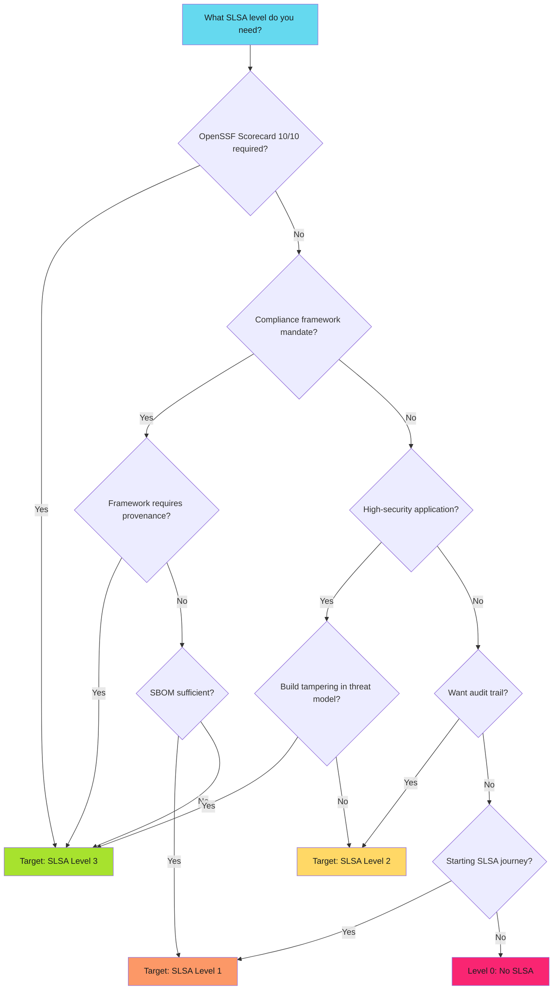
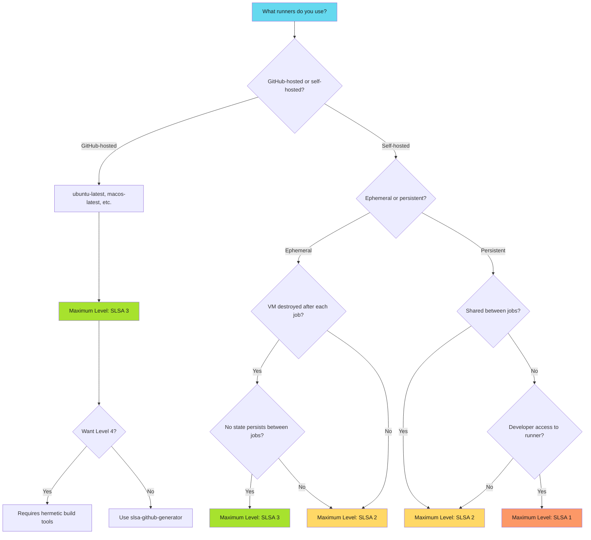
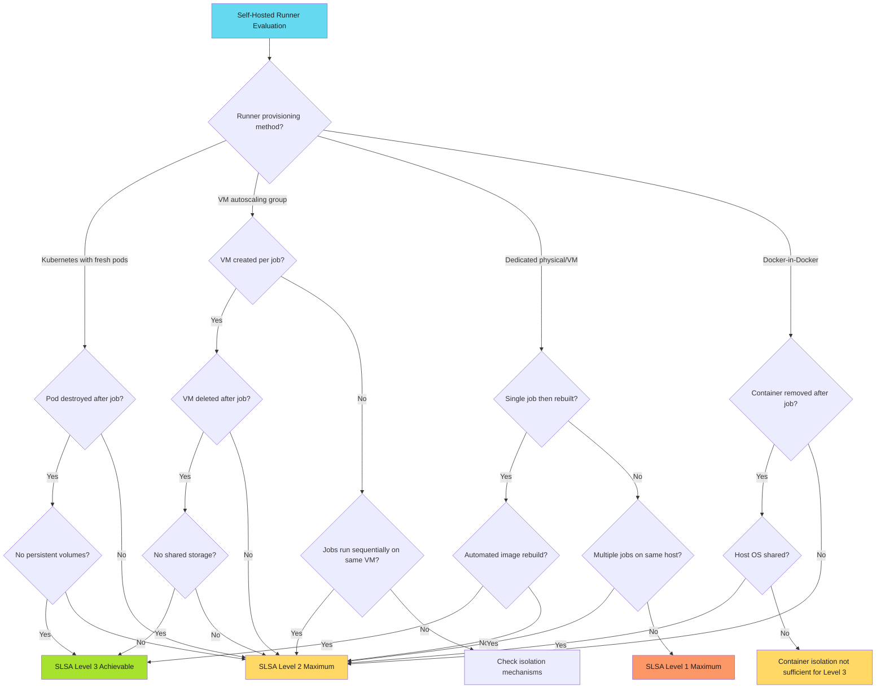
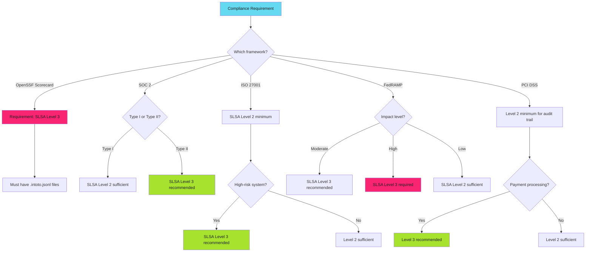
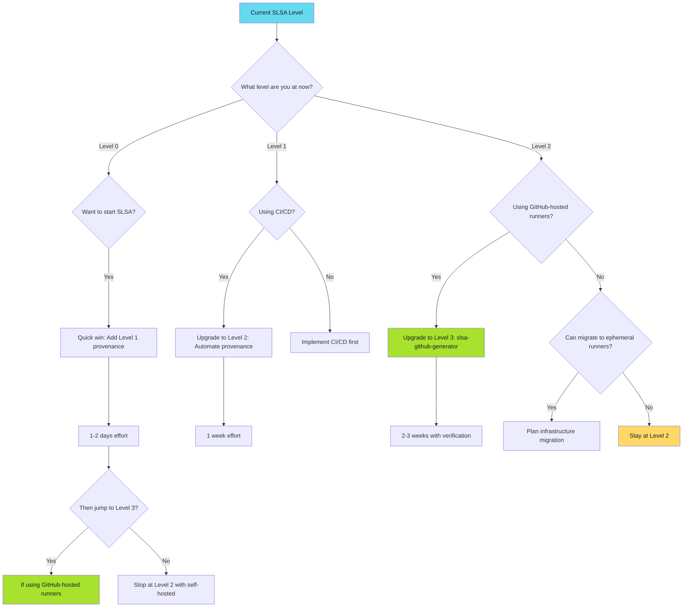
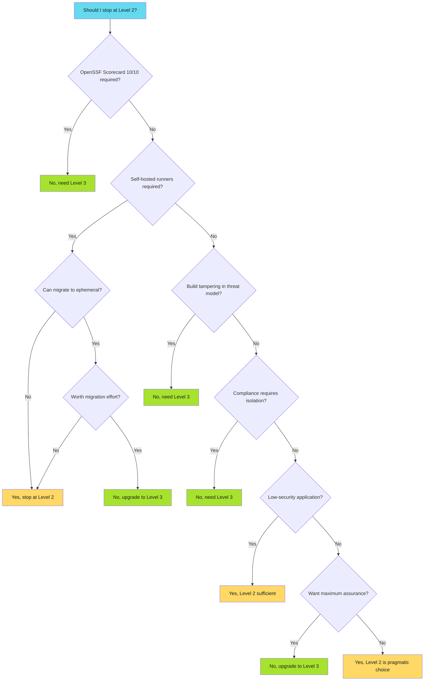

---
tags:
  - slsa
  - provenance
  - supply-chain
  - security
  - attestation
  - build-integrity
  - decision-trees
  - developers
  - operators
  - security-teams
description: >-
  SLSA level classification decision trees: determine your target SLSA level based on security requirements, runner configuration, and compliance needs. Includes self-hosted runner evaluation.
---

# SLSA Level Classification: Decision Trees

Determine the right SLSA level for your security posture and infrastructure.

!!! info "Quick Classification"
    **GitHub-hosted runners** = SLSA Level 3 achievable

    **Self-hosted persistent runners** = SLSA Level 2 maximum

    **Self-hosted ephemeral runners** = SLSA Level 3 achievable

    **Compliance requirement** = Usually SLSA Level 3

## Overview

SLSA level selection depends on three factors:

1. **Security requirements** - What attack classes must you prevent?
2. **Infrastructure capabilities** - What does your build environment support?
3. **Compliance mandates** - What do auditors require?

This guide provides decision trees for each scenario.

## Decision Tree: Requirements-Based Classification

Start here to determine your target SLSA level based on security and compliance needs:

**Key decision factors**: OpenSSF 10/10 requires Level 3 (non-negotiable). Compliance frameworks (SOC 2, ISO 27001, FedRAMP) often mandate provenance. High-security applications (payment, auth, infrastructure) benefit from Level 3 isolation. If build tampering is in your threat model, choose Level 3.

## Decision Tree: Runner Configuration Classification

Use this tree to determine the maximum SLSA level your current infrastructure supports:

**Critical questions**: Ephemeral (fresh VM per job, destroyed after) vs Persistent (same VM for multiple jobs). State isolation: Can jobs access previous job artifacts? Developer access: Can devs SSH to runners or modify configuration?

## Decision Tree: Self-Hosted Runner Evaluation

Detailed classification for self-hosted runner environments:

**Runner evaluation**: Kubernetes fresh pods achieve Level 3 (pod-per-job, no persistent volumes). VM autoscaling achieves Level 3 (VM-per-job, destroyed after). Dedicated runners max at Level 2 unless automated rebuild after each job. Docker-in-Docker max Level 2 (shared kernel/host OS).

## Classification Matrix

Quick reference for common scenarios:

| Runner Configuration | Isolation Level | Maximum SLSA Level | Notes |
|---------------------|-----------------|-------------------|-------|
| GitHub-hosted (ubuntu-latest) | Isolated | **Level 3** | Recommended |
| GitHub-hosted (self-hosted label) | Depends | Varies | Verify runner type |
| Kubernetes ephemeral pods | Isolated | **Level 3** | No persistent volumes |
| Kubernetes persistent pods | Shared | **Level 2** | Pod reused across jobs |
| AWS EC2 autoscaling | Isolated | **Level 3** | If VM-per-job |
| GCP Compute autoscaling | Isolated | **Level 3** | If VM-per-job |
| Azure VM scale sets | Isolated | **Level 3** | If VM-per-job |
| Docker-in-Docker | Shared kernel | **Level 2** | Host OS shared |
| Persistent VM | Shared | **Level 2** | Sequential jobs |
| Developer workstation | No isolation | **Level 1** | Manual provenance |

## Compliance-Driven Classification

Different compliance frameworks have different SLSA requirements:

**OpenSSF Scorecard**: Level 3 required for 10/10. **SOC 2**: Type I accepts Level 2, Type II benefits from Level 3. **ISO 27001**: Level 2 demonstrates compliance, Level 3 exceeds. **FedRAMP**: Moderate/High expect Level 3. **PCI DSS**: Level 2 audit trail, Level 3 recommended for payment processing.

## Migration Decision Tree

Use this when planning migration from current state to target SLSA level:

## Common Scenarios

| Scenario | Runner Type | Target Level | Rationale |
|----------|-------------|--------------|-----------|
| **Startup with GitHub Actions** | GitHub-hosted | Level 3 | OpenSSF 10/10, minimal complexity, 2-3 weeks |
| **Enterprise self-hosted** | Persistent VMs | Level 2 | Cannot migrate, audit trail sufficient, plan ephemeral migration |
| **Open source project** | GitHub-hosted | Level 3 | Free runners, OpenSSF badge, 1 week implementation |
| **Financial services** | Ephemeral | Level 3 | FedRAMP/PCI compliance, build tampering detection required |
| **Internal tooling** | Any | Level 1-2 | Low-security, basic audit trail, no compliance mandate |

## Upgrade Path

| From | To | Effort | Key Changes |
|------|-----|--------|-------------|
| **Level 0 → 1** | 1-2 days | Document build, record source commit, manual provenance | No infrastructure changes |
| **Level 1 → 2** | 1 week | Automate provenance, service signing, CI/CD integration | Requires CI/CD pipeline |
| **Level 2 → 3** | 2-3 weeks | Isolated builds, slsa-github-generator, verification workflows | **Requires GitHub-hosted or ephemeral runners** |

## Decision Tree: When to Stop at Level 2

Not every project needs Level 3. Use this tree to determine if Level 2 is sufficient:

## Key Takeaways

**Most organizations target Level 3**: Strong security without Level 4 complexity, achieves OpenSSF 10/10, satisfies most compliance frameworks.

**GitHub-hosted runners simplify everything**: Automatic Level 3 isolation, no infrastructure management, free for public repos.

**Self-hosted runners require careful evaluation**: Persistent runners max out at Level 2, ephemeral runners can achieve Level 3.

**Compliance often drives requirements**: OpenSSF Scorecard mandates Level 3, FedRAMP expects Level 3, SOC 2 accepts Level 2.

**Level 2 is pragmatic for many scenarios**: Provides service-generated provenance, doesn't require infrastructure changes, sufficient for audit trail.

## FAQ

**Can I skip Level 1 and 2 and go directly to Level 3?** Yes, if using GitHub-hosted runners. The levels are cumulative in requirements but not in implementation path.

**My self-hosted runners claim to be isolated. How do I verify?** Check if VM is destroyed after each job, no state persists, and no shared storage. If uncertain, assume Level 2.

**What if I need Level 3 but can't migrate from self-hosted runners?** Implement ephemeral runner infrastructure (Kubernetes with fresh pods, VM autoscaling with per-job instances).

**Does Level 2 satisfy compliance requirements?** Depends on framework. SOC 2 and ISO 27001 accept Level 2. OpenSSF Scorecard and FedRAMP Moderate expect Level 3.

**How long does Level 2 to Level 3 upgrade take?** 2-3 weeks including infrastructure changes, verification workflows, and policy updates. Longer if migrating runner infrastructure.

## Related Content

- **[SLSA Levels Explained](slsa-levels.md)**: Detailed requirements for each level
- **[SLSA Implementation Playbook](index.md)**: Complete adoption guide
- **[Current SLSA Implementation](slsa-provenance.md)**: Level 3 workflow patterns
- **[OpenSSF Scorecard](../../secure/scorecard/scorecard-compliance.md)**: SLSA impact on scores
*Classification determines feasibility. Requirements determine necessity. Infrastructure determines timeline. Start with honest assessment of all three.*
