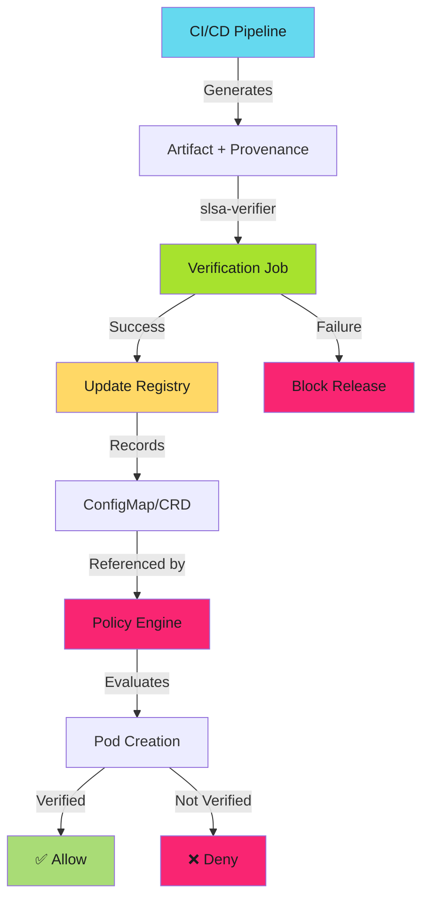

---
tags:
  - slsa
  - provenance
  - supply-chain
  - security
  - policy
  - kyverno
  - opa
  - gatekeeper
  - kubernetes
  - operators
  - security-teams
description: >-
  Production-ready Kyverno and OPA Gatekeeper policy templates for enforcing SLSA provenance requirements in Kubernetes clusters. Copy-paste ready policies for SLSA Levels 1-3.
---

# SLSA Provenance Policy Templates

Enforce SLSA requirements through policy-as-code.

!!! info "Prerequisites"
    These policies integrate with [Verification Workflows](verification-workflows.md) and [Advanced Verification Patterns](verification-advanced.md). CI/CD must verify provenance and record results before policy enforcement.

---

## Overview

Policy engines transform SLSA verification from optional checks to mandatory gates:

1. **Kyverno policies** - Native Kubernetes policy engine with CEL expressions
2. **OPA Gatekeeper** - Rego-based constraint framework for complex logic
3. **Admission control** - Block non-compliant deployments at API level
4. **Audit mode** - Identify violations without blocking (adoption phase)

**Architecture pattern**: CI/CD verifies provenance → Updates verification registry → Policy enforces at deployment time.

---

## Policy Enforcement Architecture



**Critical insight**: Policy engines don't verify provenance directly. They enforce that only verified images are deployed.

---

## Kyverno Templates

### Policy 1: Require SLSA Level 3 (Strict)

Block all pods using images without verified SLSA Level 3 provenance.

```yaml
apiVersion: kyverno.io/v1
kind: ClusterPolicy
metadata:
  name: require-slsa-level-3
  annotations:
    policies.kyverno.io/title: Require SLSA Level 3 Provenance
    policies.kyverno.io/severity: high
    policies.kyverno.io/description: >-
      All container images must have verified SLSA Level 3 provenance.
      Blocks deployment of images not in verified registry.
spec:
  validationFailureAction: Enforce
  background: true
  rules:
    - name: verify-image-provenance
      match:
        any:
          - resources:
              kinds:
                - Pod
      context:
        - name: verifiedImages
          configMap:
            name: slsa-verified-images
            namespace: slsa-system
      validate:
        message: >-
          Image {{ request.object.spec.containers[].image }} lacks verified SLSA Level 3 provenance.
          Only images in slsa-verified-images ConfigMap are allowed.
        foreach:
          - list: "request.object.spec.containers[*]"
            deny:
              conditions:
                all:
                  - key: "{{ element.image }}"
                    operator: AnyNotIn
                    value: "{{ verifiedImages.data.images }}"
```

**Enforcement**: Production-ready. Blocks all non-verified images.

**Deployment**: Deploy to `slsa-system` namespace. CI/CD updates ConfigMap on successful verification.

---

### Policy 2: Audit Mode (Adoption Phase)

Identify violations without blocking deployments. Use during initial SLSA adoption.

```yaml
apiVersion: kyverno.io/v1
kind: ClusterPolicy
metadata:
  name: audit-slsa-provenance
  annotations:
    policies.kyverno.io/title: Audit SLSA Provenance Compliance
    policies.kyverno.io/severity: medium
spec:
  validationFailureAction: Audit
  background: true
  rules:
    - name: audit-unverified-images
      match:
        any:
          - resources:
              kinds:
                - Pod
              namespaces:
                - production
                - staging
      context:
        - name: verifiedImages
          configMap:
            name: slsa-verified-images
            namespace: slsa-system
      validate:
        message: "Image {{ request.object.spec.containers[].image }} not in verified registry"
        foreach:
          - list: "request.object.spec.containers[*]"
            deny:
              conditions:
                all:
                  - key: "{{ element.image }}"
                    operator: AnyNotIn
                    value: "{{ verifiedImages.data.images }}"
```

**Usage**: Run for 30 days. Collect metrics. Identify teams needing SLSA support.

**Transition**: Change `validationFailureAction: Audit` to `Enforce` when ready.

---

### Policy 3: Namespace-Specific Enforcement

Enforce SLSA only in production, allow flexibility in development.

```yaml
apiVersion: kyverno.io/v1
kind: ClusterPolicy
metadata:
  name: production-slsa-enforcement
spec:
  validationFailureAction: Enforce
  background: true
  rules:
    - name: production-requires-slsa-3
      match:
        any:
          - resources:
              kinds:
                - Pod
              namespaces:
                - production
                - production-*
      context:
        - name: verifiedImages
          configMap:
            name: slsa-verified-images
            namespace: slsa-system
      validate:
        message: "Production namespace requires SLSA Level 3 verified images"
        foreach:
          - list: "request.object.spec.containers[*]"
            deny:
              conditions:
                all:
                  - key: "{{ element.image }}"
                    operator: AnyNotIn
                    value: "{{ verifiedImages.data.images }}"
```

**Pattern**: Progressive enforcement. Production first, expand to staging, then development.

---

## OPA Gatekeeper Templates

### ConstraintTemplate: SLSA Level Enforcement

Define reusable constraint for SLSA level enforcement.

```yaml
apiVersion: templates.gatekeeper.sh/v1
kind: ConstraintTemplate
metadata:
  name: slsaprovenance
spec:
  crd:
    spec:
      names:
        kind: SLSAProvenance
      validation:
        openAPIV3Schema:
          type: object
          properties:
            minimumLevel:
              type: integer
              minimum: 1
              maximum: 4
              description: "Minimum SLSA level required (1-4)"
  targets:
    - target: admission.k8s.gatekeeper.sh
      rego: |
        package slsa.provenance

        violation[{"msg": msg}] {
          container := input.review.object.spec.containers[_]
          not is_verified(container.image)
          msg := sprintf("Image %v lacks verified SLSA provenance", [container.image])
        }

        is_verified(image) {
          verified_images := data.inventory.cluster["v1"]["ConfigMap"]["slsa-system"]["slsa-verified-images"].data.images
          contains(verified_images, image)
        }
```

**Apply constraint**:

```yaml
apiVersion: constraints.gatekeeper.sh/v1beta1
kind: SLSAProvenance
metadata:
  name: require-slsa-level-3
spec:
  enforcementAction: deny
  match:
    kinds:
      - apiGroups: [""]
        kinds: ["Pod"]
    namespaces:
      - production
  parameters:
    minimumLevel: 3
```

---

## Verification Registry Setup

### ConfigMap: Verified Images Registry

CI/CD updates this ConfigMap after successful provenance verification.

```yaml
apiVersion: v1
kind: ConfigMap
metadata:
  name: slsa-verified-images
  namespace: slsa-system
data:
  images: |
    ghcr.io/adaptive-enforcement-lab/app:v1.2.0
    ghcr.io/adaptive-enforcement-lab/app:v1.2.1
    ghcr.io/adaptive-enforcement-lab/api:v2.0.0
```

**Update script** (run in CI/CD after verification):

```bash
#!/usr/bin/env bash
IMAGE="$1"

kubectl patch configmap slsa-verified-images \
  --namespace slsa-system \
  --type merge \
  -p "{\"data\":{\"images\":\"$(kubectl get configmap slsa-verified-images -n slsa-system -o jsonpath='{.data.images}')\n$IMAGE\"}}"
```

**Workflow integration**:

```yaml
- name: Update verified registry
  if: steps.verify.outcome == 'success'
  run: |
    IMAGE="${{ env.REGISTRY }}/${{ github.repository }}:${{ github.sha }}"
    ./scripts/update-verified-registry.sh "$IMAGE"
```

---

## FAQ

**Can I enforce different SLSA levels per namespace?** Yes. Use namespace-specific policies with different `minimumLevel` parameters in OPA or separate Kyverno policies per namespace.

**What if CI/CD verification fails but artifact is safe?** Use exception annotation with approval ticket. Time-bound exceptions only. Audit exception usage.

**How do I test policies before enforcement?** Use audit mode first (`validationFailureAction: Audit`). Test in non-production cluster. Validate with `kubectl --dry-run=server`.

**What happens if ConfigMap is deleted?** All deployments blocked. Treat ConfigMap as critical infrastructure. Backup and monitor with alerts.

**Can I integrate with external verification services?** Yes. Use OPA Gatekeeper with external data source. Call verification API in Rego policy using `http.send`.

---

## Related Content

- **[Verification Workflows](verification-workflows.md)**: CI/CD verification patterns
- **[Advanced Verification Patterns](verification-advanced.md)**: Policy engine integration architecture
- **[SLSA Implementation Playbook](index.md)**: Complete adoption guide
- **[SLSA Levels](slsa-levels.md)**: Understand SLSA level requirements

---

*Verification proves integrity. Policy enforces compliance. Automation scales trust.*
