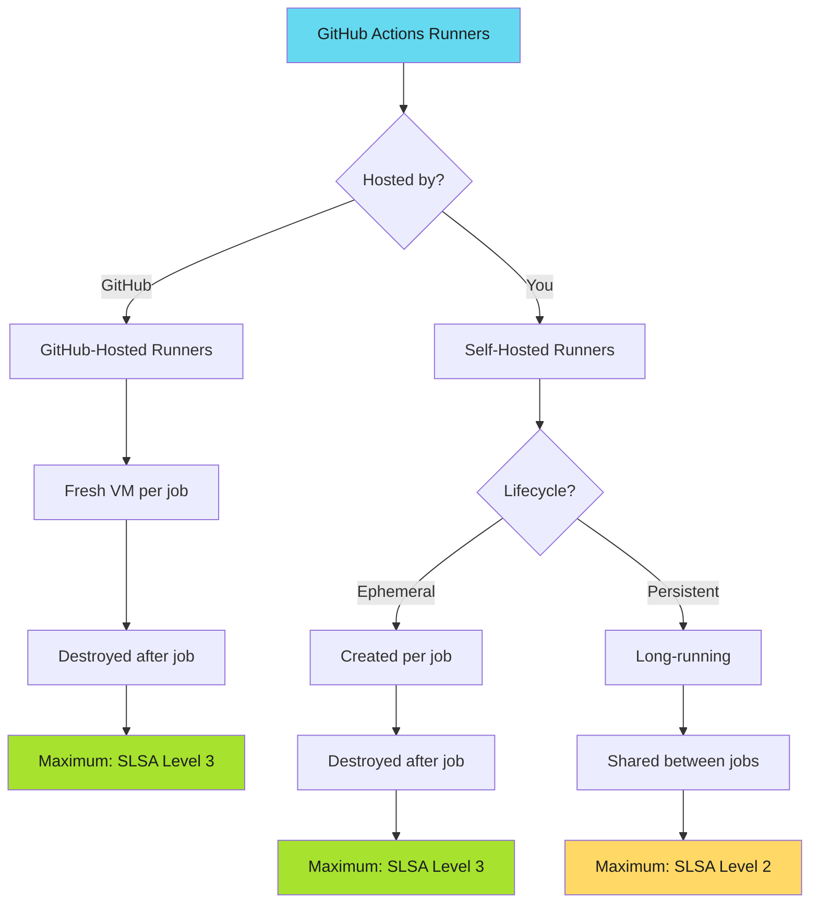
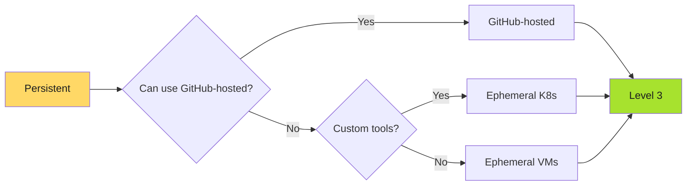
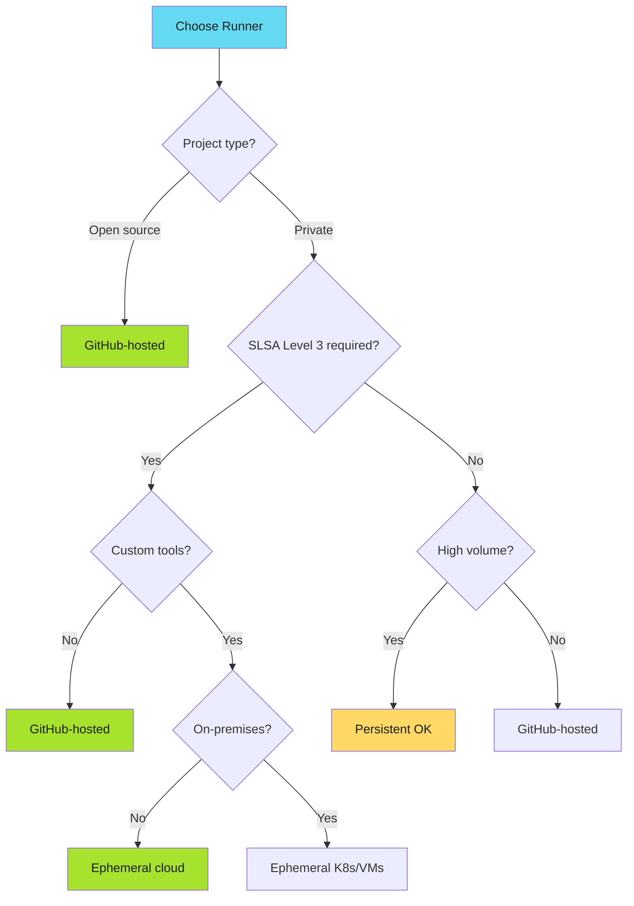

# Runner Configuration for SLSA Compliance

Choose the right runner infrastructure to achieve your target SLSA level.

!!! info "Quick Decision"
    **Need SLSA Level 3?** Use GitHub-hosted runners or ephemeral self-hosted infrastructure.

    **Stuck with persistent self-hosted?** Maximum SLSA Level 2 achievable.

    **Migration path:** Start with GitHub-hosted, migrate to ephemeral self-hosted only if required.

---

## Overview

Runner configuration determines your maximum achievable SLSA level. SLSA Level 3 requires **build isolation** via ephemeral, stateless environments.

This guide explains runner types, security implications, and configuration for SLSA compliance.

---

## Runner Types Comparison



---

## GitHub-Hosted Runners

GitHub-hosted runners provide isolated, ephemeral environments that automatically satisfy SLSA Level 3 requirements.

### Characteristics

| Property | Value | SLSA Implication |
|----------|-------|------------------|
| **Lifecycle** | Fresh VM per job | Prevents cross-job contamination |
| **State** | No persistent state | Isolation guarantee |
| **Cleanup** | Destroyed after job | No state leakage |
| **Network** | Full internet access | Allows dependency fetching |
| **Control** | Managed by GitHub | No local configuration required |
| **Cost** | Free (public), metered (private) | No infrastructure overhead |

### SLSA Level

Maximum: **SLSA Level 3** (Level 4 with hermetic build tools)

### Why GitHub-Hosted Achieves Level 3

- **Build isolation**: Each job runs in fresh VM
- **No state persistence**: VM destroyed after job
- **Non-falsifiable provenance**: `slsa-github-generator` generates signed attestations
- **GitHub OIDC trust**: Provenance signed by GitHub's OIDC provider

### Configuration Example

```yaml
jobs:
  build:
    runs-on: ubuntu-latest
    permissions:
      contents: read
      id-token: write
    steps:
      - uses: actions/checkout@v4
      - run: make build
      - uses: actions/attest-build-provenance@v2
        with:
          subject-path: 'dist/*'
```

### When to Use

- **Default choice**: Unless specific requirements prohibit
- **Open source projects**: Free unlimited minutes (ubuntu-latest, macos-latest, windows-latest)
- **OpenSSF 10/10 target**: Automatic SLSA Level 3
- **Cloud-native applications**: No on-premises requirements

---

## Self-Hosted Runners: Ephemeral

Ephemeral self-hosted runners achieve SLSA Level 3 with proper configuration.

### Requirements for Level 3

- **Fresh environment per job**: No VM/container reuse
- **Complete cleanup**: Environment destroyed after job
- **No persistent state**: No shared storage between jobs
- **Isolated networking**: Jobs cannot interfere

### Infrastructure Patterns

#### Kubernetes with Job-Per-Pod

```yaml
apiVersion: actions.summerwind.dev/v1alpha1
kind: RunnerDeployment
metadata:
  name: slsa-runner
spec:
  template:
    spec:
      ephemeral: true
      containers:
      - name: runner
        image: summerwind/actions-runner:latest
```

SLSA Level: **3** (if pod destroyed after job, no persistent volumes)

#### VM Autoscaling (EC2/GCE/Azure)

```bash
# User data: register ephemeral runner
./config.sh --url https://github.com/org/repo \
  --token ${REGISTRATION_TOKEN} \
  --ephemeral \
  --unattended

./run.sh
shutdown -h now
```

SLSA Level: **3** (if VM terminated after job)

### Validation Checklist

- [ ] New VM/container created for each job
- [ ] Environment destroyed after job completes
- [ ] No persistent volumes or shared storage
- [ ] No state leakage between jobs
- [ ] Runner registered with `--ephemeral` flag

### Common Mistakes

#### Mistake: Reusing containers

```yaml
# WRONG - Container reused
docker run --rm runner-image
```

Correct: Destroy entire VM/pod

```bash
# CORRECT
kubectl delete pod runner-xyz
```

#### Mistake: Persistent volumes

```yaml
# WRONG - Shared cache
volumes:
  - persistentVolumeClaim:
      claimName: shared-cache
```

Correct: No persistent volumes for ephemeral runners

---

## Self-Hosted Runners: Persistent

Persistent self-hosted runners **cannot achieve SLSA Level 3** due to lack of build isolation.

### Characteristics

| Property | Value | SLSA Implication |
|----------|-------|------------------|
| **Lifecycle** | Long-running | State persists |
| **State** | Shared workspace | Cross-job contamination |
| **Cleanup** | Manual scripts | Cannot guarantee isolation |
| **Control** | Full local control | Developer access possible |

### SLSA Level

Maximum: **SLSA Level 2**

### Why Persistent Cannot Achieve Level 3

- **No build isolation**: Same VM runs consecutive jobs
- **State contamination**: Job N+1 accesses artifacts from job N
- **Shared workspace**: Subtle state leakage even with cleanup

### Attack Scenarios

#### Attack 1: Cache poisoning

Malicious PR downloads malicious dependencies to runner cache. PR closed. Next legitimate build uses poisoned cache. Malicious code shipped to production.

#### Attack 2: Environment leakage

Job A sets `API_KEY=secret` environment variable. Cleanup misses environment. Job B reads environment, exfiltrates secret.

### Mitigation Strategies

#### Strict cleanup

```yaml
steps:
  - name: Pre-job cleanup
    run: |
      docker system prune -af
      rm -rf $HOME/.cache
```

#### Dedicated runners per repository

Prevents cross-repo contamination. Still vulnerable to same-repo attacks.

### Migration to Level 3



---

## Runner Selection Decision Tree



---

## Configuration Comparison

| Factor | GitHub-Hosted | Ephemeral Self-Hosted | Persistent Self-Hosted |
|--------|---------------|----------------------|------------------------|
| **SLSA Level** | 3 | 3 (if configured) | 2 (maximum) |
| **Setup** | Immediate | Days to weeks | Hours |
| **Management** | Zero | High | Medium |
| **Cost (public)** | Free | Infrastructure | Infrastructure |
| **Cost (private)** | Per-minute | Infrastructure | Fixed |
| **Isolation** | Built-in | Must configure | Not achievable |
| **OpenSSF 10/10** | Yes | Yes | No |

---

## Special Considerations

### Hybrid Approach

```yaml
jobs:
  dev-build:
    if: github.event_name == 'push'
    runs-on: [self-hosted, dev]

  production-release:
    if: github.event_name == 'release'
    runs-on: ubuntu-latest
```

Fast development feedback, compliant production releases.

### Security Hardening

- **Network isolation**: Private subnets, egress filtering
- **Secret management**: Use OIDC, never long-lived credentials
- **Least privilege**: Runners access only required resources
- **Monitoring**: Log activity, alert on anomalies

---

## FAQ

**Can Docker-in-Docker achieve Level 3?** No. Containers share host kernel. Max Level 2.

**Verify ephemeral runners achieve Level 3?** Check: fresh VM per job, destroyed after, no persistent storage, `--ephemeral` flag.

**Can persistent achieve Level 3?** No. Build isolation requires ephemeral environments.

**Kubernetes required?** No. VM autoscaling (EC2/GCE/Azure) also works.

**GitHub-hosted cost?** Free: 2,000 min/month private. Additional: $0.008/min Linux, $0.08/min macOS.

---

## Related Content

- **[SLSA Levels Explained](slsa-levels.md)**: Build isolation requirements
- **[Level Classification Decision Trees](level-classification.md)**: Determine maximum achievable level
- **[SLSA Implementation Playbook](index.md)**: Complete adoption guide
- **[Current SLSA Implementation](slsa-provenance.md)**: Level 3 workflow patterns

---

*GitHub-hosted provides simplest path to Level 3. Self-hosted requires careful architecture. Persistent maxes at Level 2, no exceptions.*
