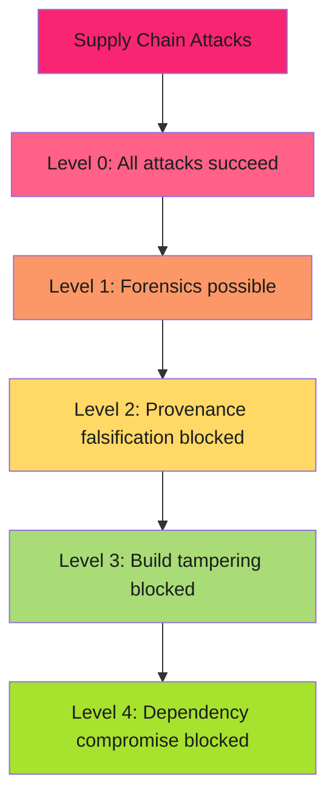

# SLSA Levels: Requirements and Security Guarantees

Incremental build security from documentation to hermetic builds.

!!! info "Quick Reference"
    **Level 1** = Document the build (manual)

    **Level 2** = Automate provenance (service-signed)

    **Level 3** = Isolated builds (non-falsifiable)

    **Level 4** = Hermetic builds + two-party review (research-grade)

---

## Overview

SLSA levels define progressive security guarantees for software builds. Each level adds stronger protections against supply chain attacks.

**Key insight**: Level 2 to Level 3 is where most organizations struggle. Level 3 requires **build isolation**, which eliminates entire attack classes.

---

## Level Comparison Matrix

| Level | Build Script | Source | Isolation | Signing | Security Guarantee |
|-------|--------------|--------|-----------|---------|-------------------|
| **0** | None | None | None | None | No protection |
| **1** | Manual/automated | Recorded | None | Optional | Forensics only |
| **2** | Automated | Versioned | None | Service-generated | Non-falsifiable provenance |
| **3** | Automated | Versioned | **Isolated** | **Non-falsifiable** | Tamper-evident builds |
| **4** | Automated | Reviewed | **Hermetic** | Non-falsifiable | Maximum assurance |

**Critical jump**: Level 2 to Level 3 requires build isolation.

---

## Level 0: No Guarantees

**Status**: Default state. No SLSA protection.

**Characteristics**:

- Developer builds on laptop
- Manual container builds and push
- No provenance generated
- No audit trail

**Vulnerabilities**: Build compromise undetectable, no artifact-to-source linkage, zero visibility into build process.

**Attack example**: Developer laptop infected with malware. Malware injects backdoor during local build. No detection possible.

---

## Level 1: Build Provenance Documentation

**Requirement**: Document the build process and generate provenance (may be manual or unverified).

**Provides**: Version-controlled build script, recorded source (commit SHA), generated provenance (may be manual), basic audit trail.

**Does NOT provide**: No guarantee provenance is accurate. Developer can modify provenance.

**Security value**: Forensics and basic compliance.

**Limitation**: Developer can falsify provenance. No tamper protection.

---

## Level 2: Service-Generated Provenance

**Requirement**: Automated build service generates provenance. Developer cannot falsify.

**Provides**: Automated service-generated provenance, service-signed (platform, not developer), automatic source versioning (Git commit), tamper detection via signature.

**Does NOT provide**: No build isolation guarantee. Build may share infrastructure.

### GitHub Actions Example

```yaml
jobs:
  build:
    runs-on: ubuntu-latest
    permissions:
      contents: read
      id-token: write
    steps:
      - uses: actions/checkout@v4
      - name: Build
        run: make build
      - uses: actions/attest-build-provenance@v2
        with:
          subject-path: 'dist/*'
```

### Runner Configurations

**Acceptable**: GitHub-hosted runners, self-hosted runners with persistent state, CI/CD platforms with service-generated provenance.

**Why**: Level 2 doesn't require isolation, just service-generated provenance.

### Security Value

Non-falsifiable provenance, automated, cryptographically signed.

**Limitation**: Builds share infrastructure. Malicious job can poison shared cache. Next job uses compromised dependencies.

---

## Level 3: Isolated Builds

**Requirement**: Builds run in isolated, ephemeral environments. Provenance cryptographically proves isolation.

**Provides**: Build isolation (fresh, ephemeral environment), non-falsifiable provenance (signed by trusted builder), tamper-evident (modification breaks cryptographic binding), third-party verifiable.

**Does NOT provide**: Not hermetic (builds can access network), two-party review not required, reproducible builds not required.

### Build Isolation Means

- Fresh environment per build (no persistent state)
- No cross-job contamination
- Build cannot be influenced by previous jobs
- Environment destroyed after build completes

### GitHub Actions Example

```yaml
jobs:
  build:
    runs-on: ubuntu-latest
    outputs:
      hashes: ${{ steps.hash.outputs.hashes }}
    steps:
      - uses: actions/checkout@v4
      - run: make build
      - id: hash
        run: |
          cd dist && sha256sum * | base64 -w0 > ../hashes.txt
          echo "hashes=$(cat ../hashes.txt)" >> "$GITHUB_OUTPUT"

  provenance:
    needs: [build]
    permissions:
      actions: read
      id-token: write
      contents: write
    uses: slsa-framework/slsa-github-generator/.github/workflows/generator_generic_slsa3.yml@v2.1.0
    with:
      base64-subjects: "${{ needs.build.outputs.hashes }}"
      upload-assets: true
```

### Runner Configurations

**Acceptable**:

- GitHub-hosted runners
- Ephemeral self-hosted runners (VM deleted after each job)
- Cloud build services with job isolation

**NOT acceptable**:

- Self-hosted runners with persistent state
- Shared build servers (sequential jobs)
- Developer workstations

**Critical question**: Is the build environment completely fresh for each job, with no state from previous jobs?

### Security Value

Isolation attacks blocked, tamper-evident, verifiable by third parties.

**OpenSSF Scorecard**: Level 3 provenance moves score from 8/10 to 10/10.

**Limitation**: Builds fetch external dependencies. Attacker can compromise upstream dependency during build.

---

## Level 4: Hermetic Builds

**Requirement**: Hermetic builds (fully isolated, no network) and two-party review.

**Provides**: Hermetic builds (no network, all dependencies declared upfront), two-party review (all changes approved), reproducible (bit-identical artifacts), maximum assurance.

### Hermetic Build Means

- No network access during build
- All dependencies fetched before build starts
- Build environment fully declared
- Reproducible (same inputs = bit-identical outputs)

**Difference from Level 3**: Level 3 allows network access. Level 4 requires all dependencies declared upfront.

### Example Technologies

- Bazel with hermetic toolchains
- Nix builds
- Google's internal build system

### Reality Check

Achieving Level 4 with GitHub Actions is extremely difficult. Requires hermetic build tools, vendored dependencies, custom runners with network isolation.

**Most organizations stop at Level 3.** Level 4 is research-grade.

### Security Value

Maximum assurance, reproducible, hermetic, two-party review.

**Use case**: High-security environments (defense, finance, critical infrastructure), not typical SaaS.

---

## Attack Classes by Level



**Level 1**: Prevents nothing, enables forensics

**Level 2**: Prevents provenance falsification

**Level 3**: Prevents build infrastructure compromise

**Level 4**: Prevents dependency compromise during build

---

## Choosing Your Target Level

**Most organizations target Level 3.** Strong security without Level 4 complexity.

### Level 1: Minimum Viable

Starting SLSA journey, basic audit trail, no compliance requirements, low-security applications.

### Level 2: Production Baseline

CI/CD with service-generated provenance, self-hosted runners without isolation, pragmatic security.

### Level 3: Industry Standard

OpenSSF Scorecard 10/10, compliance frameworks, GitHub-hosted runners, high-security applications.

### Level 4: Research-Grade

Defense/finance/critical infrastructure, regulatory requirements for reproducible builds, maximum assurance.

---

## Common Misunderstandings

**"Self-hosted runners are Level 3"**: No. Self-hosted runners must provide ephemeral, isolated environments. Most persistent runners max out at Level 2.

**"Level 3 requires reproducible builds"**: No. Reproducibility is Level 4. Level 3 requires isolation.

**"Signing artifacts = SLSA Level 3"**: No. Signing proves distribution integrity. SLSA proves build integrity.

**"Level 4 required for compliance"**: No. Most compliance frameworks accept Level 3.

---

## FAQ

**What level do GitHub-hosted runners provide?** Level 3. Ephemeral, isolated environments with non-falsifiable provenance via `slsa-github-generator`.

**Can self-hosted runners achieve Level 3?** Yes, if ephemeral and isolated (VM per job). Most persistent runners max out at Level 2.

**Level for OpenSSF Scorecard 10/10?** Level 3 (`.intoto.jsonl` provenance files).

**Implementation time?** Level 1: 1-2 days. Level 2: 1 week. Level 3: 2-3 weeks. Level 4: 1-3 months.

**Must I implement sequentially?** No. Jump directly to Level 3 if using GitHub-hosted runners with `slsa-github-generator`.

---

## Related Content

- **[SLSA Implementation Playbook](index.md)**: Complete adoption guide
- **[Current SLSA Implementation](slsa-provenance.md)**: Level 3 workflow patterns
- **[SLSA vs SBOM](slsa-vs-sbom.md)**: Clarify the distinction
- **[OpenSSF Scorecard](../../secure/scorecard/scorecard-compliance.md)**: SLSA impact on scores

---

*Level 1 documents. Level 2 automates. Level 3 isolates. Level 4 proves. Most stop at Level 3.*
