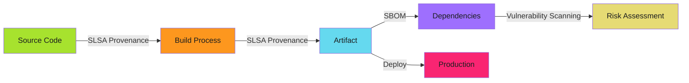

# SLSA vs SBOM: What's the Difference?

SLSA proves how artifacts were built. SBOM lists what's inside them. Different problems, different solutions.

!!! info "Quick Answer"
    **SBOM** = Inventory (what dependencies are in the artifact)

    **SLSA Provenance** = Audit trail (how the artifact was built)

    You need both. They're complementary, not competing.

---

## The Confusion

The SLSA community acknowledges SLSA vs SBOM confusion as a problem they "hope to address."

**Why the confusion exists**:

- Both are supply chain security tools
- Both generate attestation files
- Both integrate with CI/CD pipelines
- Both are recommended by security frameworks

**The critical distinction**: They answer fundamentally different questions.

---

## What Each Technology Does

### SBOM: Dependency Inventory

**Purpose**: List every component in the artifact

**Question answered**: "What third-party code is in this application?"

**Value**: Know what you're running, track vulnerabilities, license compliance

**Format**: CycloneDX or SPDX JSON listing all components and versions

---

### SLSA Provenance: Build Integrity Proof

**Purpose**: Cryptographically prove the build process

**Question answered**: "Was this artifact built from known source in a trusted environment?"

**Value**: Detect compromised builds, prove artifact came from known source

**Format**: In-toto attestation with builder identity, source commit, and build environment

---

## Side-by-Side Comparison

| Aspect | SBOM | SLSA Provenance |
|--------|------|-----------------|
| **Purpose** | Inventory dependencies | Prove build integrity |
| **Question** | "What's inside?" | "How was it built?" |
| **Attack Detection** | Known vulnerable dependencies | Compromised build process |
| **Example Attack** | Log4Shell (CVE-2021-44228) | SolarWinds build compromise |
| **Update Frequency** | Every build (dependencies change) | Every build (proves integrity) |
| **Format** | CycloneDX, SPDX | SLSA Provenance (in-toto) |
| **Verification** | Compare against vulnerability databases | Verify cryptographic signatures |
| **Primary Audience** | Security teams, compliance | Platform engineers, auditors |
| **Compliance Driver** | Executive Order 14028, EU Cyber Resilience Act | SLSA framework, OpenSSF |

---

## When to Use Each

### Use SBOM When You Need To

- **Track vulnerabilities**: Identify affected applications when CVEs are published
- **License compliance**: Audit third-party license obligations
- **Dependency management**: Understand transitive dependency chains
- **Vendor assessment**: Provide customers with component inventory
- **Policy enforcement**: Block artifacts with known vulnerable dependencies

**Example scenario**: Log4Shell is published. Query all SBOMs to find applications using affected log4j versions.

---

### Use SLSA Provenance When You Need To

- **Prove build integrity**: Verify artifact came from known source commit
- **Detect tampering**: Identify if build process was compromised
- **Enforce build standards**: Require isolated, reproducible builds
- **Audit trail**: Show exactly what source and environment produced the artifact
- **Supply chain security**: Meet SLSA framework compliance requirements

**Example scenario**: Unauthorized code appears in production. Check provenance to verify if artifact came from approved source and build process.

---

## How They Complement Each Other

SBOM and SLSA solve different parts of the supply chain security problem:

**SLSA protects against**:

- Compromised build infrastructure
- Malicious code injection during build
- Artifact tampering between build and deploy
- Unauthorized build processes

**SBOM protects against**:

- Known vulnerable dependencies
- License compliance violations
- Dependency confusion attacks
- Undisclosed third-party code

**Together**: Full visibility from source to production, covering both build integrity and component risk.

---

## Real-World Attack Scenarios

### Attack: Compromised Build System (SLSA Detects)

**SolarWinds (2020)**:

- Attackers compromised build infrastructure
- Injected malicious code during compilation
- Distributed trojanized updates to customers

**SLSA defense**:

- Provenance would show unexpected builder identity
- Verification would fail on non-GitHub-hosted build
- Tamper-evident audit trail would expose compromise

**SBOM limitation**: SBOM wouldn't detect this. Malicious code looked like legitimate application code.

---

### Attack: Vulnerable Dependency (SBOM Detects)

**Log4Shell (2021)**:

- Zero-day in widely-used log4j library
- Affects thousands of applications
- Organizations need to identify exposure fast

**SBOM defense**:

- Query all SBOMs for `log4j` component
- Identify affected applications in minutes
- Prioritize patching based on exposure

**SLSA limitation**: SLSA provenance doesn't list dependencies. Can't identify vulnerable components.

---

## Decision Matrix

| Requirement | SBOM | SLSA | Both |
|-------------|------|------|------|
| Track vulnerable dependencies | ✅ | ❌ | ✅ |
| Prove build from known source | ❌ | ✅ | ✅ |
| License compliance | ✅ | ❌ | ✅ |
| Detect build compromise | ❌ | ✅ | ✅ |
| OpenSSF Scorecard 10/10 | ❌ | ✅ | ✅ |
| EU Cyber Resilience Act | ✅ | ⚠️ | ✅ |
| Executive Order 14028 | ✅ | ⚠️ | ✅ |
| Full supply chain security | ❌ | ❌ | ✅ |

**Recommendation**: Implement both. Different controls, different risks.

---

## Regulatory Context

**Executive Order 14028 (US)**: Requires SBOM for software sold to federal government. SLSA recommended but not required.

**EU Cyber Resilience Act**: Requires SBOM and security attestation for CE-marked products. SLSA provenance counts as security attestation.

**OpenSSF Scorecard**: SLSA provenance moves Signed-Releases from 8/10 to 10/10. SBOM improves Dependency-Update-Tool score.

---

## Adoption Path

**Phase 1 (SBOM)**: Add SBOM generation to CI/CD (1 to 2 hours). Immediate vulnerability visibility.

**Phase 2 (SLSA Level 1 to 2)**: Document and automate build process (1 week). Build reproducibility.

**Phase 3 (SLSA Level 3)**: Isolated builds with cryptographic provenance (2 to 3 weeks). Build tampering detection, OpenSSF Scorecard 10/10.

**Phase 4 (Full Stack)**: Both SBOM and SLSA with verification and enforcement (1 month). Comprehensive supply chain security.

See **[SLSA Implementation Playbook](index.md)** for detailed adoption roadmap

---

## Common Misunderstandings

**"SBOM replaces SLSA"**: No. SBOM lists components, SLSA proves build integrity. Different problems.

**"SLSA includes dependency information"**: No. SLSA records build materials (source repo), not transitive dependencies.

**"I only need one"**: No. You need both for comprehensive supply chain security. SBOM for vulnerability management, SLSA for build integrity.

**"They're too complex to implement together"**: No. Both integrate into the same GitHub Actions workflow. Implementation time is 1 to 2 hours.

---

## FAQ

**Which should I implement first?** Start with SBOM. It's easier and provides immediate value for vulnerability tracking. Then add SLSA for build integrity.

**Can I use SLSA provenance as an SBOM?** No. SLSA records build materials (source repo), not dependencies. Generate both separately.

**Do I need SBOM if I have dependency scanning?** Yes. Dependency scanning checks source code, SBOM checks the final artifact. SBOM catches runtime dependencies that source scanning misses.

---

## Related Content

- **[SLSA Implementation Playbook](index.md)**: Complete SLSA adoption guide
- **[Current SLSA Implementation](slsa-provenance.md)**: Technical workflow patterns
- **[Policy-as-Code](../policy-as-code/index.md)**: Enforce SBOM and SLSA at deployment
- **[Audit Evidence Collection](../audit-compliance/audit-evidence.md)**: Use SBOM and SLSA as audit evidence

---

*SBOM lists what's inside. SLSA proves how it was built. Different questions, different tools. You need both.*
