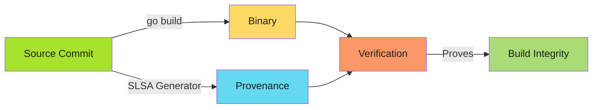
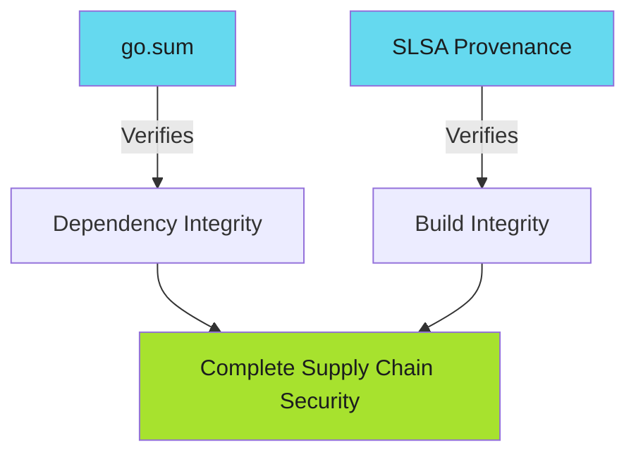

---
tags:
  - slsa
  - provenance
  - go
  - golang
  - supply-chain
  - security
  - attestation
  - developers
  - operators
description: >-
  SLSA provenance for Go projects: slsa-github-generator integration, multi-platform builds, and GoReleaser patterns with cryptographic build integrity proofs.
---

# SLSA Provenance for Go Projects

Turn Go builds from reproducible to provable.

!!! info "Go-Specific Value"
    Go builds are already reproducible with build flags. SLSA provenance adds cryptographic proof of the build environment and source commit, moving from reproducibility to non-falsifiable build integrity.

---

## Overview

Go projects have unique SLSA integration points:

- **Binary builds**: Multi-platform cross-compilation
- **Container images**: Distroless base images with Go binaries
- **GoReleaser**: Automated multi-platform release tooling
- **Go modules**: Dependency verification with `go.sum`

This guide covers SLSA Level 3 provenance generation for Go binary builds.

**Also see**: [Go Advanced Patterns](go-advanced.md) for container images, verification workflows, and best practices.

---

## Why SLSA Matters for Go

Go's reproducible builds are excellent, but they don't prove:

- **Build environment integrity**: Was the build isolated from tampering?
- **Source commit linkage**: Did this binary actually come from this commit?
- **Builder identity**: Who triggered the build?

SLSA provenance adds cryptographic proof for all three.



---

## Pattern 1: Single Binary with slsa-github-generator

Simplest integration for Go CLI tools or services.

```yaml
name: Release

permissions: {}

on:
  push:
    tags: ['v*']

jobs:
  build:
    permissions:
      contents: read
    runs-on: ubuntu-latest
    outputs:
      hashes: ${{ steps.hash.outputs.hashes }}
    steps:
      - uses: actions/checkout@v4

      - uses: actions/setup-go@v5
        with:
          go-version-file: go.mod
          cache: true

      - name: Build binary
        run: |
          CGO_ENABLED=0 go build \
            -trimpath \
            -ldflags="-s -w -X main.version=${{ github.ref_name }}" \
            -o dist/myapp \
            ./cmd/myapp

      - name: Generate hash
        id: hash
        run: |
          cd dist
          sha256sum myapp | base64 -w0 > ../hashes.txt
          echo "hashes=$(cat ../hashes.txt)" >> "$GITHUB_OUTPUT"

      - uses: actions/upload-artifact@v4
        with:
          name: binary
          path: dist/

  provenance:
    needs: [build]
    permissions:
      actions: read
      id-token: write
      contents: write
    uses: slsa-framework/slsa-github-generator/.github/workflows/generator_generic_slsa3.yml@v2.1.0
    with:
      base64-subjects: "${{ needs.build.outputs.hashes }}"
      upload-assets: true
```

**Key Go build flags**:

- `-trimpath`: Remove build-time file paths for reproducibility
- `-ldflags="-s -w"`: Strip debug info, reduce binary size
- `CGO_ENABLED=0`: Static binary, no libc dependency

---

## Pattern 2: Multi-Platform Builds

Cross-compile for Linux, macOS, Windows with SLSA provenance.

```yaml
jobs:
  build:
    permissions:
      contents: read
    runs-on: ubuntu-latest
    outputs:
      hashes: ${{ steps.hash.outputs.hashes }}
    strategy:
      matrix:
        include:
          - {goos: linux, goarch: amd64}
          - {goos: linux, goarch: arm64}
          - {goos: darwin, goarch: amd64}
          - {goos: darwin, goarch: arm64}
          - {goos: windows, goarch: amd64}
    steps:
      - uses: actions/checkout@v4
      - uses: actions/setup-go@v5
        with:
          go-version-file: go.mod

      - name: Build ${{ matrix.goos }}_${{ matrix.goarch }}
        env:
          GOOS: ${{ matrix.goos }}
          GOARCH: ${{ matrix.goarch }}
        run: |
          CGO_ENABLED=0 go build \
            -trimpath \
            -ldflags="-s -w -X main.version=${{ github.ref_name }}" \
            -o dist/myapp_${{ matrix.goos }}_${{ matrix.goarch }} \
            ./cmd/myapp

      - name: Generate hashes
        id: hash
        run: |
          cd dist
          sha256sum myapp_* | base64 -w0 > ../hashes.txt
          echo "hashes=$(cat ../hashes.txt)" >> "$GITHUB_OUTPUT"

      - uses: actions/upload-artifact@v4
        with:
          name: binaries
          path: dist/

  provenance:
    needs: [build]
    permissions:
      actions: read
      id-token: write
      contents: write
    uses: slsa-framework/slsa-github-generator/.github/workflows/generator_generic_slsa3.yml@v2.1.0
    with:
      base64-subjects: "${{ needs.build.outputs.hashes }}"
      upload-assets: true
```

**Note**: All platforms built in single job ensures consistent provenance across artifacts.

---

## Pattern 3: GoReleaser Integration

GoReleaser with SLSA provenance for production releases.

### .goreleaser.yml

```yaml
version: 2

builds:
  - id: myapp
    main: ./cmd/myapp
    env:
      - CGO_ENABLED=0
    goos:
      - linux
      - darwin
      - windows
    goarch:
      - amd64
      - arm64
    ldflags:
      - -s -w
      - -X main.version={{.Version}}
      - -X main.commit={{.Commit}}
      - -X main.date={{.Date}}
    flags:
      - -trimpath

archives:
  - format: tar.gz
    name_template: "{{ .ProjectName }}_{{ .Version }}_{{ .Os }}_{{ .Arch }}"
    format_overrides:
      - goos: windows
        format: zip

checksum:
  name_template: 'checksums.txt'
  algorithm: sha256
```

### GitHub Actions Workflow

```yaml
name: Release with GoReleaser

permissions: {}

on:
  push:
    tags: ['v*']

jobs:
  goreleaser:
    permissions:
      contents: read
    runs-on: ubuntu-latest
    outputs:
      hashes: ${{ steps.hash.outputs.hashes }}
    steps:
      - uses: actions/checkout@v4
        with:
          fetch-depth: 0

      - uses: actions/setup-go@v5
        with:
          go-version-file: go.mod

      - uses: goreleaser/goreleaser-action@v6
        with:
          version: latest
          args: release --clean --snapshot
        env:
          GITHUB_TOKEN: ${{ secrets.GITHUB_TOKEN }}

      - name: Generate hashes
        id: hash
        run: |
          cd dist
          sha256sum *.tar.gz *.zip | base64 -w0 > ../hashes.txt
          echo "hashes=$(cat ../hashes.txt)" >> "$GITHUB_OUTPUT"

      - uses: actions/upload-artifact@v4
        with:
          name: artifacts
          path: dist/

  provenance:
    needs: [goreleaser]
    permissions:
      actions: read
      id-token: write
      contents: write
    uses: slsa-framework/slsa-github-generator/.github/workflows/generator_generic_slsa3.yml@v2.1.0
    with:
      base64-subjects: "${{ needs.goreleaser.outputs.hashes }}"
      upload-assets: true
```

**Advantage**: GoReleaser handles multi-platform builds, archives, and checksums. SLSA provenance adds cryptographic proof.

---

## Go Module Verification

SLSA provenance complements Go's built-in module verification:



**go.sum protects against**: Dependency tampering, dependency confusion

**SLSA provenance protects against**: Compromised build environment, unauthorized builds

**Together**: End-to-end supply chain security from dependencies to deployment.

---

## Quick Reference: Build Flags

| Flag | Purpose | Why It Matters for SLSA |
|------|---------|-------------------------|
| `-trimpath` | Remove absolute file paths | Ensures reproducible builds across environments |
| `-ldflags="-s -w"` | Strip debug symbols | Reduces binary size, deterministic output |
| `CGO_ENABLED=0` | Static linking | No libc dependency, reproducible across systems |
| `-ldflags="-X main.version=..."` | Version injection | Traceable builds with git commit linkage |

---

## Related Content

- **[Go Advanced Patterns](go-advanced.md)**: Container images, verification, best practices
- **[SLSA Implementation Playbook](../index.md)**: Complete adoption guide
- **[Current SLSA Implementation](../slsa-provenance.md)**: Generic workflow patterns
- **[Verification Workflows](../verification-workflows.md)**: Automate provenance verification
- **[Adoption Roadmap](../adoption-roadmap.md)**: Incremental SLSA adoption
- **[Runner Configuration](../runner-configuration.md)**: Self-hosted vs GitHub-hosted for Go builds

---

*Go builds are reproducible. SLSA makes them provable.*
