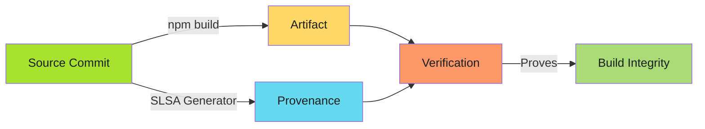
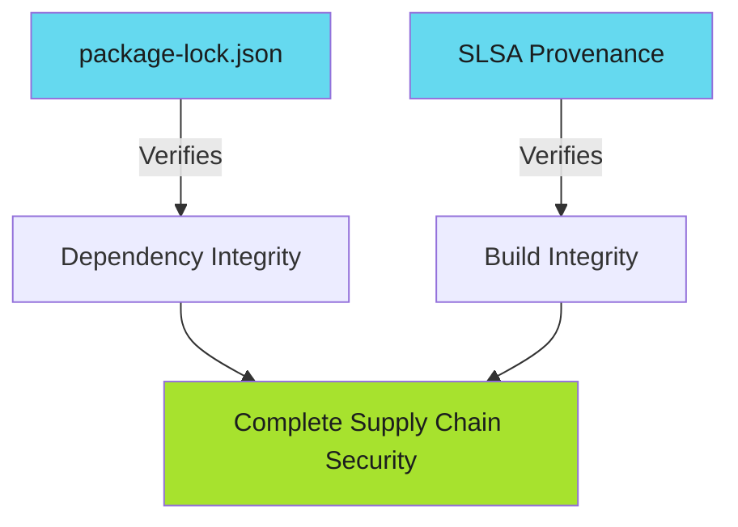

# SLSA Provenance for Node.js Projects

Turn npm builds from lockfiles to provable pipelines.

!!! info "Node-Specific Value"
    npm's package-lock.json ensures dependency integrity. SLSA provenance adds cryptographic proof of the build environment and source commit, moving from dependency verification to non-falsifiable build integrity.

---

## Overview

Node.js projects have unique SLSA integration points:

- **npm packages**: Publishing to npm registry or GitHub Packages
- **Container images**: Node runtime with application code
- **Dependency lockfiles**: package-lock.json, yarn.lock, pnpm-lock.yaml
- **Build artifacts**: Bundled JavaScript, TypeScript compilation output

This guide covers SLSA Level 3 provenance generation for Node.js applications and packages.

---

## Why SLSA Matters for Node.js

npm's lockfiles ensure dependency integrity, but they don't prove:

- **Build environment isolation**: Was the build free from tampering?
- **Source commit linkage**: Did this artifact actually come from this commit?
- **Publisher identity**: Who triggered the npm publish?

SLSA provenance adds cryptographic proof for all three.



---

## Pattern 1: npm Package Publishing

Publish npm packages with SLSA provenance to npm registry or GitHub Packages.

```yaml
name: Publish Package

permissions: {}

on:
  push:
    tags: ['v*']

jobs:
  build:
    permissions:
      contents: read
    runs-on: ubuntu-latest
    outputs:
      hashes: ${{ steps.hash.outputs.hashes }}
    steps:
      - uses: actions/checkout@v4

      - uses: actions/setup-node@v4
        with:
          node-version-file: .nvmrc
          cache: npm

      - name: Install dependencies
        run: npm ci

      - name: Build package
        run: npm run build

      - name: Pack tarball
        run: npm pack

      - name: Generate hash
        id: hash
        run: |
          sha256sum *.tgz | base64 -w0 > hashes.txt
          echo "hashes=$(cat hashes.txt)" >> "$GITHUB_OUTPUT"

      - uses: actions/upload-artifact@v4
        with:
          name: package
          path: "*.tgz"

  provenance:
    needs: [build]
    permissions:
      actions: read
      id-token: write
      contents: write
    uses: slsa-framework/slsa-github-generator/.github/workflows/generator_generic_slsa3.yml@v2.1.0
    with:
      base64-subjects: "${{ needs.build.outputs.hashes }}"
      upload-assets: true

  publish:
    needs: [build, provenance]
    permissions:
      contents: read
      id-token: write
    runs-on: ubuntu-latest
    steps:
      - uses: actions/download-artifact@v4
        with:
          name: package

      - uses: actions/setup-node@v4
        with:
          node-version: 20
          registry-url: https://registry.npmjs.org

      - name: Publish to npm
        run: npm publish *.tgz --provenance
        env:
          NODE_AUTH_TOKEN: ${{ secrets.NPM_TOKEN }}
```

**Key steps**:

- `npm pack`: Creates tarball artifact for publishing
- `npm publish --provenance`: npm's built-in provenance publishing
- SLSA provenance: Additional cryptographic proof uploaded to GitHub Releases

---

## Pattern 2: Application Artifacts (Bundled JavaScript)

Generate SLSA provenance for built application artifacts (Next.js, Vite, Webpack bundles).

```yaml
jobs:
  build:
    permissions:
      contents: read
    runs-on: ubuntu-latest
    outputs:
      hashes: ${{ steps.hash.outputs.hashes }}
    steps:
      - uses: actions/checkout@v4

      - uses: actions/setup-node@v4
        with:
          node-version: 20
          cache: npm

      - run: npm ci
      - run: npm run build

      - name: Package artifacts
        run: |
          tar -czf dist.tar.gz dist/
          tar -czf build.tar.gz .next/

      - name: Generate hashes
        id: hash
        run: |
          sha256sum *.tar.gz | base64 -w0 > hashes.txt
          echo "hashes=$(cat hashes.txt)" >> "$GITHUB_OUTPUT"

      - uses: actions/upload-artifact@v4
        with:
          name: artifacts
          path: "*.tar.gz"

  provenance:
    needs: [build]
    permissions:
      actions: read
      id-token: write
      contents: write
    uses: slsa-framework/slsa-github-generator/.github/workflows/generator_generic_slsa3.yml@v2.1.0
    with:
      base64-subjects: "${{ needs.build.outputs.hashes }}"
      upload-assets: true
```

**Use cases**: Next.js static exports, Vite production builds, Webpack bundles for deployment verification.

---

## Pattern 3: Container Images

Build Node.js application container images with SLSA provenance.

```yaml
jobs:
  build:
    permissions:
      contents: read
      packages: write
    runs-on: ubuntu-latest
    outputs:
      image-digest: ${{ steps.build.outputs.digest }}
    steps:
      - uses: actions/checkout@v4

      - uses: docker/setup-buildx-action@v3

      - uses: docker/login-action@v3
        with:
          registry: ghcr.io
          username: ${{ github.actor }}
          password: ${{ secrets.GITHUB_TOKEN }}

      - uses: docker/build-push-action@v5
        id: build
        with:
          context: .
          push: true
          tags: ghcr.io/${{ github.repository }}:${{ github.ref_name }}
          platforms: linux/amd64,linux/arm64
          cache-from: type=gha
          cache-to: type=gha,mode=max

      - name: Generate provenance subject
        id: hash
        run: |
          echo "hashes=$(echo 'ghcr.io/${{ github.repository }}@${{ steps.build.outputs.digest }}' | base64 -w0)" >> "$GITHUB_OUTPUT"

  provenance:
    needs: [build]
    permissions:
      actions: read
      id-token: write
      packages: write
    uses: slsa-framework/slsa-github-generator/.github/workflows/generator_container_slsa3.yml@v2.1.0
    with:
      image: ghcr.io/${{ github.repository }}
      digest: ${{ needs.build.outputs.digest }}
```

### Containerfile Pattern (Multi-Stage Build)

```dockerfile
# Build stage
FROM node:20-alpine AS builder
WORKDIR /app
COPY package*.json ./
RUN npm ci --omit=dev
COPY . .
RUN npm run build

# Production stage
FROM node:20-alpine
WORKDIR /app
ENV NODE_ENV=production
COPY --from=builder /app/package*.json ./
COPY --from=builder /app/node_modules ./node_modules
COPY --from=builder /app/dist ./dist
USER node
EXPOSE 3000
CMD ["node", "dist/index.js"]
```

**Alpine advantage**: Smaller image size, faster builds. Use `distroless/nodejs` for minimal attack surface.

---

## Pattern 4: Dependency Lockfile Verification

SLSA provenance complements npm's built-in lockfile verification:



**package-lock.json protects against**: Dependency tampering, version confusion

**SLSA provenance protects against**: Compromised build environment, unauthorized publishes

**Together**: End-to-end supply chain security from dependencies to deployment.

### Lockfile Best Practices

```yaml
- name: Verify lockfile integrity
  run: |
    npm ci --audit
    npm run verify-lockfile || echo "package-lock.json matches package.json"
```

**Enforce lockfile commits**:

```yaml
- name: Check for lockfile changes
  run: |
    git diff --exit-code package-lock.json || {
      echo "package-lock.json has uncommitted changes"
      exit 1
    }
```

---

## Package Manager Comparison

| Package Manager | Lockfile | SLSA Integration | Best For |
|----------------|----------|------------------|----------|
| **npm** | package-lock.json | `npm publish --provenance` | Default choice, npm registry publishing |
| **yarn** | yarn.lock | Generic SLSA pattern | Monorepos, deterministic installs |
| **pnpm** | pnpm-lock.yaml | Generic SLSA pattern | Disk space efficiency, strict mode |

**All three** work with SLSA provenance. npm has native `--provenance` flag for publishing.

---

## Quick Reference: Package Manager Commands

| Operation | npm | yarn | pnpm |
|-----------|-----|------|------|
| **Install from lockfile** | `npm ci` | `yarn install --frozen-lockfile` | `pnpm install --frozen-lockfile` |
| **Create tarball** | `npm pack` | `yarn pack` | `pnpm pack` |
| **Publish with provenance** | `npm publish --provenance` | N/A (use generic SLSA) | N/A (use generic SLSA) |
| **Verify lockfile** | `npm ci --dry-run` | `yarn install --check-files` | `pnpm install --frozen-lockfile --dry-run` |

---

## Related Content

- **[Node.js Advanced Patterns](node-advanced.md)**: Verification, best practices, troubleshooting
- **[SLSA Implementation Playbook](../index.md)**: Complete adoption guide
- **[Go Integration](go-integration.md)**: Go-specific SLSA patterns for comparison
- **[Verification Workflows](../verification-workflows.md)**: Automate provenance verification
- **[Adoption Roadmap](../adoption-roadmap.md)**: Incremental SLSA adoption

---

*npm builds are reproducible with lockfiles. SLSA makes them provable.*
