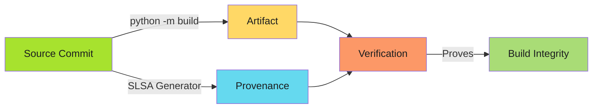
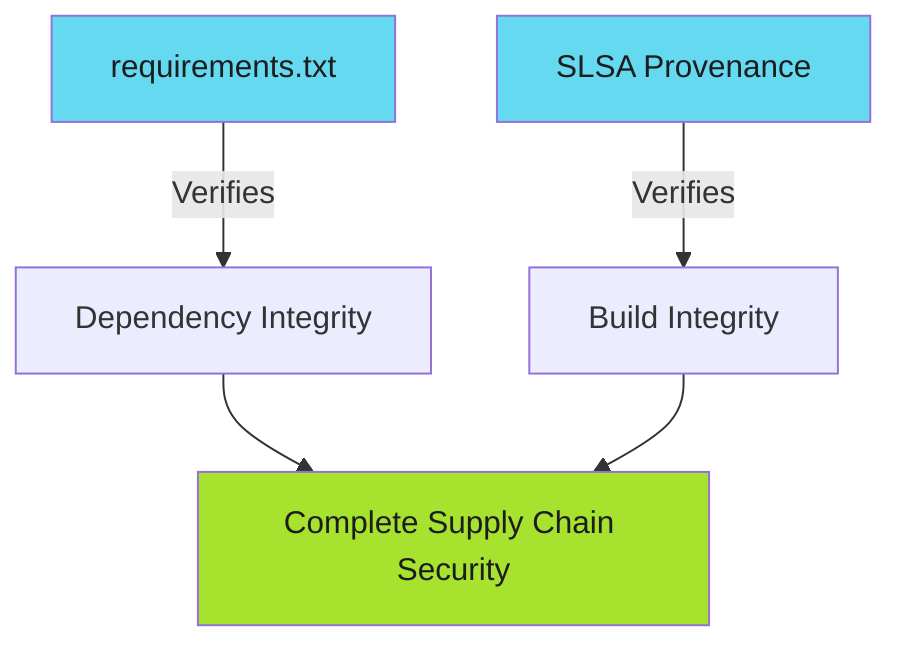

# SLSA Provenance for Python Projects

Turn pip installs from lockfiles to provable pipelines.

!!! info "Python-Specific Value"
    pip's requirements.txt and lock files ensure dependency integrity. SLSA provenance adds cryptographic proof of the build environment and source commit, moving from dependency verification to non-falsifiable build integrity.

---

## Overview

Python projects have unique SLSA integration points:

- **PyPI packages**: Publishing wheels and source distributions to PyPI or private registries
- **Container images**: Python runtime with application code
- **Dependency lockfiles**: requirements.txt, Pipfile.lock, poetry.lock
- **Build artifacts**: Wheels (.whl), source distributions (.tar.gz), compiled extensions

This guide covers SLSA Level 3 provenance generation for Python applications and packages.

---

## Why SLSA Matters for Python

pip's lockfiles ensure dependency integrity, but they don't prove:

- **Build environment isolation**: Was the build free from tampering?
- **Source commit linkage**: Did this artifact actually come from this commit?
- **Publisher identity**: Who triggered the PyPI publish?

SLSA provenance adds cryptographic proof for all three.



---

## Pattern 1: PyPI Package Publishing

Publish Python packages with SLSA provenance to PyPI or GitHub Packages.

```yaml
name: Publish Package

permissions: {}

on:
  push:
    tags: ['v*']

jobs:
  build:
    permissions:
      contents: read
    runs-on: ubuntu-latest
    outputs:
      hashes: ${{ steps.hash.outputs.hashes }}
    steps:
      - uses: actions/checkout@v4

      - uses: actions/setup-python@v5
        with:
          python-version-file: .python-version
          cache: pip

      - name: Install build tools
        run: |
          python -m pip install --upgrade pip
          pip install build

      - name: Build package
        run: python -m build

      - name: Generate hash
        id: hash
        run: |
          cd dist
          sha256sum *.whl *.tar.gz | base64 -w0 > ../hashes.txt
          echo "hashes=$(cat ../hashes.txt)" >> "$GITHUB_OUTPUT"

      - uses: actions/upload-artifact@v4
        with:
          name: packages
          path: dist/

  provenance:
    needs: [build]
    permissions:
      actions: read
      id-token: write
      contents: write
    uses: slsa-framework/slsa-github-generator/.github/workflows/generator_generic_slsa3.yml@v2.1.0
    with:
      base64-subjects: "${{ needs.build.outputs.hashes }}"
      upload-assets: true

  publish:
    needs: [build, provenance]
    permissions:
      contents: read
      id-token: write
    runs-on: ubuntu-latest
    steps:
      - uses: actions/download-artifact@v4
        with:
          name: packages
          path: dist/

      - name: Publish to PyPI
        uses: pypa/gh-action-pypi-publish@release/v1
        with:
          attestations: true
```

**Key steps**:

- `python -m build`: Creates wheel and source distribution
- `pypa/gh-action-pypi-publish`: PyPI's recommended publishing action with attestation support
- SLSA provenance: Additional cryptographic proof uploaded to GitHub Releases

---

## Pattern 2: Application Artifacts (Python Apps)

Generate SLSA provenance for built Python application artifacts.

```yaml
jobs:
  build:
    permissions:
      contents: read
    runs-on: ubuntu-latest
    outputs:
      hashes: ${{ steps.hash.outputs.hashes }}
    steps:
      - uses: actions/checkout@v4

      - uses: actions/setup-python@v5
        with:
          python-version: '3.12'
          cache: pip

      - name: Install dependencies
        run: |
          pip install -r requirements.txt
          pip install pyinstaller

      - name: Build executable
        run: |
          pyinstaller --onefile --name myapp src/main.py

      - name: Package artifacts
        run: |
          tar -czf dist/myapp-linux.tar.gz dist/myapp

      - name: Generate hashes
        id: hash
        run: |
          cd dist
          sha256sum *.tar.gz | base64 -w0 > ../hashes.txt
          echo "hashes=$(cat ../hashes.txt)" >> "$GITHUB_OUTPUT"

      - uses: actions/upload-artifact@v4
        with:
          name: artifacts
          path: dist/*.tar.gz

  provenance:
    needs: [build]
    permissions:
      actions: read
      id-token: write
      contents: write
    uses: slsa-framework/slsa-github-generator/.github/workflows/generator_generic_slsa3.yml@v2.1.0
    with:
      base64-subjects: "${{ needs.build.outputs.hashes }}"
      upload-assets: true
```

**Use cases**: PyInstaller executables, packaged Lambda functions, deployment bundles.

---

## Pattern 3: Container Images

Build Python application container images with SLSA provenance.

```yaml
jobs:
  build:
    permissions:
      contents: read
      packages: write
    runs-on: ubuntu-latest
    outputs:
      image-digest: ${{ steps.build.outputs.digest }}
    steps:
      - uses: actions/checkout@v4

      - uses: docker/setup-buildx-action@v3

      - uses: docker/login-action@v3
        with:
          registry: ghcr.io
          username: ${{ github.actor }}
          password: ${{ secrets.GITHUB_TOKEN }}

      - uses: docker/build-push-action@v5
        id: build
        with:
          context: .
          push: true
          tags: ghcr.io/${{ github.repository }}:${{ github.ref_name }}
          platforms: linux/amd64,linux/arm64
          cache-from: type=gha
          cache-to: type=gha,mode=max

      - name: Generate provenance subject
        id: hash
        run: |
          echo "hashes=$(echo 'ghcr.io/${{ github.repository }}@${{ steps.build.outputs.digest }}' | base64 -w0)" >> "$GITHUB_OUTPUT"

  provenance:
    needs: [build]
    permissions:
      actions: read
      id-token: write
      packages: write
    uses: slsa-framework/slsa-github-generator/.github/workflows/generator_container_slsa3.yml@v2.1.0
    with:
      image: ghcr.io/${{ github.repository }}
      digest: ${{ needs.build.outputs.digest }}
```

### Dockerfile Pattern (Multi-Stage Build)

```dockerfile
# Build stage
FROM python:3.12-slim AS builder
WORKDIR /app

# Install dependencies
COPY requirements.txt .
RUN pip install --no-cache-dir --user -r requirements.txt

# Copy application
COPY . .

# Production stage
FROM python:3.12-slim
WORKDIR /app

# Copy dependencies from builder
COPY --from=builder /root/.local /root/.local
COPY --from=builder /app /app

# Ensure scripts are in PATH
ENV PATH=/root/.local/bin:$PATH
ENV PYTHONUNBUFFERED=1

# Non-root user
RUN useradd -m -u 1000 appuser && chown -R appuser:appuser /app
USER appuser

EXPOSE 8000
CMD ["python", "-m", "uvicorn", "main:app", "--host", "0.0.0.0", "--port", "8000"]
```

**Slim advantage**: Smaller image size than full Python image. Use `distroless/python3` for minimal attack surface.

---

## Pattern 4: Dependency Lockfile Verification

SLSA provenance complements Python's dependency verification:



**requirements.txt protects against**: Dependency tampering, version confusion

**SLSA provenance protects against**: Compromised build environment, unauthorized publishes

**Together**: End-to-end supply chain security from dependencies to deployment.

---

## Package Manager Comparison

| Package Manager | Lockfile | Hash Support | SLSA Integration | Best For |
|----------------|----------|--------------|------------------|----------|
| **pip** | requirements.txt | `--require-hashes` | Generic SLSA pattern | Simple projects, compatibility |
| **pipenv** | Pipfile.lock | Automatic | Generic SLSA pattern | Development workflows, deterministic builds |
| **poetry** | poetry.lock | Automatic | Generic SLSA pattern | Modern packaging, dependency resolution |
| **pip-tools** | requirements.txt | `--generate-hashes` | Generic SLSA pattern | Production lockfiles, hash enforcement |

**All four** work with SLSA provenance. Use pip-tools for production-grade lockfiles with hash verification.

---

## Quick Reference: Package Manager Commands

| Operation | pip | pipenv | poetry |
|-----------|-----|--------|--------|
| **Install from lockfile** | `pip install -r requirements.txt` | `pipenv install --deploy` | `poetry install --no-root` |
| **Install with hashes** | `pip install --require-hashes -r requirements.txt` | Automatic | Automatic |
| **Build package** | `python -m build` | N/A | `poetry build` |
| **Publish to PyPI** | `twine upload dist/*` | N/A | `poetry publish` |
| **Generate lockfile** | `pip freeze > requirements.txt` | `pipenv lock` | `poetry lock` |
| **Add hashes to lockfile** | `pip-compile --generate-hashes` | Automatic | Automatic |

---

## Related Content

- **[SLSA Implementation Playbook](../index.md)**: Complete adoption guide
- **[Go Integration](go-integration.md)**: Go-specific SLSA patterns for comparison
- **[Node.js Integration](node-integration.md)**: Node-specific SLSA patterns for comparison
- **[Verification Workflows](../verification-workflows.md)**: Automate provenance verification
- **[Adoption Roadmap](../adoption-roadmap.md)**: Incremental SLSA adoption

---

*pip installs are reproducible with lockfiles. SLSA makes them provable.*
