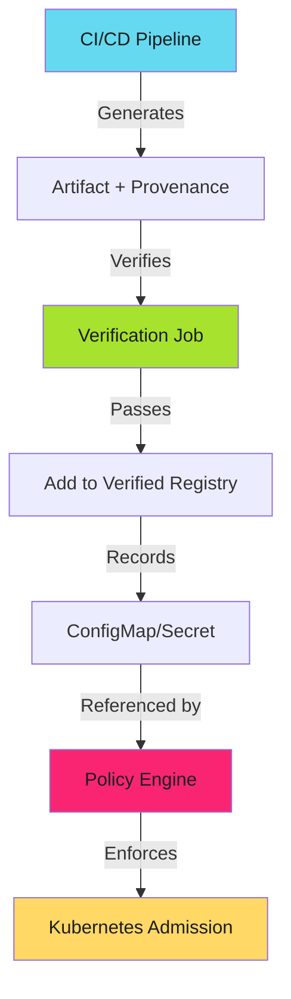

---
tags:
  - slsa
  - provenance
  - supply-chain
  - security
  - attestation
  - verification
  - policy
  - kyverno
  - opa
  - operators
  - security-teams
description: >-
  Advanced SLSA provenance verification: policy engine integration, artifact registry verification, local security audits. Kyverno and OPA Gatekeeper patterns.
---

# Advanced Verification Patterns

Policy enforcement, registry verification, and security audits.

!!! info "Prerequisites"
    Read [Verification Workflows](verification-workflows.md) first for core CI/CD patterns. This guide covers advanced scenarios and policy integration.

---

## Overview

Advanced verification patterns extend beyond CI/CD pipelines:

1. **Artifact registry verification** - Verify on download before use
2. **Policy engine integration** - Kubernetes admission control
3. **Multi-artifact verification** - Batch provenance validation
4. **Local security audits** - Developer and security team verification
5. **Branch-specific enforcement** - Conditional verification rules

---

## Pattern 4: Artifact Registry Verification

Verify provenance when artifacts are downloaded from registries.

### Download Script with Verification

```bash
#!/usr/bin/env bash
set -euo pipefail

REPO="adaptive-enforcement-lab/example"
VERSION="v1.2.0"
ARTIFACT="app_linux_amd64"

echo "Downloading $ARTIFACT $VERSION..."

# Download artifact
gh release download "$VERSION" \
  --pattern "$ARTIFACT" \
  --repo "$REPO"

# Download provenance
gh release download "$VERSION" \
  --pattern '*.intoto.jsonl' \
  --repo "$REPO"

# Verify before using
echo "Verifying provenance..."
if ! slsa-verifier verify-artifact "$ARTIFACT" \
    --provenance-path *.intoto.jsonl \
    --source-uri "github.com/$REPO"; then
  echo "❌ Provenance verification failed. Artifact not trusted."
  rm -f "$ARTIFACT" *.intoto.jsonl
  exit 1
fi

echo "✅ Provenance verified. Artifact is safe to use."
chmod +x "$ARTIFACT"
```

**Usage**: Replace direct `gh release download` with this verification script.

**Value**: Zero-trust artifact consumption. Never execute unverified binaries.

---

## Pattern 5: Multi-Artifact Verification

Verify multiple artifacts with a single provenance file.

```yaml
- run: |
    PROVENANCE="multiple.intoto.jsonl"
    for artifact in dist/*; do
      jq -e ".subject[] | select(.name == \"$(basename $artifact)\")" "$PROVENANCE" > /dev/null || exit 1
      slsa-verifier verify-artifact "$artifact" \
        --provenance-path "$PROVENANCE" \
        --source-uri "github.com/${{ github.repository }}"
    done
```

---

## Pattern 6: Branch-Specific Verification

Require provenance only for production branches.

```yaml
on:
  push:
    branches: [main, 'release/**']

jobs:
  verify:
    if: github.ref == 'refs/heads/main' || startsWith(github.ref, 'refs/heads/release/')
    runs-on: ubuntu-latest
    steps:
      - uses: slsa-framework/slsa-verifier/actions/installer@v2.6.0
      - run: slsa-verifier verify-artifact ...
```

**Rationale**: Development branches skip verification for velocity. Production enforces it.

---

## Pattern 7: Local Verification (Security Audit)

Security teams and developers can verify artifacts locally.

```bash
# Download and verify
TAG="v1.5.0"
gh release download "$TAG" --repo adaptive-enforcement-lab/example
slsa-verifier verify-artifact app_linux_amd64 \
  --provenance-path multiple.intoto.jsonl \
  --source-uri github.com/adaptive-enforcement-lab/example \
  --source-tag "$TAG"

# Detailed analysis
slsa-verifier verify-artifact app_linux_amd64 \
  --provenance-path multiple.intoto.jsonl \
  --source-uri github.com/adaptive-enforcement-lab/example \
  --print-provenance | jq '.buildDefinition'
```

**Use cases**: Security audits, incident response, compliance evidence.

---

## Policy Engine Integration

### Architecture



**Flow**: CI/CD verifies provenance, adds image to verified registry, policy engine allows only verified images.

---

## Kyverno Policy: Require Verified Provenance

```yaml
apiVersion: kyverno.io/v1
kind: ClusterPolicy
metadata:
  name: verify-slsa-provenance
spec:
  validationFailureAction: Enforce
  rules:
    - name: verify-image-provenance
      match:
        resources:
          kinds: [Pod]
      validate:
        message: "Image must have verified SLSA provenance"
        foreach:
          - list: "request.object.spec.containers"
            deny:
              conditions:
                - key: "{{ element.image }}"
                  operator: NotIn
                  value: "{{ verifiedImages }}"
      context:
        - name: verifiedImages
          apiCall:
            urlPath: /api/v1/namespaces/default/configmaps/verified-images
            jmesPath: 'data.images'
```

**Workflow**: CI/CD verifies provenance, updates ConfigMap with verified images, Kyverno enforces.

---

## OPA Gatekeeper Integration

```rego
package slsa.verification

deny[msg] {
  input.request.kind.kind == "Pod"
  container := input.request.object.spec.containers[_]
  not data.verified_images[container.image].slsa_level >= 3
  msg := sprintf("Image %v lacks SLSA Level 3+ provenance", [container.image])
}
```

```yaml
apiVersion: constraints.gatekeeper.sh/v1beta1
kind: SLSAProvenance
metadata:
  name: require-slsa-provenance
spec:
  match:
    kinds:
      - apiGroups: [""]
        kinds: ["Pod"]
```

**Value**: Declarative policy with audit mode.

---

## Container Registry Integration

```bash
IMAGE="ghcr.io/adaptive-enforcement-lab/app:v1.2.0"
slsa-verifier verify-image "$IMAGE" \
  --source-uri github.com/adaptive-enforcement-lab/app \
  --provenance-repository ghcr.io/adaptive-enforcement-lab/app
```

**Note**: Container provenance stored as OCI attestations alongside image.

---

## Verification Automation

```bash
#!/usr/bin/env bash
# verify-deployment.sh
MANIFEST="$1"
IMAGES=$(kubectl get -f "$MANIFEST" -o jsonpath='{.spec.template.spec.containers[*].image}')

for IMAGE in $IMAGES; do
  slsa-verifier verify-image "$IMAGE" \
    --source-uri github.com/adaptive-enforcement-lab/app || exit 1
done

kubectl apply -f "$MANIFEST"
```

**Usage**: `./verify-deployment.sh deployment.yaml`

---

## Verification Metrics

```yaml
- run: |
    START=$(date +%s)
    slsa-verifier verify-artifact "$ARTIFACT" \
      --provenance-path provenance.intoto.jsonl \
      --source-uri "github.com/${{ github.repository }}" && STATUS=success || STATUS=failure
    DURATION=$(($(date +%s) - START))
    curl -X POST https://metrics.example.com/verification \
      -d "artifact=$ARTIFACT&status=$STATUS&duration=$DURATION"
```

**Track**: Success rate, duration, failure reasons, daily verification count.

---

## FAQ

**How do I verify artifacts from third-party vendors?** Request their SLSA provenance files. Verify against their public source repository. If they don't provide provenance, escalate security risk.

**Can I cache verification results?** Yes. Verification results for specific artifact hash + provenance pair are deterministic. Cache for 24 hours.

**What if my policy engine doesn't support SLSA?** Use admission webhooks to call slsa-verifier as external service. Block pods with unverified images.

**How do I audit verification history?** Log all verification attempts (success and failure) to SIEM. Include artifact hash, provenance hash, verification result, timestamp.

**Can I verify npm packages?** Yes. Use `slsa-verifier verify-npm-package`. npm provenance support added in npm v9.

---

## Related Content

- **[Verification Workflows](verification-workflows.md)**: Core CI/CD verification patterns
- **[SLSA Implementation Playbook](index.md)**: Complete adoption guide
- **[Current SLSA Implementation](slsa-provenance.md)**: Generate Level 3 provenance
- **[Branch Protection](../branch-protection/branch-protection.md)**: Require verification as status check

---

*Policy engines enforce. Verification proves. Automation scales. Build defense in depth.*
