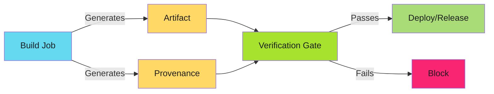
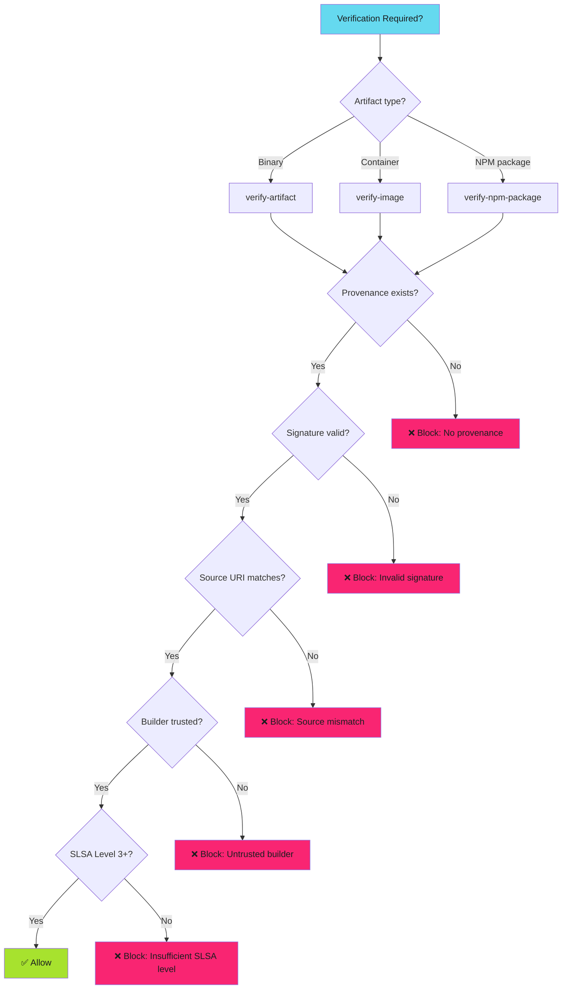

---
tags:
  - slsa
  - provenance
  - supply-chain
  - security
  - attestation
  - verification
  - developers
  - operators
  - security-teams
description: >-
  SLSA provenance verification in CI/CD: validate build integrity with slsa-verifier in PR checks, release gates, and deployment workflows. Practical GitHub Actions patterns.
---

# SLSA Provenance Verification Workflows

Turn provenance generation from aspirational to mandatory.

!!! info "Core Principle"
    Generating provenance is easy. **Verifying** it is what matters. Verification enforces build integrity at every critical decision point.

## Overview

SLSA provenance verification answers one critical question:

**Can I trust this artifact was built from the claimed source code in an isolated environment?**

This guide covers verification workflows for:

1. **CI/CD pipelines** - Block releases without valid provenance
2. **Deployment gates** - Verify before production deployment
3. **Release automation** - Ensure integrity before distribution

**Advanced patterns**: See [Advanced Verification Patterns](verification-advanced.md) for policy engines, registry verification, and local audits.

## Verification Architecture



**Critical insight**: Verification happens **after** build but **before** deployment or release. This creates an enforcement gate.

## Tool: slsa-verifier

The SLSA community provides `slsa-verifier` as the reference implementation for provenance verification.

### Installation

```bash
# Binary release
VERIFIER_VERSION="v2.6.0"
curl -sL "https://github.com/slsa-framework/slsa-verifier/releases/download/${VERIFIER_VERSION}/slsa-verifier-linux-amd64" \
  -o slsa-verifier
chmod +x slsa-verifier

# Or in GitHub Actions
- uses: slsa-framework/slsa-verifier/actions/installer@v2.6.0
```

### Basic Verification Command

```bash
slsa-verifier verify-artifact <artifact-path> \
  --provenance-path <provenance.intoto.jsonl> \
  --source-uri github.com/<org>/<repo>
```

**What it verifies**:

- Artifact matches provenance subject hash
- Provenance signature is valid
- Builder identity matches expected (slsa-github-generator)
- Source repository matches `--source-uri`
- Build ran in isolated environment (Level 3)

## Pattern 1: PR Status Check Verification

Verify provenance in pull request checks before merge.

```yaml
name: Verify Provenance

on:
  pull_request:
    branches: [main]

jobs:
  verify:
    runs-on: ubuntu-latest
    permissions:
      contents: read
    steps:
      - uses: slsa-framework/slsa-verifier/actions/installer@v2.6.0
      - uses: actions/download-artifact@v4
        with:
          name: binaries
          path: dist/
      - uses: actions/download-artifact@v4
        with:
          name: provenance
          path: provenance/
      - run: |
          for artifact in dist/*; do
            slsa-verifier verify-artifact "$artifact" \
              --provenance-path provenance/multiple.intoto.jsonl \
              --source-uri "github.com/${{ github.repository }}"
          done
```

**Enforcement**: Add as required status check in branch protection.

## Pattern 2: Release Gate Verification

Block release creation if provenance verification fails.

```yaml
name: Release
on:
  push:
    tags: ['v*']

jobs:
  build:
    runs-on: ubuntu-latest
    outputs:
      hashes: ${{ steps.hash.outputs.hashes }}
    steps:
      - uses: actions/checkout@v4
      - run: make build
      - id: hash
        run: |
          cd dist && sha256sum * | base64 -w0 > ../hashes.txt
          echo "hashes=$(cat ../hashes.txt)" >> "$GITHUB_OUTPUT"
      - uses: actions/upload-artifact@v4
        with: {name: binaries, path: dist/}

  provenance:
    needs: [build]
    permissions: {actions: read, id-token: write, contents: write}
    uses: slsa-framework/slsa-github-generator/.github/workflows/generator_generic_slsa3.yml@v2.1.0
    with:
      base64-subjects: "${{ needs.build.outputs.hashes }}"
      upload-assets: false

  verify:
    needs: [build, provenance]
    runs-on: ubuntu-latest
    steps:
      - uses: slsa-framework/slsa-verifier/actions/installer@v2.6.0
      - uses: actions/download-artifact@v4
        with: {name: binaries, path: dist/}
      - uses: actions/download-artifact@v4
        with: {name: provenance, path: .}
      - run: |
          for artifact in dist/*; do
            slsa-verifier verify-artifact "$artifact" \
              --provenance-path *.intoto.jsonl \
              --source-uri "github.com/${{ github.repository }}" || exit 1
          done

  release:
    needs: [verify]
    runs-on: ubuntu-latest
    steps:
      - uses: actions/download-artifact@v4
        with: {name: binaries, path: dist/}
      - uses: actions/download-artifact@v4
        with: {name: provenance, path: .}
      - uses: softprops/action-gh-release@v2
        with:
          files: |
            dist/*
            *.intoto.jsonl
```

**Key**: `verify` job runs before `release`. Release blocked if verification fails.

## Pattern 3: Deployment Gate Verification

Verify provenance before deploying to production.

```yaml
name: Deploy Production
on:
  workflow_dispatch:
    inputs:
      image_tag:
        required: true

jobs:
  verify:
    runs-on: ubuntu-latest
    outputs:
      verified: ${{ steps.verify.outputs.verified }}
    steps:
      - uses: slsa-framework/slsa-verifier/actions/installer@v2.6.0
      - run: |
          gh release download "${{ inputs.image_tag }}" \
            --pattern '*.intoto.jsonl' --repo "${{ github.repository }}"
          slsa-verifier verify-image \
            "ghcr.io/${{ github.repository }}:${{ inputs.image_tag }}" \
            --provenance-path *.intoto.jsonl \
            --source-uri "github.com/${{ github.repository }}"
      - id: verify
        run: echo "verified=true" >> "$GITHUB_OUTPUT"

  deploy:
    needs: [verify]
    if: needs.verify.outputs.verified == 'true'
    runs-on: ubuntu-latest
    steps:
      - run: |
          kubectl set image deployment/app \
            app="ghcr.io/${{ github.repository }}:${{ inputs.image_tag }}"
```

**Enforcement**: Deployment blocked unless `verify` job succeeds.

## Verification Decision Tree



## Verification Checklist

Before deploying or releasing artifacts, verify:

- [ ] Provenance file exists (`.intoto.jsonl`)
- [ ] Artifact hash matches provenance subject
- [ ] Provenance signature is cryptographically valid
- [ ] Builder identity is trusted (`slsa-github-generator`)
- [ ] Source repository URI matches expected value
- [ ] SLSA level meets minimum requirement (usually Level 3)
- [ ] Build ran on expected runner type (GitHub-hosted for Level 3)
- [ ] No manual intervention in build process

**Failure on any check = block deployment/release.**

## Troubleshooting Verification Failures

| Error | Cause | Fix |
|-------|-------|-----|
| Signature verification failed | Provenance corrupted/tampered | Re-generate provenance. Do not use artifact. |
| Source URI mismatch | Built from different repository | Verify `--source-uri`. Check for fork confusion. |
| Builder identity not trusted | Not generated by slsa-github-generator | Use official slsa-framework workflow. |
| Artifact hash not in provenance | Artifact modified after build | Artifact tampered. Do not use. Re-build. |
| SLSA level insufficient | Level 1/2 but Level 3 required | Migrate to GitHub-hosted or ephemeral runners. |

## Verification Best Practices

**Automate verification**: Never deploy without automated verification. Manual checks are fallible.

**Verify early and often**: PR checks, release gates, deployment gates. Multiple layers.

**Treat verification failures as security incidents**: Failed verification means potential compromise. Investigate.

**Log verification results**: Audit trail of what was verified, when, and by whom.

**Use specific source URIs**: Match exact repository, not just organization.

**Pin slsa-verifier version**: Use specific version tags for reproducibility.

**Fail closed**: If verification cannot run, block deployment. Never fail open.

## Common Verification Scenarios

| Scenario | Verification Pattern | Enforcement Point |
|----------|---------------------|-------------------|
| **PR merge** | Pattern 1: PR Status Check | Branch protection required check |
| **Release creation** | Pattern 2: Release Gate | Workflow job dependency |
| **Production deployment** | Pattern 3: Deployment Gate | Workflow conditional |

**Advanced scenarios**: Registry verification, policy enforcement, local audits covered in [Advanced Verification Patterns](verification-advanced.md).

## FAQ

**Can I skip verification for internal artifacts?** No. Internal compromise is a common attack vector. Verify everything.

**What if verification is too slow?** Cache provenance validation results. Verify once per artifact version.

**Can I verify artifacts built by forked workflows?** Only if you trust the fork. Source URI must match fork repository.

**What if slsa-verifier is down?** Verification should fail closed. No verification = no deployment.

**How do I verify locally?** See [Advanced Verification Patterns](verification-advanced.md) for local verification commands.

## Related Content

- **[Advanced Verification Patterns](verification-advanced.md)**: Policy engines, registry verification, local audits
- **[SLSA Implementation Playbook](index.md)**: Complete adoption guide
- **[SLSA Levels Explained](slsa-levels.md)**: Understand what each level verifies
- **[Current SLSA Implementation](slsa-provenance.md)**: Generate Level 3 provenance
- **[Branch Protection](../branch-protection/branch-protection.md)**: Require verification as status check
*Generation proves intent. Verification enforces trust. Automate both.*
