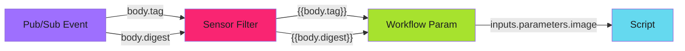

# Sensor Configuration

Sensors are the decision-makers in Argo Events. They subscribe to events from the EventBus, evaluate filter conditions, and trigger downstream actions when those conditions are met. A well-designed sensor can route hundreds of different event types to the appropriate workflows while filtering out noise.

This guide covers sensor patterns from basic event-to-workflow triggering through advanced multi-action routing and complex event filtering.

---

## Basic Sensor

The simplest sensor watches for events from a single EventSource and triggers a workflow when conditions match. This example triggers deployment restarts when new container images are pushed to a registry.

The sensor has two main sections: dependencies define what events to watch and how to filter them, while triggers define what actions to take when matching events arrive.

```yaml
apiVersion: argoproj.io/v1alpha1
kind: Sensor
metadata:
  name: deployment-restart-trigger
  namespace: argo-events
spec:
  dependencies:
    - name: image-push
      eventSourceName: gar-image-push
      eventName: image-pushed
      filters:
        data:
          - path: body.action
            type: string
            value:
              - INSERT
          - path: body.digest
            type: string
            comparator: "!="
            value: [""]

  triggers:
    - template:
        name: restart-deployments
        argoWorkflow:
          operation: submit
          source:
            resource:
              apiVersion: argoproj.io/v1alpha1
              kind: Workflow
              metadata:
                generateName: deployment-restart-
                namespace: argo-workflows
              spec:
                workflowTemplateRef:
                  name: deployment-restart
                arguments:
                  parameters:
                    - name: image
                      value: "{{body.tag}}"
                    - name: digest
                      value: "{{body.digest}}"
```

The `eventSourceName` and `eventName` fields connect this sensor to a specific EventSource. The filters ensure we only process INSERT actions (new images) with valid digests, ignoring deletions and incomplete events.

---

## Event Filtering

Filters prevent unwanted events from triggering workflows. Without proper filtering, your workflows might run on every event, wasting resources and potentially causing unintended side effects. Argo Events supports multiple filter types that can be combined with AND logic.

| Filter | Purpose | Example |
| -------- | --------- | --------- |
| `action: INSERT` | Only new images | Skip deletions |
| `digest != ""` | Valid digests only | Skip incomplete events |
| `path: body.tag` | Match image patterns | Filter by registry |

Data filters use JSONPath expressions to extract values from the event payload. The `comparator` field supports equality checks, inequality, and regex matching. Multiple filters on the same dependency are ANDed together, meaning all conditions must match for the event to pass through.

---

## Parameter Extraction

One of the most powerful features of sensors is the ability to extract values from incoming events and pass them as parameters to triggered workflows. This creates a dynamic pipeline where event data drives workflow behavior.



**Parameter transformation flow:**

1. Pub/Sub delivers an event with payload `{"tag": "registry/app:v1.2.3", "digest": "sha256:..."}`
2. The sensor extracts values using template syntax `{{body.tag}}` and `{{body.digest}}`
3. These values are injected into the workflow's `arguments.parameters` section
4. The workflow script accesses them via `{{inputs.parameters.image}}`

This extraction happens at trigger time, so each workflow instance receives the specific values from the event that triggered it. The template syntax supports nested paths like `{{body.metadata.labels.app}}` for deeply nested event structures.

---

## Multi-Action Routing

Production systems often need to route different event types to different workflows. Rather than creating separate sensors for each action type, you can use multiple dependencies with conditions to build a single router sensor.

This pattern is especially useful when events share a common transport (like a single Pub/Sub subscription) but require different processing based on their content. Each dependency defines its own filter, and the `conditions` field on triggers determines which dependency must match.

```yaml
apiVersion: argoproj.io/v1alpha1
kind: Sensor
metadata:
  name: multi-action-router
  namespace: argo-events
spec:
  revisionHistoryLimit: 1
  template:
    serviceAccountName: sensor-sa
  dependencies:
    # Route 1: ETL actions
    - name: etl-actions
      eventSourceName: pubsub-source
      eventName: main-subscription
      filters:
        data:
          - path: body.action
            type: string
            value:
              - etl-single-app
              - full-monty
    # Route 2: Report actions
    - name: report-actions
      eventSourceName: pubsub-source
      eventName: main-subscription
      filters:
        data:
          - path: body.action
            type: string
            value:
              - report-stored

  triggers:
    # Trigger 1: ETL workflow
    - template:
        name: etl-trigger
        conditions: etl-actions
        argoWorkflow:
          operation: submit
          source:
            resource:
              apiVersion: argoproj.io/v1alpha1
              kind: Workflow
              metadata:
                generateName: etl-pipeline-
              spec:
                workflowTemplateRef:
                  name: etl-pipeline
                arguments:
                  parameters:
                    - name: message
                      value: "{}"
          parameters:
            - src:
                dependencyName: etl-actions
                dataKey: body
              dest: spec.arguments.parameters.0.value

    # Trigger 2: Report processing workflow
    - template:
        name: report-trigger
        conditions: report-actions
        argoWorkflow:
          operation: submit
          source:
            resource:
              apiVersion: argoproj.io/v1alpha1
              kind: Workflow
              metadata:
                generateName: process-report-
              spec:
                workflowTemplateRef:
                  name: process-report
                arguments:
                  parameters:
                    - name: pubsub-message
                      value: "{}"
          parameters:
            - src:
                dependencyName: report-actions
                dataKey: body
              dest: spec.arguments.parameters.0.value
```

**Key patterns in multi-action routing:**

| Pattern | Purpose |
| --------- | --------- |
| Multiple `dependencies` | Define different event filters for each action type |
| `conditions` on triggers | Match triggers to specific dependencies by name |
| `dataKey: body` | Extract the full event payload for downstream processing |
| `dest: spec.arguments.parameters.0.value` | Inject the payload into the first workflow parameter |

The `parameters` section performs the actual data injection. The `src` specifies where to get the data (which dependency and which key), while `dest` specifies where to put it in the triggered resource using JSONPath notation.

---

## GitHub Push Event Filtering

GitHub webhooks present a unique challenge because a single push event can contain multiple commits, each with their own lists of modified, added, and removed files. To filter based on file patterns, you need to flatten these nested arrays and search across all of them.

This advanced filter demonstrates how to trigger workflows only when specific file types change, which is essential for documentation builds, test runs, or other file-type-specific automation.

```yaml
dependencies:
  - name: github-push-filter
    eventSourceName: github
    eventName: github
    filters:
      data:
        # Only push events
        - path: headers.X-Github-Event
          type: string
          value:
            - push
        # Only when markdown or images changed
        - path: "[body.commits.#.modified.@flatten,body.commits.#.added.@flatten].@flatten.@flatten"
          type: string
          value:
            - ".*\\.md"
            - ".*\\.jpg"
            - ".*\\.png"
```

This filter uses [GJSON path syntax](https://github.com/tidwall/gjson) to perform complex array operations:

1. `body.commits.#.modified` selects the `modified` array from every commit
2. `@flatten` collapses nested arrays into a single flat array
3. The outer array combines both `modified` and `added` file lists
4. The final `@flatten` operations merge everything into one searchable list

The regex patterns in `value` then match against this flattened list. If any file in any commit matches any pattern, the filter passes. This enables precise control over when documentation builds or image processing pipelines should run.

---

## Rate Limiting

High-volume event streams can overwhelm downstream systems if every event triggers a workflow immediately. Rate limiting prevents this by capping how many workflows can be triggered within a time window.

This is particularly important for image registries, Git repositories, or any system that might generate bursts of events during active development periods.

```yaml
spec:
  triggers:
    - template:
        name: restart-deployments
        rateLimit:
          unit: Minute
          requestsPerUnit: 60  # Max 60 workflows/min
```

When the rate limit is exceeded, events are not lost. They queue in the EventBus and are processed as capacity becomes available. The `unit` field accepts `Second`, `Minute`, or `Hour`, allowing you to tune the rate limit to your workflow's processing capacity.

---

## Retry Strategy

Network issues, API rate limits, and transient failures can cause trigger operations to fail. A retry strategy ensures that temporary problems do not result in lost events or failed pipelines.

```yaml
triggers:
  - template:
      name: workflow-trigger
      argoWorkflow:
        operation: submit
        source:
          resource:
            # ... workflow spec
    retryStrategy:
      steps: 3  # Retry up to 3 times
```

The retry strategy applies to the trigger operation itself, not the workflow execution. If submitting the workflow fails (perhaps due to API server unavailability), the sensor will retry up to the specified number of times before marking the event as failed.

For workflow-level retries, configure the retry strategy within the WorkflowTemplate itself.

---

!!! tip "Test Filters Incrementally"
    Start with a sensor that has no filters and logs all events. Add filters one at a time, verifying each works before adding the next. Complex filters are hard to debug when they silently drop events.

---

## Related

- [EventSource Configuration](event-sources.md) - Connect to external event sources
- [EventBus Configuration](event-bus.md) - Message delivery configuration
- [Argo Workflows Patterns](../../../developer-guide/argo-workflows/index.md) - WorkflowTemplate design
