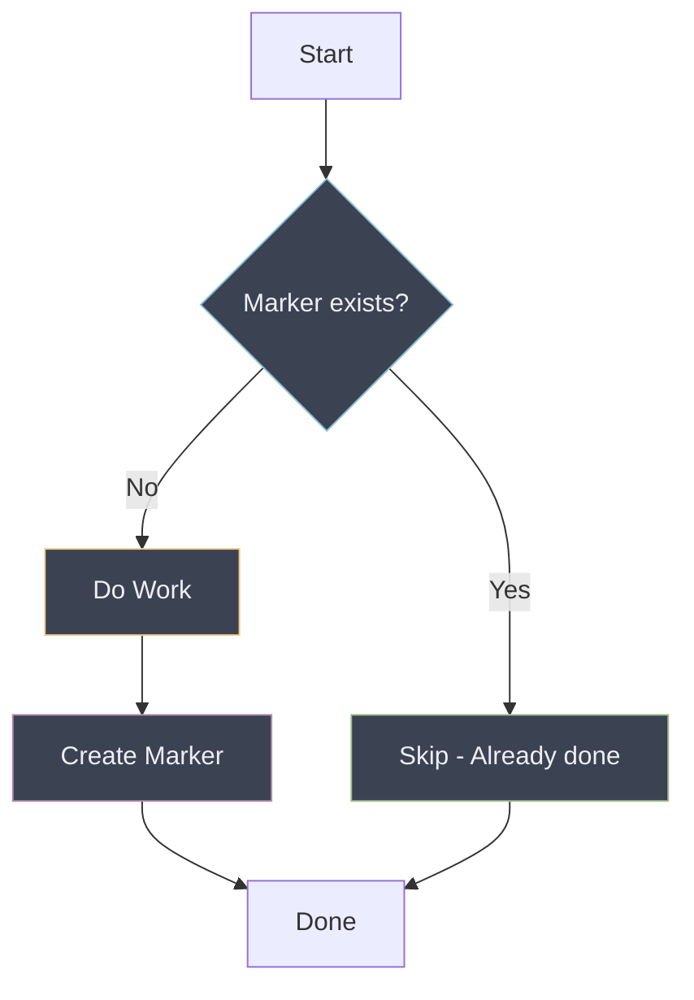

# Tombstone/Marker Files

Leave a trail so you know where you've been.

---

## The Pattern

```bash
MARKER=".completed-$OPERATION_ID"

if [ -f "$MARKER" ]; then
  echo "Already completed"
  exit 0
fi

# Do the work...

touch "$MARKER"
```

Create a marker file (or database record) when an operation completes. On rerun, check for the marker and skip if present.



!!! info "Universal Fallback"

    Tombstone markers work for any operation, even external API calls with no natural idempotency. If you can't use other patterns, markers are always an option.

---

## When to Use

!!! success "Good Fit"

    - Multi-step operations where each step should run once
    - Long-running processes that might be interrupted
    - Operations without natural idempotency (external API calls, emails)
    - Batch processing where items need individual tracking
    - Workflows spanning multiple runs or systems

!!! warning "Poor Fit"

    - Simple operations where check-before-act suffices
    - When marker storage is unreliable
    - High-frequency operations (marker overhead adds up)
    - When operation result changes over time (markers become stale)

---

## Examples

### Basic Marker File

```bash
MARKER="/tmp/.migration-completed-v2"

if [ -f "$MARKER" ]; then
  echo "Migration already completed"
  exit 0
fi

run_database_migration

touch "$MARKER"
echo "Migration completed"
```

### Run-Scoped Markers

```bash
# Unique per workflow run
MARKER=".done-${GITHUB_RUN_ID}-${GITHUB_RUN_ATTEMPT}"

if [ -f "$MARKER" ]; then
  echo "This run already completed"
  exit 0
fi

perform_deployment

touch "$MARKER"
```

### Operation-Scoped Markers

```bash
# Track each item in a batch
process_item() {
  local item="$1"
  local marker=".processed-$(echo "$item" | sha256sum | cut -c1-16)"

  if [ -f "$marker" ]; then
    echo "Skipping $item (already processed)"
    return 0
  fi

  do_work_on "$item"

  touch "$marker"
  echo "Processed $item"
}

for item in "${ITEMS[@]}"; do
  process_item "$item"
done
```

### Markers with Metadata

```bash
MARKER=".completed-$OPERATION"

if [ -f "$MARKER" ]; then
  echo "Completed at: $(cat "$MARKER")"
  exit 0
fi

perform_operation

# Store completion time and details
echo "$(date -Iseconds) by ${GITHUB_ACTOR:-unknown}" > "$MARKER"
```

### Directory-Based Markers

```bash
# Use directories for atomic marker creation
MARKER_DIR=".markers/$OPERATION_ID"

if [ -d "$MARKER_DIR" ]; then
  echo "Already completed"
  exit 0
fi

perform_operation

mkdir -p "$MARKER_DIR"
echo "$RESULT" > "$MARKER_DIR/result.json"
```

---

## GitHub Actions Examples

### Step-Level Markers

```yaml
- name: Check if already deployed
  id: check
  run: |
    MARKER=".deployed-${{ github.sha }}"
    if [ -f "$MARKER" ]; then
      echo "skip=true" >> "$GITHUB_OUTPUT"
    else
      echo "skip=false" >> "$GITHUB_OUTPUT"
    fi

- name: Deploy
  if: steps.check.outputs.skip != 'true'
  run: |
    ./deploy.sh
    touch ".deployed-${{ github.sha }}"

- name: Commit marker
  if: steps.check.outputs.skip != 'true'
  run: |
    git add ".deployed-*"
    git commit -m "Mark deployment complete" || true
    git push || true
```

### Artifact-Based Markers

```yaml
- name: Check for completion marker
  id: check
  continue-on-error: true
  uses: actions/download-artifact@v4
  with:
    name: completed-${{ github.sha }}

- name: Run expensive operation
  if: steps.check.outcome == 'failure'
  run: ./expensive-operation.sh

- name: Create completion marker
  if: steps.check.outcome == 'failure'
  run: echo "done" > marker.txt

- name: Upload marker
  if: steps.check.outcome == 'failure'
  uses: actions/upload-artifact@v4
  with:
    name: completed-${{ github.sha }}
    path: marker.txt
```

### Cache-Based Markers

```yaml
- name: Check completion cache
  id: cache
  uses: actions/cache@v4
  with:
    path: .completion-marker
    key: completed-${{ github.sha }}-${{ hashFiles('src/**') }}

- name: Run if not cached
  if: steps.cache.outputs.cache-hit != 'true'
  run: |
    ./build.sh
    mkdir -p .completion-marker
    echo "done" > .completion-marker/status
```

---

## Database-Based Markers

### SQL Tracking Table

```sql
CREATE TABLE operation_markers (
  operation_id VARCHAR(255) PRIMARY KEY,
  completed_at TIMESTAMP DEFAULT NOW(),
  result TEXT,
  metadata JSONB
);

-- Check before operation
SELECT 1 FROM operation_markers WHERE operation_id = $1;

-- Mark complete after operation
INSERT INTO operation_markers (operation_id, result)
VALUES ($1, $2)
ON CONFLICT (operation_id) DO NOTHING;
```

### Redis-Based Markers

```bash
# Check marker
if redis-cli EXISTS "completed:$OPERATION_ID" | grep -q "1"; then
  echo "Already completed"
  exit 0
fi

perform_operation

# Set marker with expiration
redis-cli SETEX "completed:$OPERATION_ID" 86400 "$(date -Iseconds)"
```

---

## Edge Cases and Gotchas

### Markers Without Cleanup

Markers accumulate forever without cleanup:

```bash
# After 1000 runs, you have 1000 marker files
ls .done-* | wc -l
# 1000
```

!!! tip "Schedule Regular Cleanup"

    Add marker cleanup to your CI pipeline or cron jobs. Stale markers waste storage and make debugging harder.

**Mitigation**: Include cleanup in your workflow:

```bash
# Clean markers older than 7 days
find . -name ".done-*" -mtime +7 -delete
```

### Partial Completion

!!! danger "The Gap Between Work and Marker"

    If your script crashes after the operation succeeds but before the marker is created, a rerun will duplicate the work. The marker only helps if it's written.

Operation fails after starting but before marker creation:

```bash
perform_operation  # Succeeds partially
# Script killed here
touch "$MARKER"    # Never runs
```

**Mitigation**: Make the operation itself idempotent, or use transaction-like patterns:

```bash
MARKER=".completed-$OP"
PENDING=".pending-$OP"

# Mark as in-progress
touch "$PENDING"

if perform_operation; then
  mv "$PENDING" "$MARKER"
else
  rm -f "$PENDING"
  exit 1
fi
```

### Stale Markers

Marker exists but operation needs to run again:

```bash
# Marker says "done" but source changed
if [ -f "$MARKER" ]; then
  exit 0  # Skips even though we should re-run
fi
```

**Mitigation**: Include content hash in marker name:

```bash
CONTENT_HASH=$(sha256sum source.txt | cut -c1-16)
MARKER=".done-${CONTENT_HASH}"
```

### Distributed Marker Access

Multiple workers checking the same marker:

```bash
# Worker 1                  # Worker 2
if [ ! -f marker ]; then   if [ ! -f marker ]; then
  # Both pass check
  do_work                    do_work  # Duplicate!
  touch marker               touch marker
fi                         fi
```

**Mitigation**: Use atomic marker creation:

```bash
# mkdir fails atomically if directory exists
if mkdir ".lock-$OPERATION" 2>/dev/null; then
  do_work
  touch ".done-$OPERATION"
  rmdir ".lock-$OPERATION"
else
  echo "Another worker is processing"
fi
```

---

## Anti-Patterns

### Markers Without Context

```bash
# Bad: no idea what this marker means
touch .done

# Good: descriptive and scoped
touch ".done-migration-v2-${GITHUB_RUN_ID}"
```

### Checking Marker After Operation

```bash
# Bad: defeats the purpose
perform_operation
if [ -f "$MARKER" ]; then
  echo "Done"
fi
touch "$MARKER"

# Good: check first
if [ -f "$MARKER" ]; then
  echo "Already done"
  exit 0
fi
perform_operation
touch "$MARKER"
```

### Markers in Ephemeral Locations

```bash
# Bad: /tmp is cleared on reboot
MARKER="/tmp/.operation-done"

# Better: persistent location
MARKER="/var/lib/myapp/.operation-done"

# Or use artifact/cache for CI
```

---

## Comparison with Other Patterns

| Aspect | [Check-Before-Act](check-before-act.md) | [Unique Identifiers](unique-identifiers.md) | Tombstone Markers |
|--------|-----------------|-------------------|-------------------|
| Tracks completion | No | No | Yes |
| Works for any operation | No | No | Yes |
| Requires storage | No | No | Yes |
| Can track partial progress | No | No | Yes |
| Cleanup required | No | No | Yes |

---

## Summary

Tombstone markers are the universal fallback for idempotency.

!!! abstract "Key Takeaways"

    1. **Check marker first** - skip if present
    2. **Create marker last** - only after success
    3. **Include context** - operation ID, content hash, timestamp
    4. **Plan for cleanup** - markers accumulate without maintenance
    5. **Handle edge cases** - partial completion, stale markers, concurrent access
