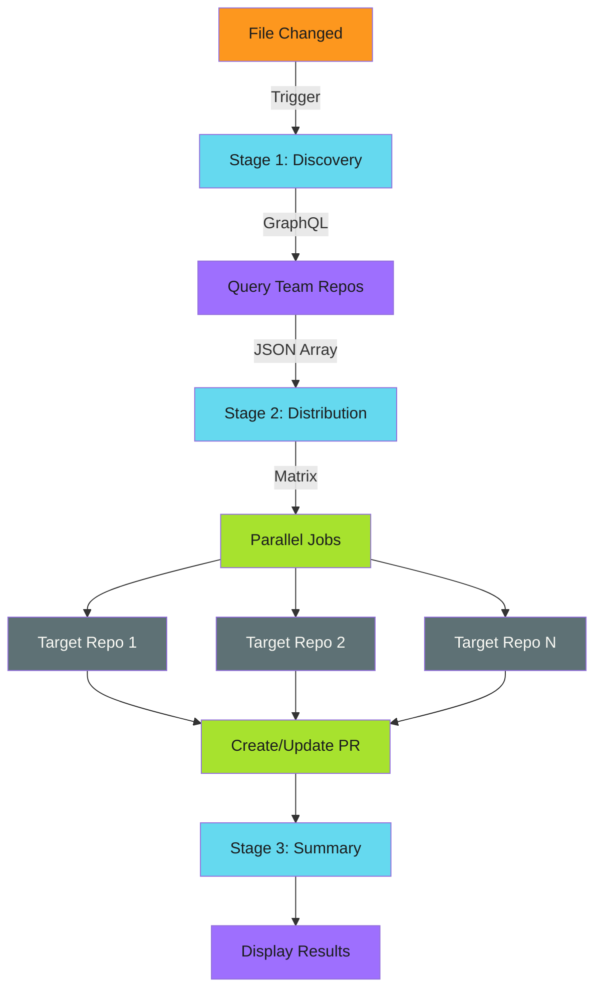

# File Distribution Workflow Pattern

This document describes a generic pattern for automated file distribution across multiple repositories using GitHub Actions, GitHub Apps, and team-based repository discovery.

## Pattern Overview

**Problem**: Maintaining consistent files (documentation, configuration, policies) across many repositories

**Solution**: Automated distribution workflow that:

- Monitors changes to source files in a central repository
- Automatically distributes updates to target repositories
- Creates or updates pull requests in each target
- Provides visibility through workflow summaries

## Architecture

### Three-Stage Workflow



### Stage Responsibilities

1. **Discovery**: Query organization for target repositories
2. **Distribution**: Parallel distribution to each repository
3. **Summary**: Aggregate and display results

## Implementation

### Stage 1: Repository Discovery

Query repositories via GraphQL to determine distribution targets:

```yaml
jobs:
  discover:
    name: Discover target repositories
    runs-on: ubuntu-latest
    outputs:
      repositories: ${{ steps.query.outputs.repos }}
      count: ${{ steps.query.outputs.count }}
    steps:
      - name: Generate authentication token
        id: auth
        uses: actions/create-github-app-token@v2
        with:
          app-id: ${{ secrets.CORE_APP_ID }}
          private-key: ${{ secrets.CORE_APP_PRIVATE_KEY }}
          owner: your-org

      - name: Query team repositories
        id: query
        env:
          GH_TOKEN: ${{ steps.auth.outputs.token }}
        run: |
          REPOS=$(gh api graphql -f query='
          {
            organization(login: "your-org") {
              team(slug: "target-team") {
                repositories(first: 100) {
                  nodes {
                    name
                    defaultBranchRef {
                      name
                    }
                  }
                }
              }
            }
          }' --jq '.data.organization.team.repositories.nodes |
            map({name: .name, default_branch: .defaultBranchRef.name})')

          echo "repos=$REPOS" >> $GITHUB_OUTPUT

          COUNT=$(echo "$REPOS" | jq 'length')
          echo "count=$COUNT" >> $GITHUB_OUTPUT
          echo "Found $COUNT repositories"
```

**Key Features**:

- GraphQL query scopes to specific team
- Returns repository names and default branch
- Outputs JSON array for matrix strategy

### Stage 2: Parallel Distribution

Distribute files to all repositories using matrix strategy:

```yaml
distribute:
  name: Distribute to ${{ matrix.repo.name }}
  needs: discover
  runs-on: ubuntu-latest
  if: needs.discover.outputs.count > 0
  strategy:
    matrix:
      repo: ${{ fromJson(needs.discover.outputs.repositories) }}
    fail-fast: false
    max-parallel: 10
  steps:
    - name: Checkout source repository
      uses: actions/checkout@v4

    - name: Generate authentication token
      id: auth
      uses: actions/create-github-app-token@v2
      with:
        app-id: ${{ secrets.CORE_APP_ID }}
        private-key: ${{ secrets.CORE_APP_PRIVATE_KEY }}
        owner: your-org

    - name: Clone target repository
      env:
        GH_TOKEN: ${{ steps.auth.outputs.token }}
      run: |
        gh repo clone your-org/${{ matrix.repo.name }} target

    - name: Prepare branch
      working-directory: target
      run: |
        # Branch management script (see below)
        ../scripts/prepare-branch.sh \
          automated-update \
          ${{ matrix.repo.default_branch }}

    - name: Copy files
      run: |
        cp source-file.txt target/destination-file.txt

    - name: Check for changes
      id: changes
      working-directory: target
      run: |
        if git diff --quiet; then
          echo "has_changes=false" >> $GITHUB_OUTPUT
        else
          echo "has_changes=true" >> $GITHUB_OUTPUT
        fi

    - name: Commit changes
      if: steps.changes.outputs.has_changes == 'true'
      working-directory: target
      run: |
        git config user.name "automation-bot"
        git config user.email "automation@your-org.com"

        git add destination-file.txt
        git commit -m "chore: update file from central repository"

    - name: Push changes
      if: steps.changes.outputs.has_changes == 'true'
      working-directory: target
      env:
        GH_TOKEN: ${{ steps.auth.outputs.token }}
      run: |
        git push -u origin automated-update

    - name: Create or update pull request
      if: steps.changes.outputs.has_changes == 'true'
      working-directory: target
      env:
        GH_TOKEN: ${{ steps.auth.outputs.token }}
      run: |
        # Check if PR exists
        PR_EXISTS=$(gh pr list \
          --head automated-update \
          --base ${{ matrix.repo.default_branch }} \
          --json number \
          --jq 'length')

        if [ "$PR_EXISTS" -eq 0 ]; then
          gh pr create \
            --base ${{ matrix.repo.default_branch }} \
            --title "chore: automated file update" \
            --body "Automated distribution from central repository"
        else
          echo "PR already exists, commits were pushed to update it"
        fi
```

**Key Features**:

- Matrix spawns parallel jobs per repository
- `fail-fast: false` ensures all repos process even if one fails
- `max-parallel: 10` limits concurrent jobs to avoid rate limits
- Idempotent: checks for changes before committing

### Stage 3: Result Summary

Aggregate results and display PR links:

```yaml
summary:
  name: Distribution summary
  needs: [discover, distribute]
  runs-on: ubuntu-latest
  if: always()
  steps:
    - name: Generate authentication token
      id: auth
      uses: actions/create-github-app-token@v2
      with:
        app-id: ${{ secrets.CORE_APP_ID }}
        private-key: ${{ secrets.CORE_APP_PRIVATE_KEY }}
        owner: your-org

    - name: Generate summary
      env:
        GH_TOKEN: ${{ steps.auth.outputs.token }}
      run: |
        echo "## Distribution Complete" >> $GITHUB_STEP_SUMMARY
        echo "" >> $GITHUB_STEP_SUMMARY
        echo "**Repositories processed:** ${{ needs.discover.outputs.count }}" >> $GITHUB_STEP_SUMMARY
        echo "**Trigger:** ${{ github.event_name }}" >> $GITHUB_STEP_SUMMARY
        echo "**Commit:** ${{ github.sha }}" >> $GITHUB_STEP_SUMMARY
        echo "" >> $GITHUB_STEP_SUMMARY

        # Extract PR URLs from workflow logs
        echo "### Pull Requests" >> $GITHUB_STEP_SUMMARY
        echo "" >> $GITHUB_STEP_SUMMARY

        PR_URLS=$(gh run view ${{ github.run_id }} --log 2>&1 |
          grep -o 'https://github.com/your-org/[^/]*/pull/[0-9]*' |
          sort -u || true)

        if [ -n "$PR_URLS" ]; then
          while IFS= read -r pr_url; do
            repo_name=$(echo "$pr_url" | sed 's|.*/\([^/]*\)/pull/.*|\1|')
            echo "- [$repo_name]($pr_url)" >> $GITHUB_STEP_SUMMARY
          done <<< "$PR_URLS"
        else
          echo "*No new pull requests created*" >> $GITHUB_STEP_SUMMARY
          echo "" >> $GITHUB_STEP_SUMMARY
          echo "Existing PRs may have been updated, or files are already current" >> $GITHUB_STEP_SUMMARY
        fi
```

**Key Features**:

- `if: always()` runs even if distribution jobs fail
- Extracts PR URLs from workflow logs
- Provides clickable summary of results

## Supporting Scripts

### Branch Preparation Script

Create `scripts/prepare-branch.sh` for idempotent branch management:

```bash
#!/bin/bash
set -e

# Usage: prepare-branch.sh <branch_name> <default_branch>

BRANCH_NAME="$1"
DEFAULT_BRANCH="$2"

if [ -z "$BRANCH_NAME" ] || [ -z "$DEFAULT_BRANCH" ]; then
  echo "Usage: $0 <branch_name> <default_branch>"
  exit 1
fi

# Configure git authentication
if [ -n "$GH_TOKEN" ]; then
  git config --local credential.helper \
    '!f() { echo "username=x-access-token"; echo "password=$GH_TOKEN"; }; f'
fi

git fetch origin

if git ls-remote --heads origin "$BRANCH_NAME" | grep -q "$BRANCH_NAME"; then
  echo "Branch exists remotely, resetting to remote state..."
  git checkout -B "$BRANCH_NAME" "origin/$BRANCH_NAME"
elif git branch --list "$BRANCH_NAME" | grep -q "$BRANCH_NAME"; then
  echo "Branch exists locally, checking out..."
  git checkout "$BRANCH_NAME"
else
  echo "Creating new branch from $DEFAULT_BRANCH..."
  git checkout -b "$BRANCH_NAME"
fi
```

**Idempotency**: Uses `git checkout -B` to force reset to remote state, avoiding merge conflicts on subsequent runs.

## Workflow Configuration

### Trigger Configuration

```yaml
on:
  push:
    branches:
      - main
    paths:
      - 'source-file.txt'  # Only trigger when this file changes
  workflow_dispatch:  # Allow manual triggers
```

### Required Permissions

```yaml
permissions:
  contents: write  # For checking out and pushing to repositories
  id-token: write  # For generating Core App tokens
  pull-requests: write  # For creating pull requests
```

## Pagination Handling

For organizations with many repositories, implement pagination:

```bash
# In discovery script
REPOS=$(gh api graphql --paginate -f query='
{
  organization(login: "your-org") {
    team(slug: "target-team") {
      repositories(first: 100) {
        pageInfo {
          hasNextPage
          endCursor
        }
        nodes {
          name
          defaultBranchRef {
            name
          }
        }
      }
    }
  }
}' --jq '.data.organization.team.repositories.nodes |
  map({name: .name, default_branch: .defaultBranchRef.name})')

# Add pagination guard
COUNT=$(echo "$REPOS" | jq 'length')
if [ "$COUNT" -ge 100 ]; then
  echo "WARNING: Repository count at limit, some repos may be missing"
  echo "Implement proper pagination handling"
fi
```

## Idempotency Guarantees

The workflow is designed to be fully idempotent:

### Branch Management

- `git checkout -B` forces reset to remote state
- No merge conflicts on subsequent runs
- Safe to run multiple times

### Change Detection

- Checks if file content actually changed
- Skips commit/push if no changes
- Avoids empty commits

### PR Management

- Checks for existing PRs before creating
- Updates existing PRs with new commits
- No duplicate PRs created

## Error Handling

### Failure Strategies

```yaml
strategy:
  matrix:
    repo: ${{ fromJson(needs.discover.outputs.repositories) }}
  fail-fast: false  # Continue processing other repos on failure
```

### Conditional Execution

```yaml
- name: Operation
  if: steps.previous.outcome == 'success'
  run: |
    # Only runs if previous step succeeded
```

### Error Reporting

```yaml
- name: Report failures
  if: failure()
  run: |
    echo "::error::Distribution failed for ${{ matrix.repo.name }}"
```

## Performance Optimization

### Parallel Processing

```yaml
strategy:
  matrix:
    repo: ${{ fromJson(needs.discover.outputs.repositories) }}
  max-parallel: 10  # Process 10 repositories concurrently
```

**Tuning**:

- Start with `max-parallel: 10`
- Monitor rate limit headers
- Reduce if hitting rate limits
- Increase for smaller organizations

### Rate Limit Management

```bash
# Check rate limits before operations
RATE_LIMIT=$(gh api /rate_limit --jq '.resources.core.remaining')
if [ "$RATE_LIMIT" -lt 100 ]; then
  echo "WARNING: Rate limit low ($RATE_LIMIT remaining)"
  sleep 60
fi
```

## Extension Patterns

### Multiple File Distribution

```yaml
- name: Copy files
  run: |
    cp file1.txt target/
    cp file2.yaml target/
    cp file3.md target/
```

### Conditional Distribution

```yaml
- name: Check repository type
  id: check_type
  working-directory: target
  run: |
    if [ -f "package.json" ]; then
      echo "type=nodejs" >> $GITHUB_OUTPUT
    elif [ -f "pom.xml" ]; then
      echo "type=java" >> $GITHUB_OUTPUT
    fi

- name: Copy appropriate files
  run: |
    if [ "${{ steps.check_type.outputs.type }}" = "nodejs" ]; then
      cp node-config.json target/
    elif [ "${{ steps.check_type.outputs.type }}" = "java" ]; then
      cp java-config.xml target/
    fi
```

### Template Rendering

```yaml
- name: Render template
  run: |
    sed "s/{{REPO_NAME}}/${{ matrix.repo.name }}/g" template.txt > target/file.txt
```

## Monitoring and Observability

### Workflow Summary Format

```markdown
## Distribution Complete

**Repositories processed:** 42
**Trigger:** push
**Commit:** abc123def

### Pull Requests

- [repository-1](https://github.com/org/repository-1/pull/15)
- [repository-2](https://github.com/org/repository-2/pull/8)
- [repository-3](https://github.com/org/repository-3/pull/23)

*No new pull requests created for 39 repositories*
*Existing PRs were updated or files are already current*
```

### Metrics Collection

```yaml
- name: Collect metrics
  run: |
    echo "repos_processed=${{ needs.discover.outputs.count }}" >> metrics.txt
    echo "prs_created=$(gh pr list --search 'author:app/automation' --json number | jq 'length')" >> metrics.txt
```

## Security Considerations

### Token Scope

```yaml
# Generate org-scoped token
- name: Generate token
  uses: actions/create-github-app-token@v2
  with:
    app-id: ${{ secrets.CORE_APP_ID }}
    private-key: ${{ secrets.CORE_APP_PRIVATE_KEY }}
    owner: your-org  # Critical for org-wide access
```

### Branch Protection

- Distribution branch should respect branch protection rules
- PRs require approval like any other contribution
- No bypass of security controls

### Audit Trail

- All changes recorded in git history
- PRs provide review opportunity
- Workflow logs show complete execution trace

## Troubleshooting

### Common Issues

#### No Repositories Found

**Symptom**: Discovery returns 0 repositories

**Checks**:

1. Verify team slug is correct
2. Confirm Core App has "Members" organization permission
3. Check `owner` parameter in token generation

#### PRs Not Created

**Symptom**: Workflow completes but no PRs appear

**Checks**:

1. Verify files actually changed
2. Check change detection logic
3. Review workflow logs for error messages

#### Permission Denied

**Symptom**: `403 Forbidden` errors

**Checks**:

1. Verify Core App has required permissions
2. Confirm app installed on target repositories
3. Check workflow permissions declaration

## Best Practices

1. **Start Small**: Test with 2-3 repositories before full rollout
2. **Monitor First Run**: Watch logs carefully on initial deployment
3. **Gradual Rollout**: Increase `max-parallel` gradually
4. **Clear Documentation**: Document what files are distributed and why
5. **Review Process**: Ensure PRs are reviewed before merging
6. **Error Handling**: Implement comprehensive error handling
7. **Idempotency**: Design for safe re-execution
8. **Observability**: Provide clear status reporting

## References

- [GitHub Core App Setup](./github-app-setup/index.md)
- [GitHub Actions Integration](./actions-integration.md)
- [GitHub Actions Matrix Strategy](https://docs.github.com/en/actions/using-jobs/using-a-matrix-for-your-jobs)
- [GitHub GraphQL API](https://docs.github.com/en/graphql)
