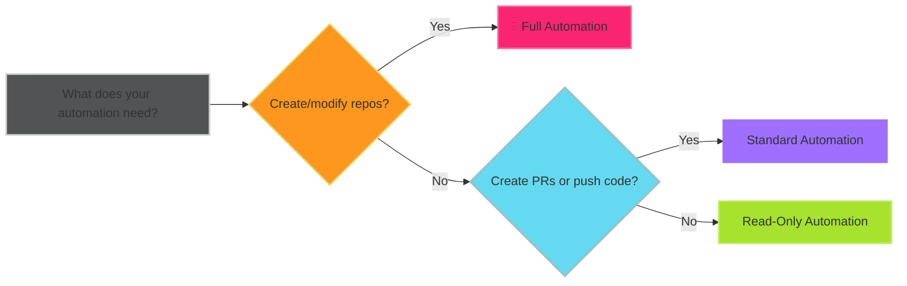

# Permission Design Patterns

Common permission configurations for different automation scenarios.

## Read-Only Automation

For reporting and analysis workflows:

```text
Contents: Read
Pull Requests: Read
Issues: Read
Members: Read
```

!!! example "Use Cases"

    - Security scanning
    - Metrics collection
    - Compliance reporting
    - Code analysis

## Standard Automation

For typical cross-repository workflows:

```text
Contents: Read & Write
Pull Requests: Read & Write
Members: Read
```

!!! example "Use Cases"

    - File synchronization
    - Automated PR creation
    - Documentation updates
    - Dependency updates

## Full Automation

For infrastructure and repository management:

```text
Contents: Read & Write
Pull Requests: Read & Write
Administration: Write
Actions: Read & Write
Members: Read
```

!!! example "Use Cases"

    - Repository provisioning
    - Advanced CI/CD
    - Organization management
    - Template enforcement

## Permission Matrix

| Permission | Read-Only | Standard | Full |
|------------|:---------:|:--------:|:----:|
| Contents | Read | Read & Write | Read & Write |
| Pull Requests | Read | Read & Write | Read & Write |
| Issues | Read | - | Read & Write |
| Members | Read | Read | Read |
| Administration | - | - | Write |
| Actions | - | - | Read & Write |
| Workflows | - | - | Write |

## Permission Decision Tree



## Pattern Guidelines

!!! tip "Start Minimal"

    Begin with Read-Only and add permissions as needed.

!!! warning "Avoid Over-Provisioning"

    Full Automation should be reserved for infrastructure workflows only.

## Next Steps

- [Security best practices](security-best-practices.md)
- [Common permission requirements](common-permissions.md)
