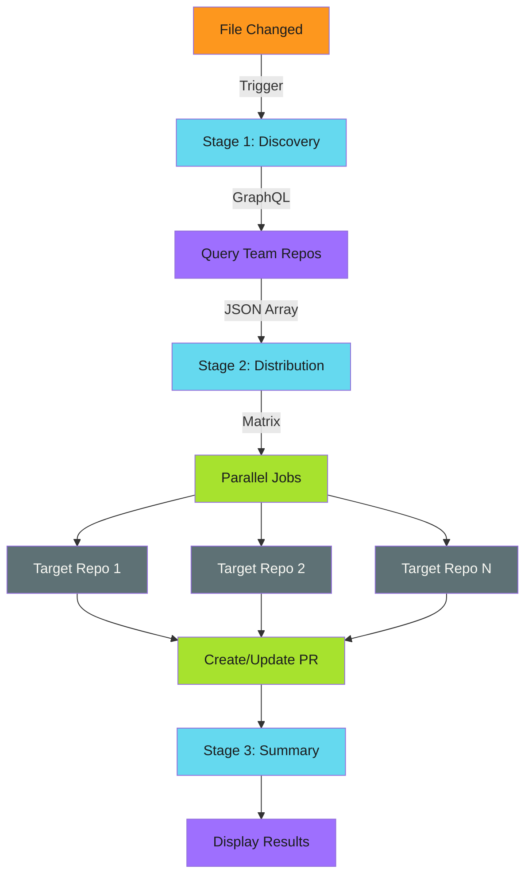

# Architecture

## Three-Stage Workflow

## Stage Responsibilities

1. **Discovery**: Query organization for target repositories
2. **Distribution**: Parallel distribution to each repository
3. **Summary**: Aggregate and display results

## Data Flow

| Stage | Input | Output |
|-------|-------|--------|
| Discovery | GraphQL query | JSON array of repositories |
| Distribution | Repository list | PRs created/updated |
| Summary | Workflow results | Human-readable report |

## Key Design Principles

- **Decoupled stages** - Each stage operates independently
- **Matrix parallelization** - Distribution scales horizontally
- **Fail-fast disabled** - Individual failures don't block others
- **Idempotent operations** - Safe to re-run at any point
