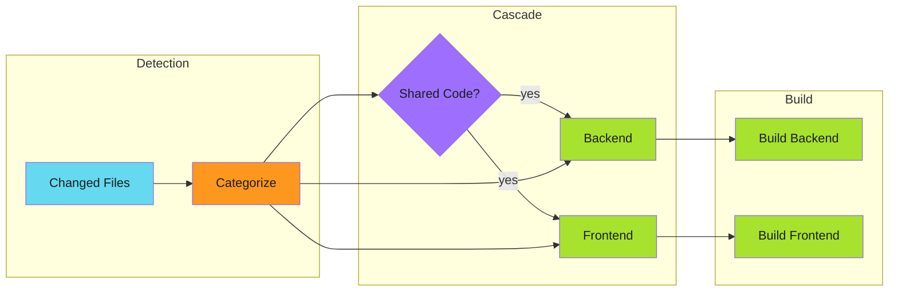
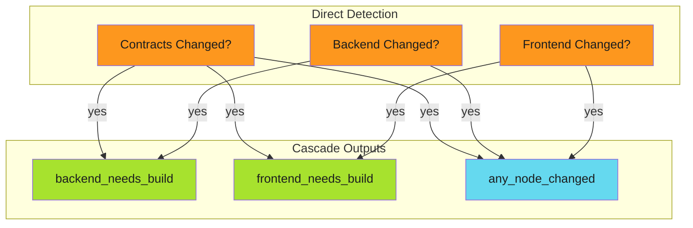

# Change Detection

Detect which components changed and skip unnecessary builds. This reduces CI time and resource usage in monorepos.

---

## Overview

Change detection identifies modified files and maps them to components:



---

## Using tj-actions/changed-files

The [tj-actions/changed-files](https://github.com/tj-actions/changed-files) action provides file-based change detection with YAML configuration:

```yaml
jobs:
  detect-changes:
    name: Detect Changes
    runs-on: ubuntu-latest
    outputs:
      contracts_changed: ${{ steps.changes.outputs.contracts_any_changed }}
      backend_changed: ${{ steps.changes.outputs.backend_any_changed }}
      frontend_changed: ${{ steps.changes.outputs.frontend_any_changed }}
      charts_changed: ${{ steps.changes.outputs.charts_any_changed }}
    steps:
      - name: Checkout Repository
        uses: actions/checkout@v4
        with:
          fetch-depth: 0  # Required for change detection
      - name: Detect changed paths
        id: changes
        uses: tj-actions/changed-files@v45
        with:
          files_yaml: |
            contracts:
              - packages/contracts/**
              - package.json
              - package-lock.json
            backend:
              - packages/backend/**
            frontend:
              - packages/frontend/**
            charts:
              - charts/**
```

---

## Output Naming Convention

With `files_yaml`, outputs follow the pattern `<category>_any_changed`:

| YAML Category | Output Variable |
|---------------|-----------------|
| `contracts:` | `contracts_any_changed` |
| `backend:` | `backend_any_changed` |
| `charts:` | `charts_any_changed` |

!!! warning "fetch-depth: 0"

    Change detection requires commit history. Always set `fetch-depth: 0`
    or a value large enough to include the base commit.

---

## Cascade Dependencies

Shared code (like contracts or types) should trigger rebuilds of dependent components:

```yaml
outputs:
  # Direct changes
  contracts_changed: ${{ steps.changes.outputs.contracts_any_changed }}
  backend_changed: ${{ steps.changes.outputs.backend_any_changed }}
  frontend_changed: ${{ steps.changes.outputs.frontend_any_changed }}

  # Cascade: contracts changes trigger dependent builds
  backend_needs_build: >-
    ${{ steps.changes.outputs.contracts_any_changed == 'true' ||
        steps.changes.outputs.backend_any_changed == 'true' }}
  frontend_needs_build: >-
    ${{ steps.changes.outputs.contracts_any_changed == 'true' ||
        steps.changes.outputs.frontend_any_changed == 'true' }}

  # Any Node.js code changed (for shared test step)
  any_node_changed: >-
    ${{ steps.changes.outputs.contracts_any_changed == 'true' ||
        steps.changes.outputs.backend_any_changed == 'true' ||
        steps.changes.outputs.frontend_any_changed == 'true' }}
```



---

## Conditional Job Execution

Use the `needs` and `if` keywords to conditionally run jobs:

```yaml
jobs:
  detect-changes:
    # ... detection job from above

  test:
    name: Test Node Packages
    needs: detect-changes
    if: needs.detect-changes.outputs.any_node_changed == 'true'
    runs-on: ubuntu-latest
    steps:
      - uses: actions/checkout@v4
      - run: npm ci && npm test

  build-backend:
    name: Build Backend
    needs: [detect-changes, test]
    if: |
      always() && !cancelled() &&
      needs.detect-changes.outputs.backend_needs_build == 'true' &&
      (needs.test.result == 'success' || needs.test.result == 'skipped')
    runs-on: ubuntu-latest
    steps:
      - uses: actions/checkout@v4
      - run: docker build -f Dockerfile.backend .
```

---

## The always() Pattern

When jobs depend on other jobs that might be skipped, use `always() && !cancelled()`:

```yaml
if: |
  always() && !cancelled() &&
  needs.detect-changes.outputs.backend_needs_build == 'true' &&
  (needs.test.result == 'success' || needs.test.result == 'skipped')
```

| Condition | Purpose |
|-----------|---------|
| `always()` | Run regardless of dependency status |
| `!cancelled()` | Don't run if workflow was cancelled |
| `result == 'success'` | Dependency completed successfully |
| `result == 'skipped'` | Dependency was skipped (acceptable) |

!!! info "Why Both Checks?"

    Without `always()`, a job with skipped dependencies won't run.
    Without the result checks, a job would run even if dependencies failed.

---

## Summary Job

Add a summary job for branch protection status checks:

```yaml
build-status:
  name: Build Status
  runs-on: ubuntu-latest
  needs: [detect-changes, test, build-backend, build-frontend, helm-charts]
  if: always()
  steps:
    - name: Check build results
      run: |
        echo "## Build Summary" >> $GITHUB_STEP_SUMMARY
        echo "" >> $GITHUB_STEP_SUMMARY
        echo "| Component | Changed | Result |" >> $GITHUB_STEP_SUMMARY
        echo "|-----------|---------|--------|" >> $GITHUB_STEP_SUMMARY
        echo "| Backend | ${{ needs.detect-changes.outputs.backend_needs_build }} | ${{ needs.build-backend.result || 'skipped' }} |" >> $GITHUB_STEP_SUMMARY
        echo "| Frontend | ${{ needs.detect-changes.outputs.frontend_needs_build }} | ${{ needs.build-frontend.result || 'skipped' }} |" >> $GITHUB_STEP_SUMMARY
        echo "| Charts | ${{ needs.detect-changes.outputs.charts_changed }} | ${{ needs.helm-charts.result || 'skipped' }} |" >> $GITHUB_STEP_SUMMARY

    - name: Fail if any required job failed
      if: |
        needs.test.result == 'failure' ||
        needs.build-backend.result == 'failure' ||
        needs.build-frontend.result == 'failure' ||
        needs.helm-charts.result == 'failure'
      run: exit 1
```

Configure branch protection to require the `Build Status` job. This single check aggregates all component results.

---

## Force Rebuild

Add a `workflow_dispatch` input for manual rebuilds:

```yaml
on:
  push:
    branches: [main]
  workflow_dispatch:
    inputs:
      force_all:
        description: "Force build all components"
        type: boolean
        default: false

jobs:
  detect-changes:
    outputs:
      backend_needs_build: >-
        ${{ inputs.force_all == true ||
            steps.changes.outputs.backend_any_changed == 'true' }}
```

---

## Common Patterns

### Root Package Files

Include root-level dependency files in shared detection:

```yaml
files_yaml: |
  contracts:
    - packages/contracts/**
    - package.json           # Root package.json
    - package-lock.json      # Lockfile changes affect all
    - tsconfig.json          # TypeScript config
```

### Infrastructure Changes

Separate infrastructure from application code:

```yaml
files_yaml: |
  terraform:
    - infrastructure/**/*.tf
    - infrastructure/**/*.tfvars
  kubernetes:
    - k8s/**/*.yaml
    - charts/**
  application:
    - src/**
```

### Documentation Only

Skip builds for documentation-only changes:

```yaml
outputs:
  docs_only: >-
    ${{ steps.changes.outputs.docs_any_changed == 'true' &&
        steps.changes.outputs.code_any_changed != 'true' }}
```

---

## Troubleshooting

| Issue | Cause | Solution |
|-------|-------|----------|
| All jobs skip | Wrong output name | Use `<category>_any_changed` pattern |
| Cascade not working | Missing OR condition | Check cascade logic includes shared dependencies |
| Dependent job fails | Skipped dependency | Add `always() && !cancelled()` pattern |
| No files detected | Shallow clone | Set `fetch-depth: 0` |

---

## Next Steps

- [Workflow Triggers](workflow-triggers.md) - Handle automation tools
- [Protected Branches](protected-branches.md) - Work with branch protection
