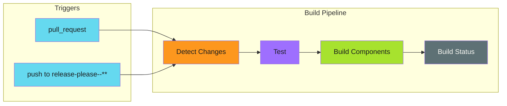
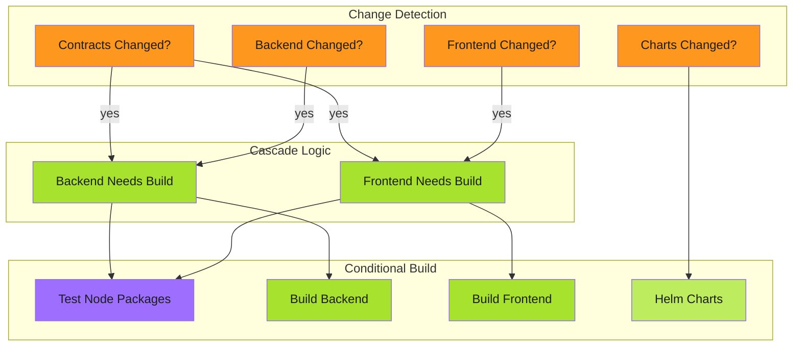
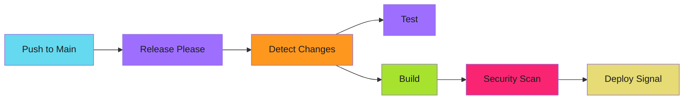

# Modular Release Pipelines

Automated version management, changelog generation, and optimized builds for monorepos.

---

## Overview

This guide covers implementing release automation with:

- **Release-please** for version bumping and changelog generation
- **Change detection** to skip unnecessary builds
- **Cascade rebuilds** when shared dependencies change
- **Dual-trigger patterns** for automation compatibility

---

## The Problem

Traditional CI/CD pipelines rebuild everything on every commit. In a monorepo with multiple components, this means:

- Unnecessary compute time for unchanged components
- Longer feedback loops for developers
- Wasted resources on duplicate work

Additionally, conventional release management requires manual:

- Version bumping in package files
- Changelog maintenance
- Git tagging

Release-please automates this based on conventional commits, but introduces a compatibility challenge with standard `pull_request` triggers.

---

## The Solution

A modular pipeline architecture that:

1. Detects which components changed
2. Only builds affected components
3. Automatically versions and releases based on commits
4. Works with protected branches and automation tools

---

## Guides

| Guide | Description |
|-------|-------------|
| [Release-Please Configuration](release-please-setup.md) | Setting up automated versioning |
| [Change Detection](change-detection.md) | Detecting and cascading changes |
| [Workflow Triggers](workflow-triggers.md) | GITHUB_TOKEN limitations and workarounds |
| [Protected Branches](protected-branches.md) | Working with branch protection rules |

---

## Architecture

### Build Pipeline

Runs on pull requests and release-please branches:

### Release Pipeline

Runs on main branch pushes:

---

## Quick Start

1. [Configure release-please](release-please-setup.md) for your repository
2. [Set up change detection](change-detection.md) for your components
3. [Add dual triggers](workflow-triggers.md) for automation compatibility
4. [Handle protected branches](protected-branches.md) if applicable

---

## Related

- [Idempotency Patterns](../../../../developer-guide/engineering-practices/patterns/idempotency/index.md) for making reruns safe
- [Three-Stage Design](../../../../developer-guide/engineering-practices/patterns/workflow-patterns/three-stage-design.md) for complex workflows
