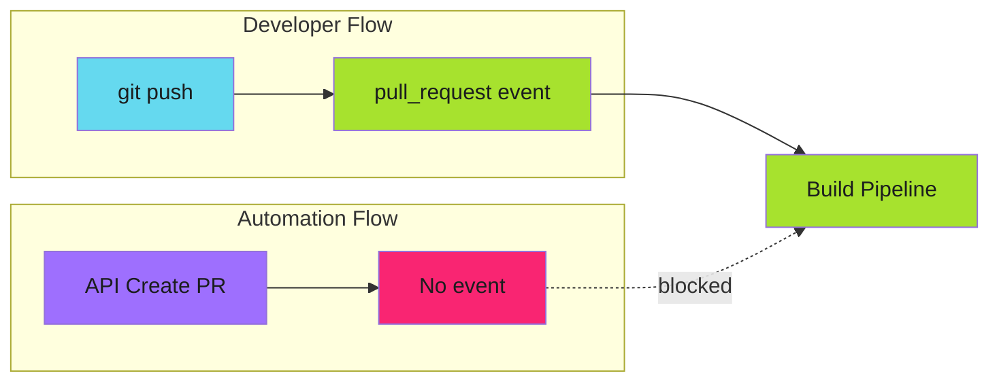
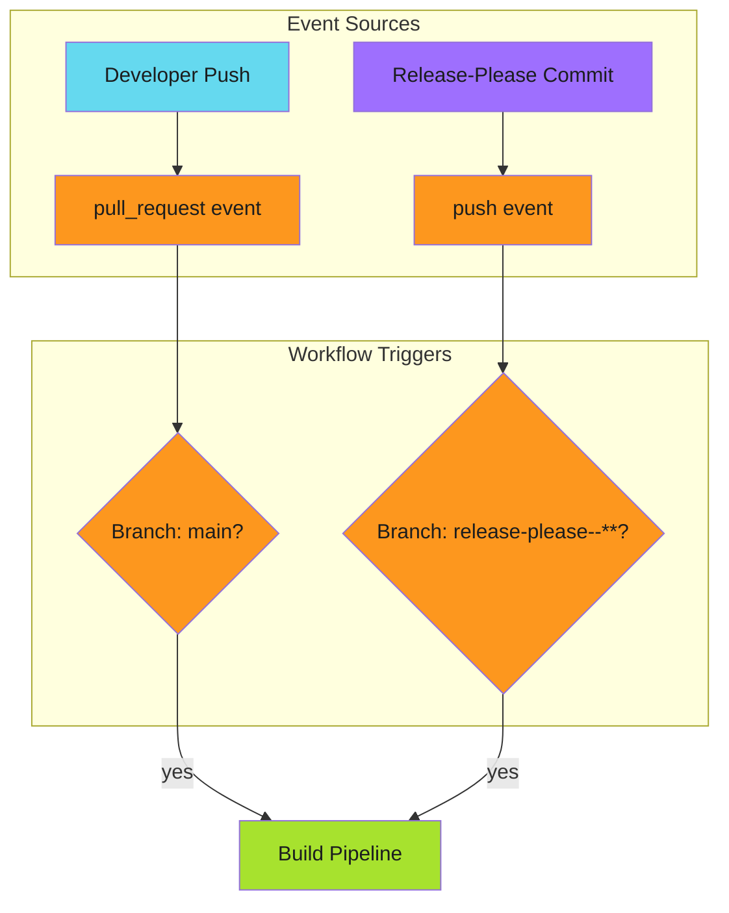

# Workflow Triggers

Handle the GITHUB_TOKEN limitation that prevents automation tools from triggering workflows.

---

## The Problem

[Release-please](https://github.com/marketplace/actions/release-please-action) creates PRs via the GitHub API using `GITHUB_TOKEN`. These PRs don't trigger `pull_request` workflows:



!!! warning "GITHUB_TOKEN Security Measure"

    Actions triggered by `GITHUB_TOKEN` [don't emit workflow events](https://docs.github.com/en/actions/security-guides/automatic-token-authentication#using-the-github_token-in-a-workflow).
    This prevents infinite recursion but breaks automation compatibility.

---

## Event Behavior

| Action | Git Push | API (GITHUB_TOKEN) |
|--------|----------|-------------------|
| Push to branch | `push` event | `push` event |
| Create PR | `pull_request` event | **No event** |
| Update PR | `pull_request` event | **No event** |

The key insight: even with `GITHUB_TOKEN`, pushing commits to a branch emits `push` events. Only PR operations are silent.

---

## The Dual-Trigger Solution

Add a secondary `push` trigger for automation branches:

```yaml
on:
  pull_request:
    branches: [main]
    types: [opened, synchronize, reopened]
  push:
    branches:
      - 'release-please--**'
```



---

## Branch Patterns

Release-please uses specific branch naming:

| Repository Type | Branch Pattern |
|-----------------|---------------|
| Simple repo | `release-please--branches--main` |
| Monorepo | `release-please--branches--main--component` |

The glob `release-please--**` matches both patterns.

!!! tip "Verify Your Pattern"

    Check what branches release-please actually creates in your repository.
    Branch naming conventions may differ between versions.

---

## Alternative Approaches

### Personal Access Token

Use a PAT instead of `GITHUB_TOKEN`:

```yaml
- uses: googleapis/release-please-action@v4
  with:
    token: ${{ secrets.RELEASE_PLEASE_PAT }}
```

Drawbacks:

- Requires PAT management and rotation
- Broader permissions than necessary
- Different auth mechanism for one workflow

### GitHub App Token

Use a GitHub App for authentication:

```yaml
- uses: actions/create-github-app-token@v1
  id: app-token
  with:
    app-id: ${{ secrets.APP_ID }}
    private-key: ${{ secrets.APP_PRIVATE_KEY }}

- uses: googleapis/release-please-action@v4
  with:
    token: ${{ steps.app-token.outputs.token }}
```

Better security but more complex setup. See [GitHub App Setup](../../github-app-setup/index.md).

### pull_request_target

For workflows that need PR context from forks:

```yaml
on:
  pull_request_target:
    branches: [main]
```

!!! danger "Security Risk"

    `pull_request_target` runs with write permissions in the context of
    the base branch. Use with extreme caution for untrusted contributions.

---

## Recommended Pattern

The dual-trigger approach is simplest for release-please:

```yaml
name: Build Pipeline
on:
  # Regular PRs from developers
  pull_request:
    branches: [main]
    types: [opened, synchronize, reopened]

  # Release-please PRs (commits trigger push events)
  push:
    branches:
      - 'release-please--**'

  # Manual trigger
  workflow_dispatch:

concurrency:
  group: build-${{ github.head_ref || github.ref }}
  cancel-in-progress: true
```

---

## Concurrency Control

Prevent duplicate builds with concurrency groups:

```yaml
concurrency:
  group: build-${{ github.head_ref || github.ref }}
  cancel-in-progress: true
```

| Variable | Context |
|----------|---------|
| `github.head_ref` | PR source branch (exists for PRs) |
| `github.ref` | Full ref (fallback for push events) |

For release pipelines, don't cancel in progress:

```yaml
concurrency:
  group: release-${{ github.ref }}
  cancel-in-progress: false
```

---

## Other Automation Tools

The same pattern applies to other tools that use `GITHUB_TOKEN`:

| Tool | Branch Pattern |
|------|---------------|
| Release-please | `release-please--**` |
| Renovate (self-hosted) | `renovate/**` |
| Custom bots | Varies |

Dependabot is different - it uses `pull_request_target` by default.

---

## Troubleshooting

| Issue | Cause | Solution |
|-------|-------|----------|
| No build on release PR | GITHUB_TOKEN limitation | Add push trigger for release-please branches |
| Duplicate builds | Both triggers match | Check concurrency groups |
| Wrong ref in build | Using `github.ref` on PR | Use `github.head_ref` for PR builds |

---

## Verification

Test your setup:

1. Merge a conventional commit (`feat: new feature`)
2. Verify release-please creates a PR
3. Verify build pipeline runs on the PR
4. Check workflow run shows the correct trigger

---

## Next Steps

- [Protected Branches](protected-branches.md) - Handle branch protection
- [Change Detection](change-detection.md) - Optimize builds

---

## References

- [Release-please Action](https://github.com/marketplace/actions/release-please-action) - GitHub Marketplace
- [GITHUB_TOKEN automatic authentication](https://docs.github.com/en/actions/security-guides/automatic-token-authentication) - GitHub Docs
- [Release-please repository](https://github.com/googleapis/release-please) - googleapis
