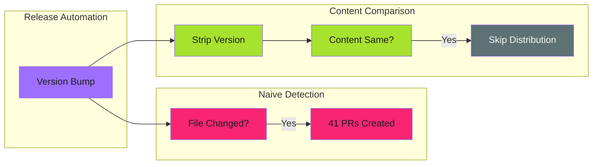

# Content Comparison

Skip operations when only volatile metadata changed, not meaningful content.

---

## The Problem

Automated version bumping creates a common issue:

1. Release automation updates version in `CONFIG.md` (e.g., `2.5.4` → `2.5.5`)
2. File distribution workflow detects "file changed"
3. Creates PRs across 40+ repositories
4. Every PR contains only a version number change—no meaningful content



This creates **PR fatigue**—developers learn to ignore automated PRs, defeating their purpose.

---

## The Solution

Compare file content **after stripping volatile fields**:

```bash
#!/bin/bash
# check-changes.sh - Content-based change detection

# Strip version line from front matter
strip_version() {
  sed '/^version:.*# x-release-please-version$/d' "$1"
}

# Quick check: any changes at all?
if [ -z "$(git status --porcelain)" ]; then
  echo "has_changes=false" >> "$GITHUB_OUTPUT"
  echo "No changes detected"
  exit 0
fi

# Changes detected - check if meaningful
if [ -f "CONTRIBUTING.md" ]; then
  SOURCE_CONTENT=$(strip_version "CONTRIBUTING.md")

  # Get original from git (if exists)
  if git show HEAD:CONTRIBUTING.md > /dev/null 2>&1; then
    ORIGINAL_CONTENT=$(git show HEAD:CONTRIBUTING.md | \
      sed '/^version:.*# x-release-please-version$/d')

    if [ "$SOURCE_CONTENT" = "$ORIGINAL_CONTENT" ]; then
      # Only version changed - restore and skip
      git checkout -- CONTRIBUTING.md
      echo "has_changes=false" >> "$GITHUB_OUTPUT"
      echo "Version-only change detected, skipping"
      exit 0
    fi
  fi
fi

echo "has_changes=true" >> "$GITHUB_OUTPUT"
echo "Content changes detected"
```

---

## Key Implementation Details

### Version Line Format

The pattern assumes a specific format for version tracking:

```markdown
---
title: Contributing Guidelines
version: 2.5.5 # x-release-please-version
---
```

The `# x-release-please-version` comment is a [release-please annotation](https://github.com/googleapis/release-please/blob/main/docs/customizing.md#updating-arbitrary-files) that marks where versions should be updated.

The sed pattern must match exactly:

```bash
sed '/^version:.*# x-release-please-version$/d'
```

### Edge Cases

| Scenario | Behavior | Why |
|----------|----------|-----|
| File missing in target | Fall through to distribute | `git show HEAD:file` fails, new file needed |
| Only version changed | Restore original, skip | No meaningful work to do |
| Content + version changed | Distribute | Real changes exist |
| No changes at all | Skip immediately | `git status --porcelain` is empty |

### Restoring Original State

When skipping, restore the file to avoid git detecting changes:

```bash
git checkout -- CONTRIBUTING.md
```

This keeps the working directory clean for subsequent operations.

---

## Workflow Integration

```yaml
- name: Copy file to target
  run: cp SOURCE.md target-repo/SOURCE.md

- name: Check for meaningful changes
  id: check-changes
  working-directory: target-repo
  run: ${{ github.workspace }}/scripts/check-changes.sh

- name: Commit and push
  if: steps.check-changes.outputs.has_changes == 'true'
  working-directory: target-repo
  run: |
    git add .
    git commit -m "chore: update SOURCE.md"
    git push
```

---

## Extending the Pattern

### Multiple Volatile Fields

Strip multiple fields before comparison:

```bash
strip_volatile() {
  sed -e '/^version:.*# x-release-please-version$/d' \
      -e '/^updated:.*$/d' \
      -e '/^generated:.*$/d' \
      "$1"
}
```

### JSON Files

For JSON configuration files:

```bash
strip_volatile_json() {
  jq 'del(.version, .timestamp, .buildId)' "$1"
}

SOURCE=$(strip_volatile_json "config.json")
TARGET=$(git show HEAD:config.json | jq 'del(.version, .timestamp, .buildId)')
```

### YAML Files

For YAML files with yq:

```bash
strip_volatile_yaml() {
  yq 'del(.metadata.version, .metadata.timestamp)' "$1"
}
```

---

## Comparison with Other Approaches

| Approach | Pros | Cons |
|----------|------|------|
| `git diff --quiet` | Simple | Misses untracked files |
| `git status --porcelain` | Catches everything | No content filtering |
| **Content comparison** | Filters noise | Requires format knowledge |
| Checksum comparison | Format-agnostic | Still catches version changes |

---

## Real-World Results

Before content comparison:

- 41 repositories processed
- 41 PRs created (version-only)
- Developer fatigue, ignored PRs

After content comparison:

- 41 repositories processed
- 0 PRs created (correctly skipped)
- PRs only created for meaningful changes

---

## Related

- [Work Avoidance Patterns](index.md) - Pattern overview
- [File Distribution Idempotency](../file-distribution/idempotency.md) - Check-before-act pattern
- [Release-Please Extra-Files](../release-pipelines/release-please-setup.md#extra-files) - Version annotation format

## References

- [release-please: Updating Arbitrary Files](https://github.com/googleapis/release-please/blob/main/docs/customizing.md#updating-arbitrary-files) - Version annotation syntax
- [GNU sed Manual](https://www.gnu.org/software/sed/manual/sed.html) - Pattern matching
- [git-show Documentation](https://git-scm.com/docs/git-show) - Retrieving file content from commits
