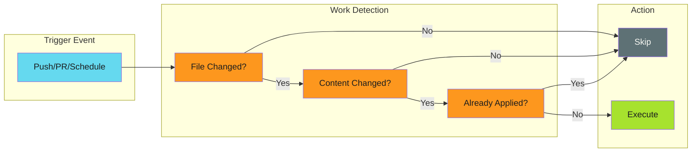

# Work Avoidance Patterns

Skip unnecessary work in CI/CD pipelines through intelligent detection and filtering.

---

## Overview

Efficient pipelines don't just run fast—they avoid running at all when work isn't needed. These patterns detect when operations can be safely skipped, reducing:

- Compute costs
- API rate limit consumption
- PR noise across repositories
- Developer context-switching



---

## Patterns

| Pattern | Use Case |
|---------|----------|
| [Content Comparison](content-comparison.md) | Skip when only metadata (versions, timestamps) changed |
| [Path Filtering](path-filtering.md) | Skip jobs when relevant files haven't changed |
| [Cache-Based Skip](cache-based-skip.md) | Skip when output already exists |

---

## When to Apply

Work avoidance is valuable when:

- **Distribution workflows** push files to many repositories
- **Monorepo builds** trigger on any change but only need subset builds
- **Scheduled jobs** run regardless of whether work exists
- **Release automation** bumps versions without content changes

---

## Relationship to Idempotency

Work avoidance and [idempotency](../../../../developer-guide/engineering-practices/patterns/idempotency/index.md) are complementary:

| Concern | Idempotency | Work Avoidance |
|---------|-------------|----------------|
| Focus | Safe re-execution | Skipping execution |
| Question | "Can I run this again safely?" | "Should I run this at all?" |
| Failure handling | Retry entire workflow | N/A (didn't run) |
| Resource usage | Uses resources on rerun | Saves resources |

Best practice: Apply **work avoidance first**, then ensure remaining operations are **idempotent**.

---

## Quick Example

A file distribution workflow that skips version-only changes:

```yaml
- name: Check for meaningful changes
  id: check
  run: |
    # Strip version line before comparing
    strip_version() {
      sed '/^version:.*# x-release-please-version$/d' "$1"
    }

    SOURCE=$(strip_version "source/CONFIG.md")
    TARGET=$(git show HEAD:CONFIG.md 2>/dev/null | sed '/^version:.*# x-release-please-version$/d' || echo "")

    if [ "$SOURCE" = "$TARGET" ]; then
      echo "skip=true" >> $GITHUB_OUTPUT
    else
      echo "skip=false" >> $GITHUB_OUTPUT
    fi

- name: Distribute file
  if: steps.check.outputs.skip != 'true'
  run: ./distribute.sh
```

---

## Related

- [File Distribution](../file-distribution/index.md) - Applies these patterns at scale
- [Change Detection](../release-pipelines/change-detection.md) - File-level detection for builds
- [Idempotency Patterns](../../../../developer-guide/engineering-practices/patterns/idempotency/index.md) - Safe re-execution
