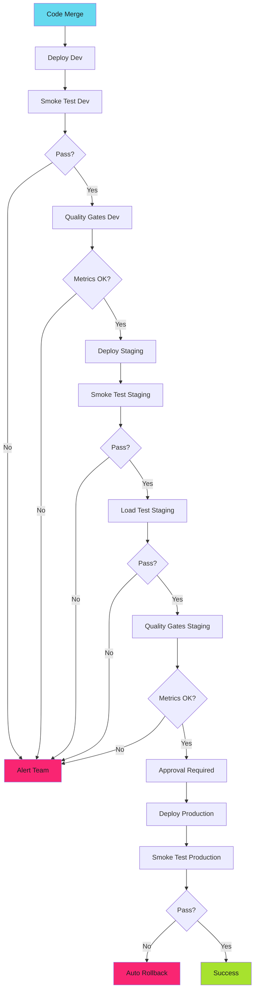

# Environment Progression Operations

!!! tip "Operational Patterns"
    Advanced operational patterns for progressive deployment. These patterns build on the core deployment strategies.

## Feature Flags for Progressive Rollout

Enable features progressively across environments:

```yaml
# Dev: all features on
feature_flags:
  new_ui: true
  beta_api: true
  experimental_cache: true

# Staging: beta features on
feature_flags:
  new_ui: true
  beta_api: true
  experimental_cache: false

# Production: stable features only
feature_flags:
  new_ui: true
  beta_api: false
  experimental_cache: false
```

New feature works in dev and staging before production sees it.

---

## Monitoring Across Environments

Track metrics in each environment:

```yaml
# Prometheus queries
# Dev error rate
rate(http_requests_total{namespace="development",status=~"5.."}[5m])

# Staging error rate
rate(http_requests_total{namespace="staging",status=~"5.."}[5m])

# Production error rate
rate(http_requests_total{namespace="production",status=~"5.."}[5m])
```

Alert when staging error rate spikes. Fix before production deploy.

---

## The Gatekeeper Pattern

Automated gates between environments:

```yaml
jobs:
  deploy-dev:
    steps:
      - run: deploy to dev
      - run: smoke test

  quality-gate-dev:
    needs: deploy-dev
    steps:
      - name: Check error rate
        run: |
          ERROR_RATE=$(curl -s prometheus/query?query=rate | jq '.value')
          if (( $(echo "$ERROR_RATE > 0.01" | bc -l) )); then
            echo "Error rate too high: $ERROR_RATE"
            exit 1
          fi

      - name: Check response time
        run: |
          P95=$(curl -s prometheus/query?query=p95 | jq '.value')
          if (( $(echo "$P95 > 500" | bc -l) )); then
            echo "P95 response time too high: $P95ms"
            exit 1
          fi

  deploy-staging:
    needs: quality-gate-dev
    steps:
      - run: deploy to staging
```

Metrics bad in dev? Staging doesn't deploy.

---

## The Full Progression



---

## Common Pitfalls

### Pitfall 1: Skipping Environments

"Just this once, deploy directly to prod." Never ends well.

### Pitfall 2: Staging Too Different from Production

Staging with 1 pod doesn't catch production race conditions at 50 pods.

### Pitfall 3: No Rollback Plan

If you can't rollback in 60 seconds, your deployment strategy is incomplete.

### Pitfall 4: Manual Smoke Tests

Automated smoke tests or they don't happen consistently.

---

## Implementation Checklist

Building environment progression:

1. **Define environments:** Dev, staging, production at minimum
2. **Namespace isolation:** NetworkPolicies enforce boundaries
3. **Configuration management:** Kustomize overlays or Helm values
4. **Smoke tests:** Automated validation at each stage
5. **Quality gates:** Metrics thresholds between environments
6. **Load testing:** Staging simulates production load
7. **Rollback automation:** Auto-rollback on smoke test failure
8. **Feature flags:** Progressive enablement across environments
9. **Monitoring:** Per-environment dashboards
10. **Approval gates:** Manual approval before production

---

## Related Patterns

Environment progression fits into SDLC hardening:

- **[SDLC Hardening](../../blog/posts/2025-12-12-harden-sdlc-before-audit.md):** Build security into pipelines
- **[Zero-Vulnerability Pipelines](../../blog/posts/2025-12-15-zero-vulnerability-pipelines.md):** Scan before each environment
- **[Policy-as-Code with Kyverno](../../blog/posts/2025-12-13-policy-as-code-kyverno.md):** Enforce standards per environment

---

*The deployment that exploded in dev never reached staging. The migration that locked tables in staging never touched production. The config that worked in dev got caught in smoke tests. Zero production incidents from environmental differences.*
