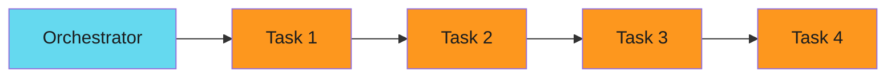
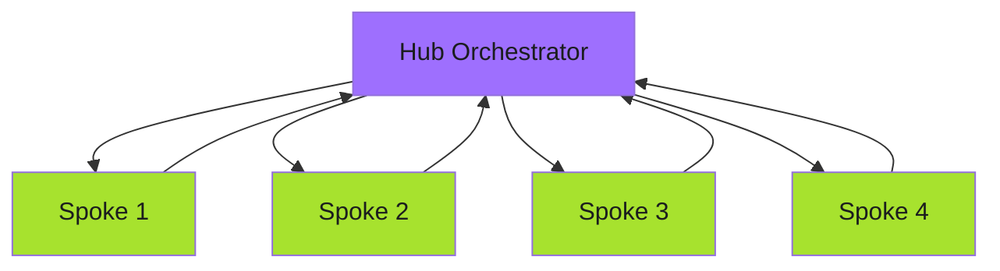

# Hub and Spoke

One hub coordinates. Many spokes execute. The hub doesn't do the work. It distributes, tracks, and summarizes.

This pattern scales horizontally. Add workers without touching the orchestrator.

## The Problem

Sequential processing doesn't scale:



Total time: sum of all tasks. Can't parallelize. Bottleneck at the orchestrator.

## The Pattern

!!! tip "Quick Start"
    This guide is part of a modular documentation set. Refer to related guides in the navigation for complete context.

Hub coordinates, spokes execute in parallel:



Total time: longest single task. Linear scaling. Hub unchanged as spokes grow.

## Argo Workflows Implementation

Hub workflow spawns children:

```yaml
apiVersion: argoproj.io/v1alpha1
kind: WorkflowTemplate
metadata:
  name: hub-orchestrator
spec:
  entrypoint: hub
  templates:
    - name: hub
      inputs:
        parameters:
          - name: repositories
      steps:
        # Discover work
        - - name: discover
            template: get-repositories

        # Fan out to spokes
        - - name: process-repo
            template: spawn-spoke
            arguments:
              parameters:
                - name: repo
                  value: "{{item}}"
            withParam: "{{steps.discover.outputs.result}}"

        # Collect results
        - - name: summarize
            template: collect-results

    - name: spawn-spoke
      inputs:
        parameters:
          - name: repo
      resource:
        action: create
        manifest: |
          apiVersion: argoproj.io/v1alpha1
          kind: Workflow
          metadata:
            generateName: spoke-{{inputs.parameters.repo}}-
          spec:
            workflowTemplateRef:
              name: spoke-worker
            arguments:
              parameters:
                - name: repository
                  value: "{{inputs.parameters.repo}}"
```

Hub discovers repositories, spawns a spoke workflow for each, then summarizes results.

## Spoke Worker Template

Each spoke is independent:

```yaml
apiVersion: argoproj.io/v1alpha1
kind: WorkflowTemplate
metadata:
  name: spoke-worker
spec:
  entrypoint: process
  arguments:
    parameters:
      - name: repository
  templates:
    - name: process
      inputs:
        parameters:
          - name: repository
      container:
        image: gcr.io/project/worker:v1
        command: ["/app/worker"]
        args:
          - "--repo={{inputs.parameters.repository}}"
          - "--action=process"
```

Spoke doesn't know about the hub. Just does its work and exits.
