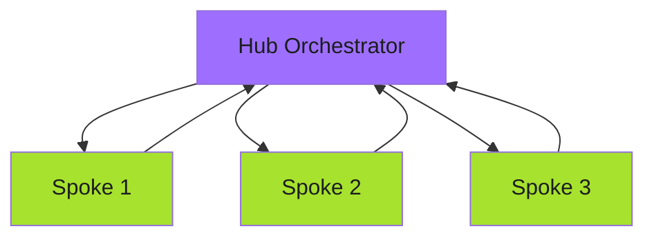
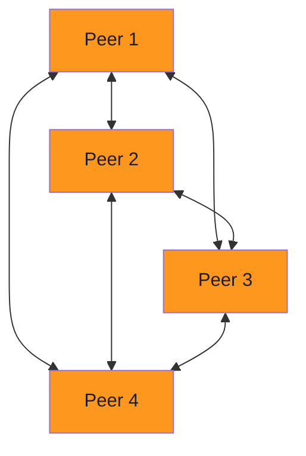
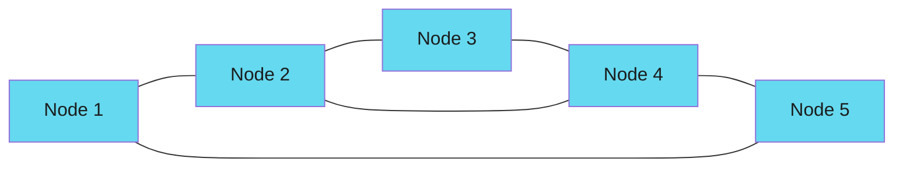
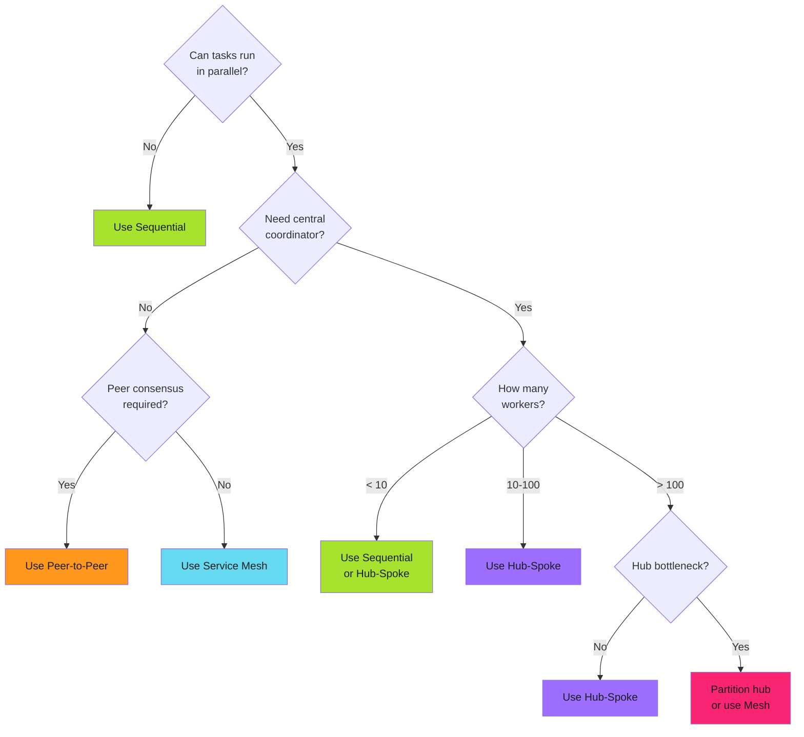

# Hub-Spoke vs Alternative Patterns

When to use hub-and-spoke. When other patterns fit better. Decision criteria.

!!! tip "Pattern Selection Priority"
    Start simple. Sequential processing works for small-scale operations. Add hub-spoke for parallelism. Consider mesh or P2P only when hub coordination becomes a bottleneck.

---

## Architecture Comparison

### Hub-and-Spoke



**Connections:** O(n). Hub connects to each spoke.

### Peer-to-Peer (P2P)



**Connections:** O(n²). Every peer connects to every other peer.

### Mesh Network



**Connections:** Partial mesh. Selected connections for redundancy.

### Sequential Processing


**Connections:** O(n) linear. Each task connects to next.

---

## Pattern Trade-offs

| Aspect | Hub-Spoke | P2P | Mesh | Sequential |
| -------------------- | ----------- | ------- | -------- | ------------ |
| **Complexity** | Low | High | Medium | Very Low |
| **Connection count** | O(n) | O(n²) | Partial | Linear |
| **Coordination** | Centralized | Distributed | Distributed | None |
| **Single point of failure** | Yes (hub) | No | No | Yes (any task) |
| **Scalability** | High | Low | Medium | None |
| **Debugging** | Medium | Hard | Hard | Easy |
| **Time to result** | O(1)* | Variable | Variable | O(n) |
| **Resource efficiency** | High | Low | Medium | High |

*O(1) = Time of longest spoke, not sum of all spokes

---

## Hub-Spoke vs Peer-to-Peer

### Hub-Spoke: Centralized Coordination

```yaml
# Hub spawns workers, collects results
- name: hub
  steps:
    - - name: spawn-workers
        template: worker
        withParam: "{{workflow.parameters.targets}}"
    - - name: aggregate
        template: summarize
```

**Characteristics:**

- Hub knows all spokes
- Spokes don't know about each other
- Failures isolated to individual spokes
- Hub is SPOF (single point of failure)

### P2P: Distributed Consensus

```go
// Each peer discovers and communicates with all other peers
func (p *Peer) syncWithPeers(peers []Peer) error {
    for _, peer := range peers {
        if peer.ID == p.ID {
            continue // Skip self
        }

        // Exchange state with peer
        state, err := peer.GetState()
        if err != nil {
            return err
        }

        // Merge states
        if err := p.MergeState(state); err != nil {
            return err
        }
    }
    return nil
}
```

**Characteristics:**

- Every peer knows every other peer
- Consensus required for decisions
- No SPOF, but coordination overhead grows with O(n²)
- Complex failure scenarios (split brain, Byzantine faults)

**Use Hub-Spoke when:**

- Central coordination makes sense
- Workers are independent (no inter-worker communication)
- Scale matters (100+ workers)

**Use P2P when:**

- No central authority should exist
- Consensus is required
- System must survive any single failure
- Scale is small (< 20 peers)

---

## Hub-Spoke vs Mesh Network

### Hub-Spoke: Star Topology

All communication flows through hub. Hub tracks everything.

### Mesh: Partial Connectivity

```yaml
# Service mesh: each service connects to subset of others
apiVersion: v1
kind: Service
metadata:
  name: service-a
spec:
  selector:
    app: service-a
  ports:
    - port: 80
---
# service-a calls service-b and service-c directly
# No central hub routes requests
```

**Mesh Characteristics:**

- Services discover and call each other
- No central routing
- Resilient to individual node failures
- Harder to monitor (distributed tracing required)

**Use Hub-Spoke when:**

- Operations are one-time executions (workflows, CI/CD)
- Central logging and monitoring preferred
- Work distribution is hub's responsibility

**Use Mesh when:**

- Long-running services need direct communication
- Microservices architecture
- Service discovery and load balancing required
- No central coordinator should route all traffic

---

## Hub-Spoke vs Sequential

### Sequential: Simple but Slow

```yaml
# GitHub Actions: sequential jobs
jobs:
  task-1:
    runs-on: ubuntu-latest
    steps:
      - run: ./task1.sh

  task-2:
    needs: task-1
    runs-on: ubuntu-latest
    steps:
      - run: ./task2.sh

  task-3:
    needs: task-2
    runs-on: ubuntu-latest
    steps:
      - run: ./task3.sh
```

**Sequential Time:** task1 + task2 + task3 = 3x duration

### Hub-Spoke: Parallel Execution

```yaml
# Hub-spoke: parallel jobs
jobs:
  discover:
    runs-on: ubuntu-latest
    outputs:
      tasks: ${{ steps.find.outputs.tasks }}
    steps:
      - id: find
        run: echo 'tasks=["task1","task2","task3"]' >> $GITHUB_OUTPUT

  execute:
    needs: discover
    runs-on: ubuntu-latest
    strategy:
      matrix:
        task: ${{ fromJson(needs.discover.outputs.tasks) }}
    steps:
      - run: ./${{ matrix.task }}.sh
```

**Hub-Spoke Time:** max(task1, task2, task3) = 1x duration (if equal)

**Use Sequential when:**

- Tasks must run in order (dependencies between them)
- Parallelism not possible
- Simplicity preferred over speed

**Use Hub-Spoke when:**

- Tasks are independent
- Speed matters
- Same operation across many targets

---

## Decision Tree



---

## Real-World Pattern Selection

| Scenario | Requirements | Pattern | Rationale |
| --------------------------- | ------------------------------- | -------------- | ------------------------------------------------ |
| File distribution (75 repos) | Update same file in all repos | Hub-Spoke | Central coordination, independent tasks (2min vs 2.5hr) |
| Blockchain consensus | Distributed ledger, no central authority | Peer-to-Peer | Consensus required, Byzantine fault tolerance |
| Microservice communication | Services calling each other | Service Mesh | Long-running, direct communication, service discovery |
| CI/CD pipeline stages | Build → Test → Deploy | Sequential | Stages have dependencies, must run in order |
| Parallel test execution | Unit, integration, E2E tests | Hub-Spoke | Test stages independent, can run concurrently |

---

## Related Patterns

- **[Hub and Spoke Overview](index.md):** Core hub-spoke concepts
- **[Communication Models](push-pull-patterns.md):** Push vs pull in hub-spoke
- **[Three-Stage Design](../three-stage-design.md):** Sequential + parallel hybrid

---

*The team chose hub-and-spoke. 75 repositories updated in parallel. 2 minutes, not hours. Central coordination. No O(n²) complexity. The pattern fit. The system scaled.*
