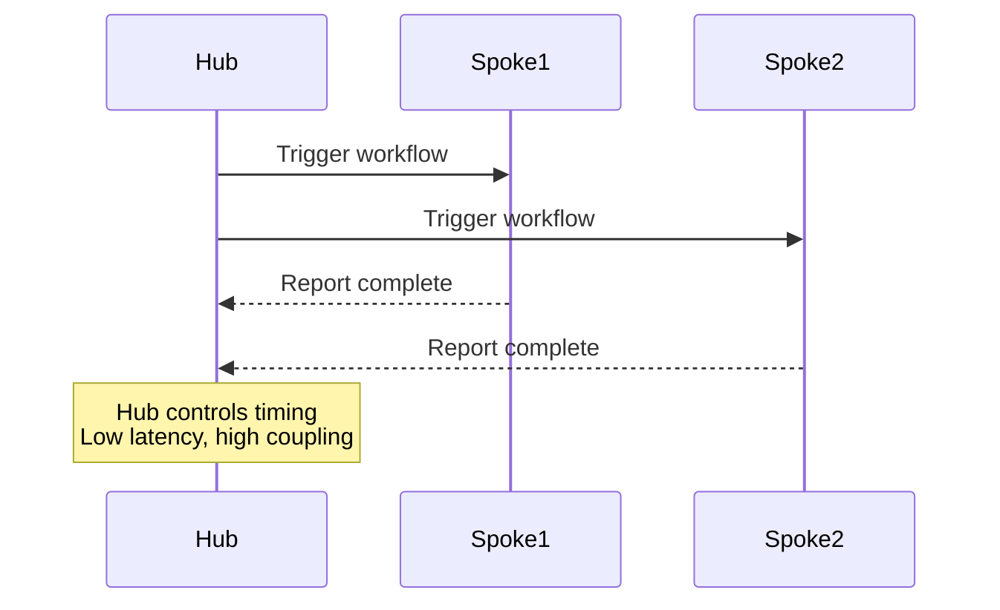
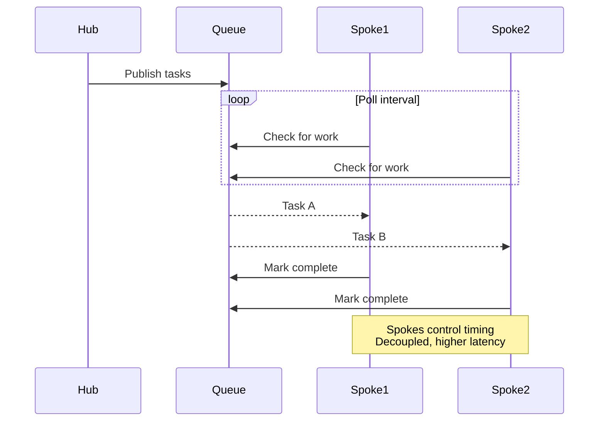
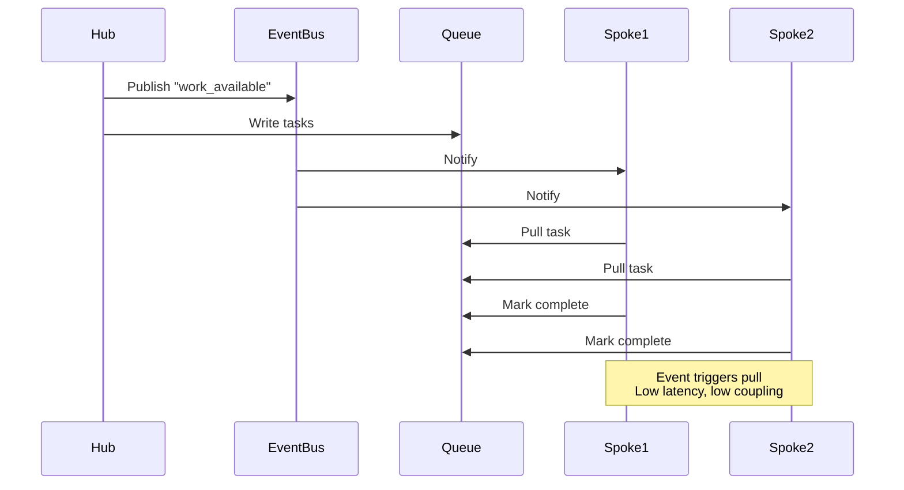

# Hub and Spoke Communication Models

How the hub talks to spokes. How spokes report back. Three models: push, pull, hybrid.

!!! tip "Choose Based on Latency vs Coupling"
    Push models have lower latency but higher coupling. Pull models decouple the hub from spokes but introduce polling overhead. Hybrid approaches balance both by using events to trigger pulls.

---

## Push Model: Hub Initiates Work

Hub triggers spokes directly. Spokes don't poll. Hub controls timing.



### GitHub Actions Push Implementation

```yaml
# Hub workflow: distributes work via workflow_dispatch
name: Hub Push Distribution

on:
  workflow_dispatch:
    inputs:
      target_repos:
        description: "JSON array of repos"
        required: true

jobs:
  distribute:
    runs-on: ubuntu-latest
    strategy:
      matrix:
        repo: ${{ fromJson(github.event.inputs.target_repos) }}
    steps:
      - name: Trigger spoke workflow
        run: |
          gh workflow run spoke-worker.yml \
            --repo myorg/${{ matrix.repo }} \
            --field task="process" \
            --field hub_run_id="${{ github.run_id }}"
```

Spoke workflow receives trigger, executes, reports back via API:

```yaml
# Spoke workflow: processes work, reports to hub
name: Spoke Worker

on:
  workflow_dispatch:
    inputs:
      task:
        required: true
      hub_run_id:
        required: true

jobs:
  process:
    runs-on: ubuntu-latest
    steps:
      - name: Execute task
        run: ./process-task.sh "${{ github.event.inputs.task }}"

      - name: Report to hub
        if: always()
        run: |
          STATUS=${{ job.status }}
          gh api repos/myorg/hub-repo/dispatches \
            --field event_type="spoke_complete" \
            --field client_payload[hub_run_id]="${{ github.event.inputs.hub_run_id }}" \
            --field client_payload[spoke_repo]="${{ github.repository }}" \
            --field client_payload[status]="$STATUS"
```

**Trade-offs:**

- **Low latency**: Hub triggers spokes immediately
- **High coupling**: Hub must know spoke workflows and repo structure
- **Direct control**: Hub controls exactly when spokes run

---

## Pull Model: Spokes Poll for Work

Hub publishes work queue. Spokes poll and pull tasks. Spokes control timing.



### ConfigMap Queue Implementation

Hub writes work to ConfigMap:

```yaml
# Hub publishes work queue
- name: publish-work
  resource:
    action: create
    manifest: |
      apiVersion: v1
      kind: ConfigMap
      metadata:
        name: work-queue
      data:
        tasks: |
          [
            {"id": "1", "repo": "repo-a", "status": "pending"},
            {"id": "2", "repo": "repo-b", "status": "pending"},
            {"id": "3", "repo": "repo-c", "status": "pending"}
          ]
```

Spoke polls ConfigMap, claims work:

```go
package main

import (
    "context"
    "encoding/json"
    "time"

    corev1 "k8s.io/api/core/v1"
    metav1 "k8s.io/apimachinery/pkg/apis/meta/v1"
    "k8s.io/client-go/kubernetes"
)

type Task struct {
    ID     string `json:"id"`
    Repo   string `json:"repo"`
    Status string `json:"status"`
}

func pollForWork(ctx context.Context, client *kubernetes.Clientset, spokeID string) (*Task, error) {
    for {
        // Get work queue
        cm, err := client.CoreV1().ConfigMaps("default").Get(ctx, "work-queue", metav1.GetOptions{})
        if err != nil {
            return nil, err
        }

        // Parse tasks
        var tasks []Task
        if err := json.Unmarshal([]byte(cm.Data["tasks"]), &tasks); err != nil {
            return nil, err
        }

        // Find pending task
        for i, task := range tasks {
            if task.Status == "pending" {
                // Claim task
                tasks[i].Status = "claimed:" + spokeID
                updated, _ := json.Marshal(tasks)
                cm.Data["tasks"] = string(updated)

                // Update ConfigMap
                _, err := client.CoreV1().ConfigMaps("default").Update(ctx, cm, metav1.UpdateOptions{})
                if err != nil {
                    // Race condition: another spoke claimed it, retry
                    continue
                }

                return &task, nil
            }
        }

        // No work available, wait
        time.Sleep(5 * time.Second)
    }
}
```

**Trade-offs:**

- **Decoupled**: Spokes don't need to know about hub structure
- **Higher latency**: Polling interval adds delay
- **Self-service**: Spokes claim work when ready
- **Race conditions**: Requires atomic updates or locking

---

## Hybrid: Event-Driven Pull

Hub publishes event. Spokes listen for events, then pull work. Combines low latency with decoupling.



### Argo Events + ConfigMap Implementation

EventSource triggers on ConfigMap change:

```yaml
apiVersion: argoproj.io/v1alpha1
kind: EventSource
metadata:
  name: work-queue-monitor
spec:
  resource:
    namespace: default
    group: ""
    version: v1
    resource: configmaps
    eventTypes:
      - ADD
      - UPDATE
    filter:
      prefix: "work-queue"
```

Sensor spawns spoke workflows when work appears:

```yaml
apiVersion: argoproj.io/v1alpha1
kind: Sensor
metadata:
  name: spoke-launcher
spec:
  dependencies:
    - name: work-available
      eventSourceName: work-queue-monitor
      eventName: default
  triggers:
    - template:
        name: spawn-spoke
        argoWorkflow:
          operation: submit
          source:
            resource:
              apiVersion: argoproj.io/v1alpha1
              kind: Workflow
              metadata:
                generateName: spoke-worker-
              spec:
                workflowTemplateRef:
                  name: spoke-pull-worker
```

Spoke pulls work from ConfigMap (same as pull model), but only runs when event fires.

**Trade-offs:**

- **Low latency**: Event notification is immediate
- **Decoupled**: Spokes react to events, not direct triggers
- **No polling overhead**: Spokes sleep until events arrive
- **Complexity**: Requires event infrastructure

---

## Decision Matrix

| Requirement | Push | Pull | Hybrid |
| ------------- | ------ | ------ | -------- |
| Low latency | ✅ | ❌ | ✅ |
| Decoupled hub/spoke | ❌ | ✅ | ✅ |
| No polling overhead | ✅ | ❌ | ✅ |
| Simple implementation | ✅ | ⚠️ | ❌ |
| No event infrastructure | ✅ | ✅ | ❌ |
| Race condition handling | N/A | ❌ | ⚠️ |
| Hub controls timing | ✅ | ❌ | ⚠️ |

**Choose push when:**

- Low latency is critical
- Hub knows spoke structure (tightly coupled system)
- Simple implementation preferred

**Choose pull when:**

- Hub and spokes must be decoupled
- Spokes control their own scheduling
- Polling overhead is acceptable

**Choose hybrid when:**

- Need both low latency and decoupling
- Event infrastructure already exists
- Complexity is justified by scale

---

## Related Patterns

- **[Hub and Spoke Overview](index.md):** Core pattern concepts
- **[Implementation Examples](examples.md):** Full workflow templates
- **[Operations Guide](operations.md):** Failure handling and monitoring

---

*The hub published work. The spokes pulled tasks. No tight coupling. No polling waste. Events bridged the gap. Latency stayed low. The system scaled.*
