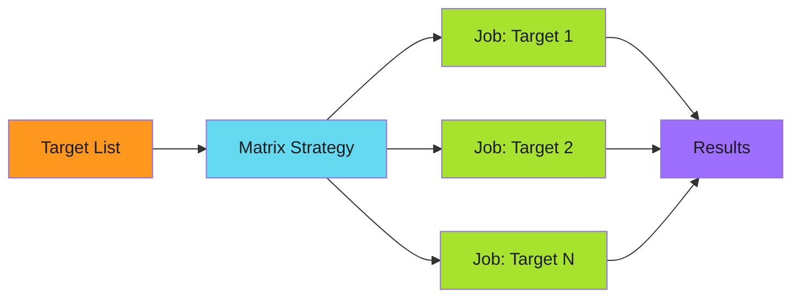

# Matrix Distribution

Parallelize operations across dynamic target lists.

---

## The Pattern

```yaml
strategy:
  matrix:
    target: ${{ fromJson(needs.discover.outputs.targets) }}
  fail-fast: false
  max-parallel: 10
```

Matrix distribution spawns parallel jobs for each target in a dynamically-generated list. Combined with [three-stage design](../three-stage-design.md), it enables scalable workflows that process many targets efficiently.



---

## When to Use

!!! success "Good Fit"

    - Processing multiple repositories, files, or services
    - Operations that are independent and can run in parallel
    - Workloads that benefit from horizontal scaling
    - Batch operations with predictable per-target runtime

!!! warning "Poor Fit"

    - Sequential operations where order matters
    - Operations with shared state between targets
    - When total job count would exceed GitHub Actions limits (256)

---

## Core Configuration

### Dynamic Matrix

Generate the target list in a discovery stage:

```yaml
discover:
  outputs:
    targets: ${{ steps.query.outputs.targets }}
  steps:
    - name: Build target list
      id: query
      run: |
        TARGETS='[{"name": "repo-1"}, {"name": "repo-2"}]'
        echo "targets=$TARGETS" >> $GITHUB_OUTPUT

distribute:
  needs: discover
  strategy:
    matrix:
      target: ${{ fromJson(needs.discover.outputs.targets) }}
  steps:
    - run: echo "Processing ${{ matrix.target.name }}"
```

### Failure Isolation

Prevent one failure from canceling other jobs:

```yaml
strategy:
  matrix:
    target: ${{ fromJson(needs.discover.outputs.targets) }}
  fail-fast: false  # Critical: continue processing other targets
```

### Rate Limiting

Control concurrency to avoid API rate limits:

```yaml
strategy:
  matrix:
    target: ${{ fromJson(needs.discover.outputs.targets) }}
  max-parallel: 10  # Limit concurrent jobs
```

---

## In This Section

- [Conditional Distribution](conditional-distribution.md) - Type detection and filtering
- [Template Rendering](template-rendering.md) - Substitution and transformations
- [Anti-Patterns](anti-patterns.md) - Common mistakes to avoid

---

## Summary

!!! abstract "Key Takeaways"

    1. **Dynamic matrices** - Generate target lists in discovery stage
    2. **Isolate failures** - Always use `fail-fast: false`
    3. **Control concurrency** - Set `max-parallel` for rate limits
    4. **Conditional logic** - Detect target types, filter as needed
    5. **Template rendering** - Use `envsubst`, `jq`, `yq` for transformations
